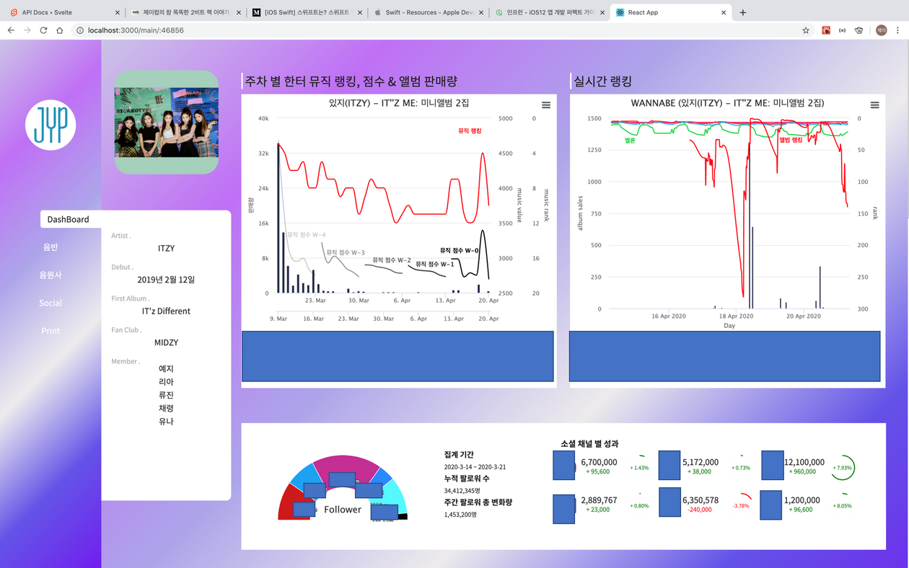
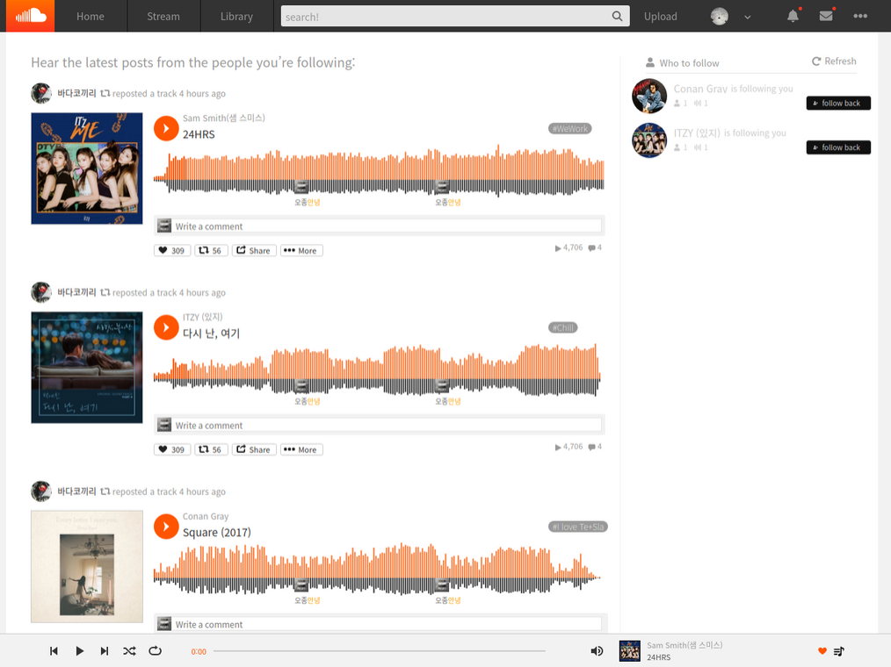
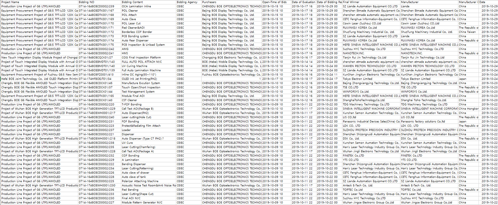
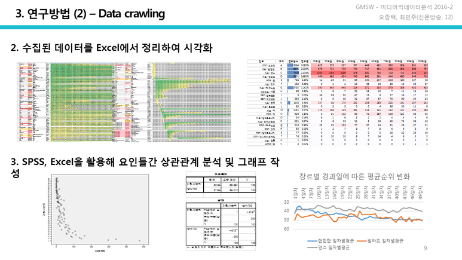

# Jong Taek Oh

### Front-end Developer

## About

- 어릴 적 비주얼베이직 6.0 으로 채팅 프로그램을 만들고 처음 느꼈던 희열을 잊지 못해 개발자의 삶을 살기로 결심했습니다.
- 프론트엔드, 특히 자바스크립트로 구현 가능한 기능들에 호기심이 많습니다.
- 새로움과 미래에 관해 이야기 하고 상상하기를 즐깁니다.
- 생각 나누기를 좋아해 7년 간 블로그를 운영하고, 5년 간 연 평균 50권을 읽고, 3년 간 독서모임을 운영해왔습니다.

## SKILLS

- React / React Hooks
- Redux
- Next.js
- SASS
- Styled Components
- HTML5 / CSS3
- JavaScript (ES6)
- Git

## EDUCATION & CAREER

- Sejong Univ. 🗓2012.03 ~ 2018.08

  - Bachelor of Arts - Communication Arts
  - Bachelor of Business Administration

- WeCode Bootcamp 🗓2020.01 ~ 2020.04

  - Studying Web, Front-end Skills, etc.

- RSupport 🗓2020.06 ~

  - Front-End Developer
    <!--

## INTERNSHIP

### 한터글로벌

#### 연예 기획사 대상 통계 대시보드 데모 페이지 개발

- React.js, React Hooks, HighCharts.js, Styled Components, Git
- 프로그램 기획 전반 주도
- PDF 보고서 출력 기능

## PROJECT

### 1) Not- SoundCloud

#### 음원스트리밍서비스 (2020.02.24 ~ 03.07)

- React.js, React Hooks, Redux, Next.js, Styled Components, Git
- Web Audio API를 통한 음원 스트리밍
- 데이터 Visualization
- React-Redux를 사용한 음원 데이터 전역상태 관리
- 드래그 앤 드롭을 통한 파일 업로드
- Next.js 동적 라우팅 및 getInitialProps(SSR) 사용
- 구글 소셜 로그인 (OAuth 2.0)

### 2) WeketKurly

#### 신선식품새벽배송서비스 (2020.03.09 ~ 03.20)

- React.js, SASS, Git
- API를 통해 수신한 화면 상품 정보 출력 및 레이아웃 작성
- state 값을 이용한 컴포넌트의 조건부 렌더링
- 장바구니 및 장바구니 담기 기능 구현
- 이미지 슬라이드 구현
- sessionStorage 사용한 로그인 정보(token) 관리
- git 및 tig 등 git log tool 활용

### 3) Mini Project

#### WECODE Happy Birthday to Wecode (2020.01 - 04)

- 총 10시간에 걸쳐 완성된 위코드 1주년 기념 문예창작대회 투표 사이트

- 모달 및 슬라이드 기능 구현(Slick.js)

#### Web Crawling (Python3)

#### 1) 중국입찰정보사이트 China bidding

- Selenium 사용, 키워드와 조건에 맞는 입찰 정보 수집, 기사작성

#### 2) 음원스트리밍서비스 Genie

- BeautifulSoup 사용, 약 1년 반 분량 일간 100위 차트 수집 및 통계분석 -->

## CONTACT

- ohjtack@gmail.com
