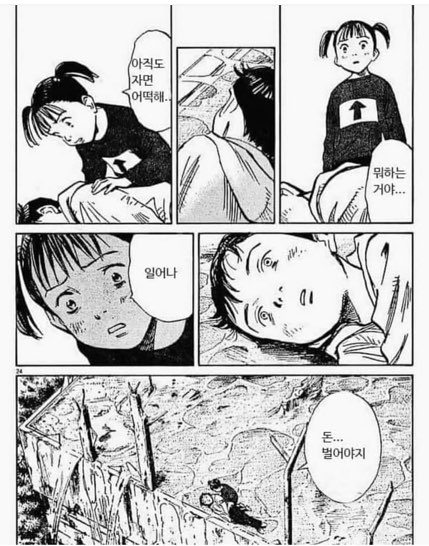
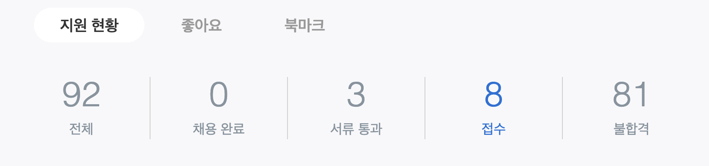
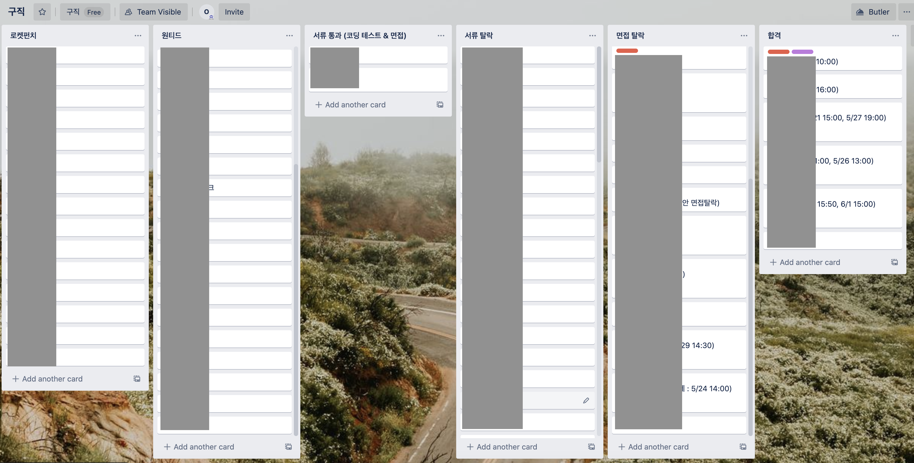
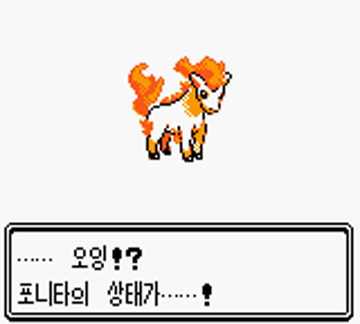
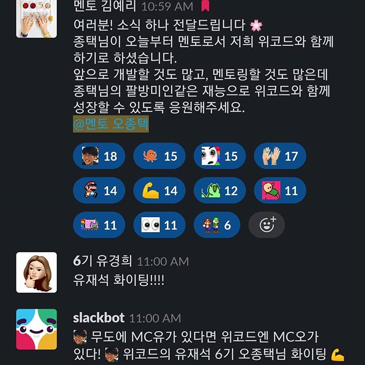

위코드 첫 수업 시작 1월 28일, 첫 출근 6월 15일. 140일 간의 기록... 까지는 아니고 4월 17일 수료 이후 취업까지 60일 간의 과정을 간단하게 기록해보는 시간을 가져보고자 한다.

내가 그렇게 썩 모범적으로 취업을 준비했다고는 못하겠지만 개발자로의 커리어 전환을 꿈꾸는 또 다른 비전공자들에게는 도움이 될 수 있는 내용이니까.

<br>

### 1. 일어나... 리팩토링 하러 가야지...

<br>

<div align="center">돈 보다 달콤한 리팩토링...</div>

<br>

수료했지만 수료한 게 아니다. 한 두달 전 작성했던 코드를 들고 면접 보러 돌아다닐 생각하니 정신이 아득해지는 기분이었다. 개떡 같이 짜놓은 부끄러운 코드에 설탕을 쳐야 할 시간이 돌아왔다.

위코드 3달 과정을 수료하고 내가 첫번째로 착수한 작업은 1, 2차 프로젝트에서 부족했던 점을 보완하는 작업이었다.

프로젝트 별 주안점이 달랐다. 1차 프로젝트에서는 추가하거나 꼭 완성하고 싶었던 기능과 백엔드와의 추가적인 연동 작업, 2차 프로젝트에서는 프로젝트 막판에 가서야 도입하기로 결정해 미진했던 redux 기능 추가였다. 곁가지로 기한에 쫓겨 더럽게 짠 코드들을 정리하는 작업이 더해졌다.

1차 프로젝트 수정 작업은 백엔드 종연님이 같이 수고해주셨고, 2차 프로젝트 수정 작업은 혼자 진행했다. 두 프로젝트 모두 합쳐 2주 정도가 소요됐는데 기억에서 사라진 내 코드를 수정하는 것 + 내가 작성하지 않은 다른 사람의 코드를 이해해가며 수정하는 일은 꼭 해봄직한 경험이었다.

아래 링크는 작업이 끝나고 작성한 1차 프로젝트 후기다. 2차 프로젝트는 귀찮아서 작성 안했음... 그 대신 관련 내용으로 갈음해본다.

참고 링크 :

- [1차 프로젝트 후기 - 마켓컬리 클로닝](https://saengmotmi.netlify.app/development/1%EC%B0%A8-%ED%94%84%EB%A1%9C%EC%A0%9D%ED%8A%B8-%ED%9B%84%EA%B8%B0---%EB%A7%88%EC%BC%93%EC%BB%AC%EB%A6%AC-%ED%81%B4%EB%A1%9C%EB%8B%9D/)
- [2020-04-20 Web Audio API 디벼보기 - 2 (사실은 Redux)](https://saengmotmi.netlify.app/development/web-audio-api-%EB%94%94%EB%B2%BC%EB%B3%B4%EA%B8%B0---2/)

<br>

### 2. 1 Page 이력서 & 포트폴리오 정리

그 다음에는 예전에 간단하게 써뒀던 1 page 이력서를 수정하고 1차, 2차 프로젝트, 기업협업 때 진행한 내용까지 포트폴리오 형식으로 정리하는 일이었다.

이력서 전체를 다 까는 건 민망하기도 하고... 정 궁금하시면 따로 연락 주시면 되겠다.

참고로 같은 내용이라도 다양한 형태로 만들어두면 좋다. 이미 서류를 받았음에도 포트폴리오를 추가로 요구하는 곳이 있다. 나는 노션에 이력서 중 포트폴리오 부분만 따로 떼어 넣고, 학부 때 했던 팀프로젝트나 기타 미니 프로젝트 내용도 넣었다.

동기분 중에는 같은 내용인데도 노션으로 포맷을 바꾸고 나서 서류 합격률이 확 높아진 경우가 있었다. 그게 꼭 노션이라 그랬는지는 모르겠지만 가능한 다양한 시도를 해보는 게 좋다.

<br>

### 3. 자바스크립트 & 리액트 개념 공부 스터디

프로젝트 보완과 이력서 작성이 끝났다. 이제 그간 시간 부족을 핑계로 해오지 못했던 개념 공부와 면접 준비를 겸할 차례다.

하지만 누구와 어떻게? 위코드 6기 백엔드끼리 `6기협동조합`이라는 채널이 있다는 사실이 떠올랐다. 그런데 생각해보니 누구 마음대로 6기협동조합이야... 암튼 거기서 영감을 얻어 그 길로 `6프협(6기 프론트엔드 협동조합)` 채널을 파고 같이 공부할 사람들을 차례차례 납치(?)해왔다.

```
나 : oo님 같이 자바스크립트 공부하실래요?
oo님 : 오 좋죠 ㅎㅎ
나 : 그럼 님은 납치야
oo님 : ???
```

이 시기 공부한 내용들은 역시 블로깅이 되어 있다. 위코드에서 매일 만나 크고 작은 개념들을 공부해오고(ex. promise, 클로저, 브라우저의 렌더링 절차 등) 서로 설명해주는 방식으로 진행했다.

접해보지 못했던 주제에 대해 관심을 갖게 되기도 하고, 알고 있다고 생각했는데 설명하다보니 명확하지 못했던 부분이 드러나기도 했다. 또 이 기간 동안 `속 깊은 자바스크립트`나 `코어 자바스크립트` 같은 책들을 읽으면서 자바스크립트에 대한 갈증을 조금이나마 덜 수 있어 좋았다.

이 내용들을 블로그에 적어두기를 정말 잘했다고 생각한 것이, 면접을 다니면서 자기가 공부한 내용을 꾸준히 기록한 걸 좋게 보는 곳이 많았다. 어느 면접에서는 "왜 1차 면접 때 블로깅 한거 크게 어필 안하셨나요? 만약 저희가 알았다면 훨씬 긍정적으로 검토했을 텐데요"라는 피드백도 들었다. 블로그 꼭 열심히 하시길.

- [2020-05-09 this 바인딩](https://saengmotmi.netlify.app/study/2020-05-09-this-%EB%B0%94%EC%9D%B8%EB%94%A9/)
- [2020-05-13 이벤트 버블링, 캡처링, useCapture Option](https://saengmotmi.netlify.app/study/2020-05-13-%EC%9D%B4%EB%B2%A4%ED%8A%B8-%EB%B2%84%EB%B8%94%EB%A7%81,-%EC%BA%A1%EC%B2%98%EB%A7%81,-usecapture/)

<br>

### 4. 이력서 폭풍 살포 & 코테, 면접 (feat. 원티드 & 로켓펀치)

이 기간 동안 **서류를 126개** 넣었다. 원티드 92개, 로켓펀치 35개. 이렇게 보니 원티드에 거의 2.5배 많은 지원을 했는데, 서류 통과든 탈락이든 반응이 빠르게 오는 데다 동시 지원 기능 인터페이스가 편리하게 구성된 원티드의 지원 비중이 높았던 것 같다.

이렇게까지 많이 넣어야 하냐는 질문이 있을 수도 있겠다. 개인적으로는 정신적인 소모를 최소화하기 위해서라도 최대한 단기간 안에 많은 곳의 전형을 진행하는 게 좋다고 생각한다.

기간이 길어지면 기본적으로 몸과 마음이 지치게 된다. 더군다나 시간은 기회비용이다. 소득 없이 구직과 공부, 개발을 병행하기란 쉽지 않은 일이다. 내가 원하는 기업의 전형이 뜻밖에 길어지는 동안 차순위의 기업이 빠르게 최종 선택을 푸시하게 되는 경우도 생길 수 있다.

또한 면접을 통해 차회차 면접에서 도움 받을 수 있고, 반복적으로 드러나는 부족한 부분을 보완할 수 있고, 다양한 스타일의 기업을 접해보면서 나와 맞는 스타일이 어떤 것인가를 면밀히 살펴볼 수 있다.

<br>

<div align="center">고생 많았어, 종택</div>

<br>

나는 React 프론트엔드 개발자 포지션을 중심으로 지원했고 서류 통과는 25곳, 감사하게도 그 중 최종 합격을 통보 받은 곳은 6곳이었다. 코딩테스트, 면접 케이스가 대부분이었고 과제를 준 곳도 있었는데 채용이 결정된 곳이 있어 전형을 진행하지는 않았다.

내 경우 면접은 열심히 보고 돌아다녔던 거 같은데 체감상 서류 통과 타율이 그렇게까진 높지 않았던 것 같다. 코로나 시즌의 여파거나, 내 서류의 구성이 인사담당자 보시기에 퍽 좋지 않았거나, 아니면 둘 다거나.

그래도 일단 서류 통과하고 면접 잡히고 나서 그 이후 전형에서의 성공률은 괜찮은 편이었던 것 같다. 서류 지원 모수가 충분한데도 결과가 좋지 못하다면 본인 서류의 문제점에 대해 가설을 세우고 수정해가며 지원하는 방법을 추천한다.

약간의 팁이라면 같은 회사가 원티드, 로켓펀치 동시에 공고를 올려놓는 경우가 있다. 이 경우에는 원티드에 지원하는 게 좋다.

로켓펀치의 경우 지원 전 필수 질문을 작성해야 지원할 수 있는 경우가 종종 있는데, 원티드는 그런 단계가 없다. 더욱이 만약 채용이 결정되어 3개월 근속하게 될 경우 취업축하금을 받을 수도 있다. 그렇다고 해서 로켓펀치를 제쳐두고 지원할 필요는 없다.

<br>

<div align="center"></div>

<br>

위 사진은 지원한 회사와 각 회사별 전형 단계를 트렐로로 정리한 화면이다. 회사명 등은 민감한 정보일 수 있어 가려놓았다. 이렇게 트렐로로 관리하는 방법은 광훈님을 따라한 건데 해보니 꽤 좋은 방법인듯 하다.

로켓펀치, 원티드에서 알람이 올 때마다 들어가서 카드를 옮겨놓고 일정과 전형 관련한 내용들을 카드에 복붙해놓는 것만으로도 일정관리가 상당히 쉬워진다.

<br>

### 5. 오잉? 6기 오종택의 상태가...?

그렇게 우여곡절 끝에 한달 좀 넘는 구직 활동을 성공적으로 마무리 짓게 됐다. 그리곤 기쁜 마음으로 출근 전 까지 위코드에서 파트타임 멘토로 일하고 있었는데...

오잉? 6기 오종택의 상태가...?

<br>

<div align="center" style="width: 400px; height: 400px; margin: 0 auto;"></div>

<br>

멘토 오종택으로 진화했다!

<br>

<div align="center" style="width: 400px; height: 400px; margin: 0 auto;"></div>

<br>

기승전위코드로 급작스럽게 마무리 되는 나의 좌충우돌 취업 성공기 끝... 프론트엔드 개발자 겸 멘토로서 앞으로는 선릉에서 뵙겠습니다.

<br>

## 6. 덧붙이는 말

생각해보면 위코드 3달 동안 크고 작은 일들이 참 많았다.

2월 말에는 외할머니께서 갑작스럽게 돌아가셨다. 상태가 급작스럽게 나빠지셨는데 내가 공부하느라 바빴던 탓에 집안 어른들께선 만약 정말 상태가 안 좋아지시면 그때 부르기로 했다는 설명을 들었다.

저녁 늦게서야 인하대병원 중환자실에 도착했다. 이미 어떻게 손쓸 수 없는 상황이었다. 그나마 한창 의식이 없으셨다가 다행히 내가 도착했을 때 마치 기다리고 있었다는 듯이 조금 의식이 돌아오셨다고 했다.

할머니는 이미 눈동자만 간신히 움직일 수 있고, 귀에 입을 가까이 대야만 간신히 말을 알아 들을 수 있으셨다. 두 손으로 미지근한 손을 잡고 손자가 왔다고 말씀드리자 눈꼬리에 살짝 미소가 비쳤다.

엄마는 옆에서 "종택이 열심히 공부하고 있으니까 하늘에서 잘 돌봐줘"라고 했다. 할머니는 눈동자로 끄덕이셨다. 방 안에 있던 모두가 소리 죽여 길게 울었다. 삼일장을 치렀다. 할머니는 종종 다니시던 절의 납골당에 모셔졌다.

멈춰있던 일상은 다시 숨가쁘게 돌아가기 시작했다. 정신 없이 지내다 보니 49재가 끝난 지도 벌써 두 달이다. 나는 신이나 영적 존재를 믿지 않는다. 그런데 자꾸 문득문득 할머니가 하늘 위에서 나를 돌봐주고 계시는게 아닌가 하는 생각이 든다. 지난 한달 반 동안 일어난 일들을 생각해보면 힘든 시간이었지만 결국 모든 것들이 잘 해결되었다.

이제서야 문득 할머니가 보고 싶다. 할머니 한테 용돈을 받기만 했다. 월급을 받으면 용돈을 드리고 싶었다. 그걸 못하게 된 게 가장 속상하고 아쉽다. 아무리 많은 눈물로도 그 상실을 대신할 수는 없을 것이다.
