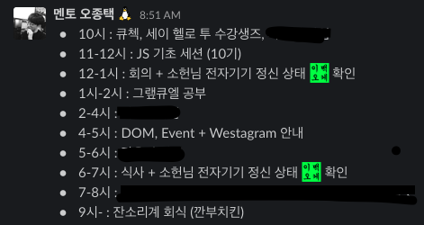

수강생으로 3개월, 하지만 멘토로서 2주차 출근. 아직 흐름 따라잡느라 정신 없지만 정신이 없을 수록 기록을 해둬야 한다는 것은 그간 살아오며 얻어낸 몇 안 되는 통찰 중 하나였다. 아이젠 끝을 빙벽에 박아넣는 등반가의 마음으로 이것저것 흩어놓아보겠다.

1. 일정관리, 시간관리

위코드의 하루, 또 일주일은 숨 가쁘고 정신 없이 흘러간다. 3개월 간의 부트캠프를 거치며 완전한 개발 입문자 취업이 가능한 수준까지 끌어올리는 기간 동안의 일정이 그렇게 녹록하지만은 않다. 수강생 분들의 일정이 타이트하다는 건 그 일정을 준비하는 멘토들의 일정 또한 그렇다는 뜻이다.

확인해야 할 일정과 푸시 알람이 상당했다. 소헌님이 손목에 알람을 받을 목적으로 시계를 차고 다닌다고 한 말이 이해됐다.

동시에 진행되는 일정을 챙겨야 하는 경우도 많다.

예컨대 일정에 없다가 갑자기 생기는 세션이 그렇다. 수강생 분들의 진도와 성향 등을 파악하여 그때 그때 대응해야 하게 되는 경우다.

2. 어디까지 알려줄 것인가, 어떤 방향으로 지도할 것인가
