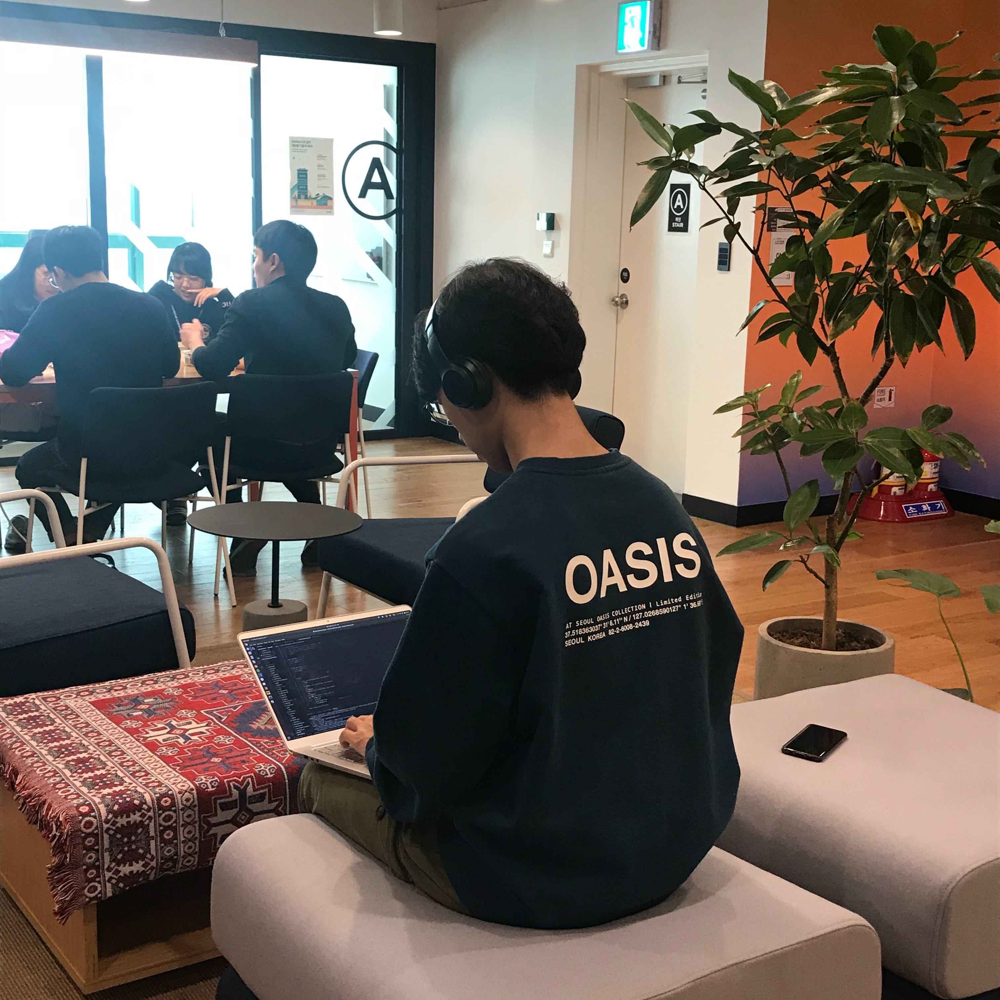

    
    코딩만이 나라에서 허락한 유일한 마약...

 

### 위코드 두달 끝! 기업협업 시작!

위코드에서 보낸 두달. 한달의 foundation, 다시 한달 간 진행된 두 번의 프로젝트가 끝났다. 이제 월요일이면 다시 한달 간의 기업협업이 시작된다.

농담 삼아 "이미 재가 되었지만 그 남은 재라도 태워야할 상황"이라고는 했지만 정말정말정말 힘들었다. 오늘 하루는 14시간 동안 잠만 잤다. 곧장 새로운 공부를 하기는 지쳤기도 하고 지난 시간들에 대한 회고가 필요할거 같아 간단한 기록을 남겨보려 한다.

### 왜 나는 그토록 헛된 시간을...

나는 긴 시간동안 언론 지망생이었다. 대학을 다니며 책을 읽으며 글을 썼고, 신문을 공부했다. 인턴 경험도 있었고, 업계의 유명한 선배들로부터 교육을 받으며 동료들과 새로운 언론에 대한 고민을 나누기도 했다. 지난해에는 작은 매체였지만 기자 명함을 갖고서 산업계 현장을 누비며 자부심을 느끼기도 했다.

하지만 지금은 개발자가 되기 위해 공부하고 있다. '기자 같은 건 그만 두고 개발자나 하라'는 말이 공공연히 돌아다녔다고는 했지만 퇴사는 갑작스러웠다. 회사 선배도, 부모님도 적잖은 충격을 받았던 것 같다. 친구들은 물론 "잘 어울린다"며 응원을 해주었지만 사실 나조차도 내가 왜 이렇게 급작스레 20대 대부분의 시간을 쏟은 공부를 내던지고 개발자의 삶을 원하게 됐는지 이해가 잘 가지 않았다.

되짚어보면 어쩌면 나는 도망치는 중이었는지도 모른다. 체면이나 기대 같은 것들. 내가 진정으로 원치 않았던 것들에 나의 인생을 맞춰야 했던 데서 오는 피로감 같은 것들로부터.

사실 중학생 때부터 나는 막연히 '프로그래머'가 되지 않을까 생각해왔다. 비주얼베이직6.0 책을 처음 사보고, 잠들기 전까지 어떻게 하면 소켓 통신을 할 수 있을지, 일대일 채팅을 어떻게 하면 다대다 채팅으로 바꿀 수 있을지를 고민했다.

그러나 정작 문과를 선택했고 성적에 맞춰 신문방송학을 전공하게 됐다. 신문방송학과 경영학 모두 재미있게 공부했지만 그것들이 내 안에 불을 붙이거나 움직이게 하진 못했던 것 같다. 적당히 공부를 좋아했고 그래서 적당히 괜찮은 성적을 받았으나 내 안엔 언제나 잔상 같은 불만이 따라다녔다.

### 내가 책임져야 할 내 인생을 위해

고등학교에서 만난 일겸이라는 친구가 있다. 그 친구는 지금 음악을 하고 있다. 원래 꿈꾸는 방식은 아니었겠지만 지금은 나름의 방식으로 꽤 자리를 잡은 것처럼 보인다. 그는 고등학생 일때부터 자신이 원하는 미래를 갖기 위해 부모님과 싸웠고, 설득시켰고, 끝내 자신의 방식을 증명했다.

내게 부족한 건 그런 것들이었다. 아무래도 좋다는 식으로 내 삶을 남의 삶인 듯 흘러왔던 시간들. 내 것이지도 못했지만 그렇다고 공무원이 되라는 부모님의 기대에 맞춘 것도 아닌 어정쩡한 시간들을 책임지려 하지 않았다. 내 것이 아닌 삶에 진정성을 가질 수도, 일말의 성취감을 느낄 수도 없었다.

지난 두달 간 나는 과히 성취감에 절어있었다고 해도 좋을 정도의 기분으로 살았다. HTML, CSS, JavaScript, React, Git, Next.js, Redux 등등 다양하면서도 하나 같이 새로운 지식을 익혔다. 매일 매일이 새로운 날들이었다. 좀체 스스로를 칭찬할 줄 모르던 나였기에 이런 기분은 더더욱 반가웠다.

잘 해왔지만 앞으로는 더 잘해야 한다. 가르쳐 주는 것을 받아 먹는 게 아니라 뭘 어떻게 배워나가야 할지 스스로 찾아가며 성장해야 해야 할 날들이 더 많다. 이곳에서 만난 동기들과 멘토분들이 앞으로도 함께 해주시리라 믿는다.
