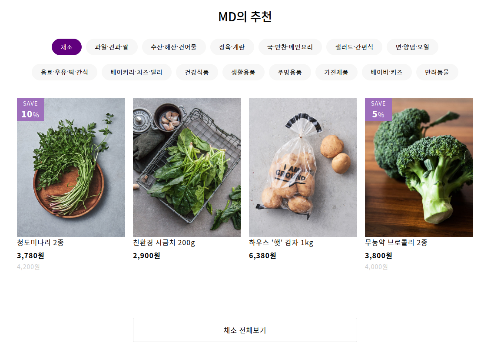

이번 포스트에서는 API를 사용한 통신이 버튼을 누를 때마다 발생하도록 하는 방법을 설명한다.

결과물은 다음과 같다. 카테고리가 있고, 해당 카테고리를 누를 때 하단에 표시되는 아이템들이 바뀐다. 버튼과 아이템 모두 마켓컬리에서 사용하는 API를 사용했다.

<div align="center"></div>

React에서 fetch를 사용한 API 통신은 기본적으로 componentDidMount에서 이뤄지게 된다. 비동기처리 문제 때문에 API 요청에 대한 응답이 오지 않아 빈 화면을 보여줄 수 있기 때문이다. 또한 setState는 render단에서 사용하면 무한 콜스택 문제에 빠지게 된다. 따라서 API 통신을 한다면 기본적으로 다음과 같은 형태가 될 것이다.

```jsx
componentDidMount() {
fetch(
    `https://api.kurly.com/v2/home/recommendation`
) //API 주소
    .then(res => {
    return res.json();
    })
    .then(res =>
    this.setState({
        data: res.data["products"].filter(item => item !== undefined)
    })
    );
};
```

다만 이렇게 되면 매번 필요할 때마다 API를 새로 불러다 쓰는게 아니라 컴포넌트가 그려졌을 때만 API를 호출하게 된다.

그래서 페이지가 불러 질 때는 초기값만 주고 이후에는 onClick 이벤트에 API를 호출할 수 있도록 바꿔줘야 한다.

```jsx
componentDidMount() {
  this._getMdApi(907);
}

_getMdApi = num => {
  fetch(
    `https://api.kurly.com/v2/home/recommendation/md_choice/categories/${num}`
  ) //API 주소를 변수로 넘겨줄 수 있도록 `${변수}`를 사용했다
  .then(res => {
    return res.json();
  })
  .then(res =>
    this.setState({
      data: res.data["products"].filter(item => item !== undefined)
      })
  );
};

_mdClick = e => {
	this.setState({
		mdButtonSelect: Number(e.target.id.split(".")[1]),
		mdButtonValue: e.target.textContent
	}); //id값을 활용해 클릭한 버튼의 순서와 API에 넘겨줄 카테고리 번호를 읽어옴
	this._getMdApi(Number(e.target.id.split(".")[0]));
};

const categoryList = categories // categories가 유효하면(true, 즉 undefined나 null 등 false가 아니면)
	? categories.map((param, idx) => {
		return (
			<button
				key={idx}
				style={
					idx === this.state.mdButtonSelect
						? this.state.buttonStyle
						: null
				}
				className="md-cate-button"
				id={param["no"] + "." + idx}
				onClick={this._mdClick}
				>
				{param["name"]}
			</button>
		);
		})
	: null;
```
