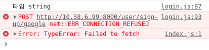

### 실수 1 : token을 보낼 때는 Authorization

```javascript
const GoogleApiPOST = token => {
  const myHeaders = new Headers()
  myHeaders.append('Content-Type', 'application/json')
  myHeaders.append('Authorization', token)
  fetch('http://10.58.6.99:8000/user/sign-up/google', {
    method: 'POST',
    headers: myHeaders,
  })
    .then(res => res.json())
    .then(res => console.log('Success:', JSON.stringify(res)))
    .catch(error => console.error('Error:', error))
}
```

프로젝트 막판에 어이 없는 실수 때문에 발목이 잡혔다. 완성했다고 생각했던 구글 로그인 기능이 작동하지 않았다. 처음에는 구글 서버로부터 토큰을 받아오지 못해서 문제였는데, 이번엔 구글 토큰은 받아왔는데 그 받아온 토큰을 백엔드 서버에 POST 하지 못했다.

<div align="center">
    
    <br>으으...
</div>로

에러 메시지는 매번 달랐는데, 종종 [CORS(Cross-Origin Resource Sharing)](https://developer.mozilla.org/ko/docs/Web/HTTP/CORS) 오류를 가리키기도 했다. 게다가 분명 POST로 보냈는데 서버 측에서는 method로 자꾸 OPTIONS로 response가 떴.

하지만 결국 문제는 key 값을 잘못 넣었던 것. 키값이 id_token이라길래 {"id_token" : token}처럼 넣었는데 그냥 {"Authorization" : token}으로 했어야 했다. 급하다보니 미처 못보고 넘어간 단순 실수.

### 실수 2. 홍철 없는 홍철팀, 리턴 없는 if문

```scss
const ProgressDiv = styled.div`
  height: 2px;
  background-color: #ccc;
  /* padding: 10px 0; */
  position: absolute;
  top: 23px;

  ${props => {
    return props.offsetX // 여기!
      ? css`
          width: ${props.offsetX + "px"};
          background-color: #f50;
          z-index: 1000;
        `
      : css`width: 472px;`
  }}
`;
```

사운드클라우드 하단 프로그래스바를 만드는 중이었다. 역시 시간에 쫓겨 급히 만들고 있는 와중에 어이 없는 실수를 했는데...

컴포넌트에 offsetX라는 props를 넘겨주고 해당 값에 따라 div의 width 값을 조절하는 기능을 구현하는 중이었다. 하지만 console에 아무리 찍어봐도 props 값은 제대로 넘어가고 있는데 div의 width 값이 바뀌지 않았다.

이번에도 결국 문제는 단순 문법 실수. arrow function의 축약형 문제로 return을 적어주지 않아 조건이 맞게 들어갔음에도 졸지에 return 없는 조건문이 되었던 것이다.

한줄짜리 함수인 경우에는 중괄호와 return을 생략할 수 있지만, 그렇지 않을 경우에는 반드시 넣어주어야 한다.

### 실수 3. nth-child(n) vs nth-of-type(n)

```scss
span {
  display: inline-block;
  font-size: 12px;

  &:nth-child(2) {
    color: #333;
  }
  &:nth-child(4) {
    color: #999;
  }
`;
```

스타일드 컴포넌트를 사용하면서 특정 요소들에만 스타일링을 해야할 상황이 있었다. 이런 상황을 가정해보자. div 태그 아래 span, button, span, button, span 태그가 순서대로 나열되어 있다고 하자. 그리고 나는 그 중 1, 3, 5번째 요소인 span 태그에만 스타일을 주고 싶은 상황이다.

그러면 nth-child(2n-1)을 하면 되지 않을까? 물론 그렇지만...

불운하게도 2번째 자리에 button 태그가 하나 더 들어갔다면? 2n-1은 더 이상 맞지 않는 규칙이 된다.

이 경우에는 `span:nth-of-type(1)`같은 식으로 nth-of-type을 사용하면 된다.
