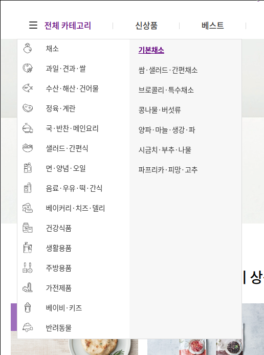

1차 프로젝트 발표 중 기억에 남았던 표현이 있었다. 소헌님이 "기억하고 싶은 코드"라는 표현을 썼는데 꽤 마음에 들었다. 하루하루 구현해야 할 기능을 쳐내느라 바쁜 와중에도 마음에 담아두고 싶은 코드는 있기 마련이니까.

하지만 이런 코드들도 특별히 기록해 두지 않으면 기억 저편으로 사라지고 말 것이다. 그래서 1차 프로젝트에서 내가 작성한 코드 중 따로 기억하고 싶은 코드를 몇 편에 나눠 적어보려고 한다.

첫번째는 나를 겁나 애먹였던 + 맵(map)돌이라는 별명을 남겨줬던 마켓컬리 네비게이션 바의 2단 호버 기능이다. (리팩토링이 안된 와중에 코드를 공개적으로 올리는 게 수치스럽긴 하지만...)

<br>

<div align="center">
    
</div>

<br>

처음엔 CSS의 :hover를 사용하려고 했는데 그런식으로는 호버 이후 2차 카테고리에 관련된 이벤트를 처리할 수 없어서 거의 다 만들어놓고 한번 폐기했다 ㅠ

완성된 코드의 동작 단계는 다음과 같다.

- "전체 카테고리"에 커서가 올라가면 div0의 display를 none에서 block으로 바꾼다. 그리고 1차 카테고리에 커서가 올라가면 영역(2차 카테고리가 들어갈 자리)을 오른쪽으로 펼치기 위해 width를 함께 넓혀준다.

- div 태그에 onMouseEnter, onMouseLeave라는 이벤트를 달고 각각의 이벤트에 visible이라는 메소드를 연결했다. 각각의 visible 명령이 넘어오는 위치를 구분하기 위해 이름과 인덱스를 각각 인자로 넘겨줬다.

```jsx
<div
  className="category-listdown-depth0"
  onMouseEnter={() => this._visible('cate', 1)}
  onMouseLeave={() => this._visible('cate', 1)}
  style={{
    display: visibleCategory0 ? 'block' : 'none',
    width: visibleCategory1 ? '438px' && null
  }}
>
```

- 다음은 그 아래 실제 내용(1차, 2차 카테고리)이 들어갈 ul 태그다. 역시 1차 카테고리에 커서가 올라오면(visibleCategory1라는 state가 true가 되면) 2차 카테고리가 출력될 자리를 위해 width를 넓혀준다.

- 카테고리 목록을 보여주는 방식은 매번 map 함수를 사용해 state의 저장된 데이터를 가공해 보여준다. 1차 카테고리를 먼저 map으로 뿌리고, 커서가 갔을 때 커서가 올라간 li 태그의 인덱스를 읽어서 그 인덱스(1차 카테고리)에 해당하는 2차 카테고리를 다시 한번 맵으로 뿌려준다.

```jsx
  <div style={{ width: visibleCategory1 ? '438px' && null }}>
    <ul className="category-listdown-depth1">
      {data.categories
        ? this._liCategoryListdown(
            data.categories.map((param, _) => {
              return [param['name'], param['categories']]
            })
          )
        : null}
    </ul>
    <ul
      style={{ display: visibleCategory1 && 'flex' }}
      className="category-listdown-depth2"
    >
      {dataDepth2.map((param, idx) => (
        <li>
          <span>{param["name"]}</span>
        </li>
      ))}
    </ul>
  </div>
</div>
```

- 카테고리 호버 여부를 판단하는 메소드다. 이벤트가 들어올 때마다 인덱스 값을 읽어서 boolean 값을 토글해준다.

```jsx
_visible = idx => {
  switch (idx) {
    case 0:
      this.setState({
        visibleCategory0: !this.state.visibleCategory0,
      })
      break
    case 1:
      this.setState({
        visibleCategory1: !this.state.visibleCategory1,
      })
      break
    default:
      console.log('visible')
  }
}
```

- 마우스 이벤트가 인식 되었을 때 카테고리 목록을 그려주는 부분이다. map이 돌 때마다 1차 카테고리(채소) 안에 있는 2차 카테고리 목록(기본채소, 쌈 샐러드 간편채소...)을 읽어서 dataDepth2라는 state에 저장해주고, 화면에는 이 state를 출력했다. setState를 render 바깥에 심는게 은근 머리 아픈 일이었다.

```jsx
_liCategoryListdown = paramArr => {
  let liCateListdown = []

  liCateListdown =
    paramArr &&
    paramArr.map((param1, idx) => {
      return (
        <li
          key={idx}
          onMouseEnter={() => {
            this._visible('cate', 2)
            this._liCategoryListdown2(param1[1])
          }}
          onMouseLeave={() => {
            this._visible('cate', 2)
            this._liCategoryListdown2(param1[1])
          }}
        >
          <div>
            
            <span>{param1[0]}</span>
          </div>
        </li>
      )
    })
  return liCateListdown
}

_liCategoryListdown2 = arr => {
  this.setState({ dataDepth2: arr })
}
```
