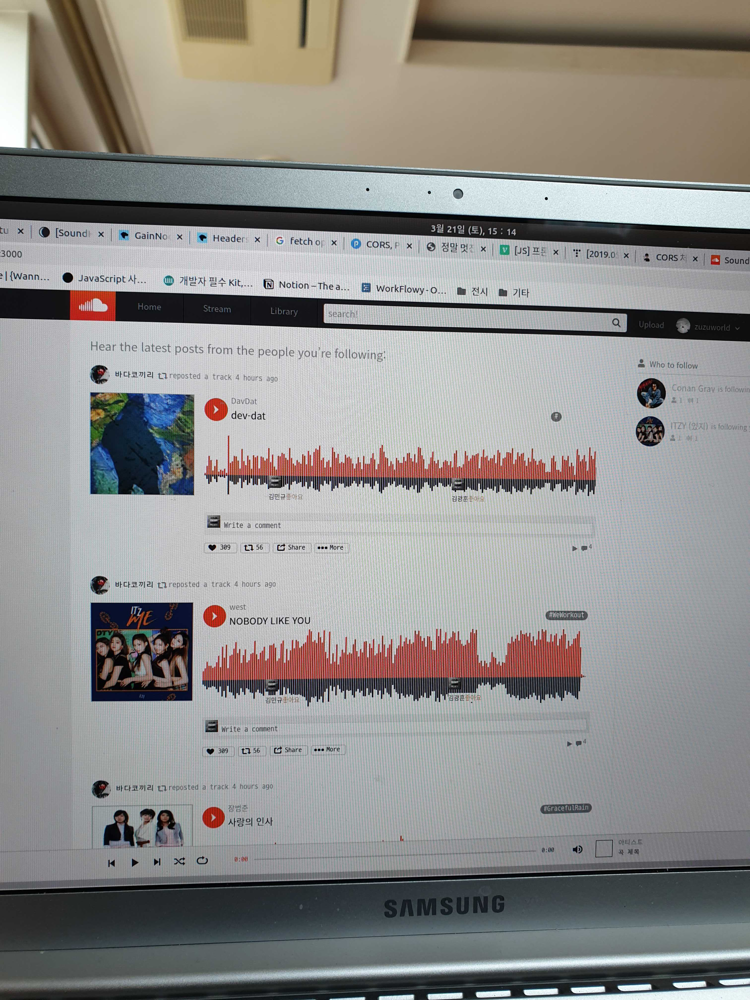
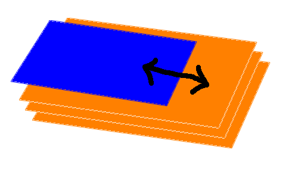

### 1. 파형 모양의 따라오는 프로그래스바

<div align="center">
    
    <br> 백엔드 서버가 안열려서 일단 이렇게...
</div>

<br>

[지난 번 포스팅](https://saengmotmi.netlify.com/development/%EC%82%AC%EC%9A%B4%EB%93%9C-%ED%81%B4%EB%9D%BC%EC%9A%B0%EB%93%9C-visualizer/)에서는 visualizer에 파장을 그리는 법에 대해 간단히 적었다. 다만 이 방식으로는 실제 사운드 클라우드 처럼 파형 모양 그대로 색칠되는 것이 아니라 박스 형태로 영역이 칠해지게 된다.

이번 포스트에서는 마우스 움직임이나 곡 진행 상황에 따라 파형 모양으로 프로그래스바가 채워지는 것에 대해 설명한다.

<div align="center">
    
    <br> 아앗 그림이...
</div>

일단 3개의 canvas 태그를 미리 그려 놓고 필요에 따라 길이를 조절하며 보여준다는 것이 기본 아이디어다. 마우스를 따라오는 파형(1)과 곡의 진행 사항을 나타내는 파형(2)는 overflow 속성에 hidden이 주어진 div에 끼워 width 값에 따라 보여지는 부분을 다르게 한다.

이렇게 하는 이유는 1) canvas 태그에 그림을 일단 그려놓고 width 값을 변화시키면 그림이 뭉개지기 때문이고 2) 그냥 미리 그려놓고 보이는 부분만 변화시킨다는 아이디어가 직관적으로 느껴졌기 때문이다. 말로 하니까 길어지는데 코드로 보면 좀 나을지도 모르겠다.

```html
<CanvasContainer>
  <Canvas posId="wave-top" onMouseMove={onCanvasMove} onClick={event =>
  onCanvasClick(event, "top")} width="640" height="80" ref={canvasRefTop} />
  <Canvas posId="wave-bot" onMouseMove={onCanvasMove} onClick={event =>
  onCanvasClick(event, "bot")} width="640" height="60" ref={canvasRefBot} />
  <OverDivWrapper isPlay="{count}" mouseOn="y" widthProps="{`${canvasWidth}`}">
    <OverDiv ref="{canvasRefOver2}" width="640" height="80" />
  </OverDivWrapper>
  <OverDivWrapper mouseOn="n" widthProps다="{`${canvasWidth}`}">
    <OverDiv ref="{canvasRefOver1}" width="640" height="80" />
  </OverDivWrapper>
  {commentArr}
</CanvasContainer>
```

```scss
const OverDiv = styled.canvas`
  position: absolute;
  top: 0;
  left: 0;
  width: 640px;
  height: 80px;
`;

const OverDivWrapper = styled.div`
  position: absolute;
  top: 0;
  left: 0;
  width: ${props => {
    if (props.mouseOn === "y") {
      return props.isPlay;
    }
    if (props.mouseOn === "n") {
      return props.widthProps;
    }
  }}px;
  height: 80px;
  overflow: hidden;
  background-color: transparent;다
  z-index: ${props => (props.mouseOn === "y" ? 5 : 6)};
`;
```

상단의 canvas 태그 두 개는 각각 파형의 윗부분(주황)과 아랫부분(검정)을 나타낸 것이다. OverDivWrapper와 OverDiv가 앞서 설명한 canvas와 이를 감싸고 있는 div다.

### 2. useEffect + setInterval

별거 아닌데 Hooks를 처음 쓰다 보니 좀 헤멨던 부분이다. 헷갈렸던 이유는 useEffect의 동작 순서도 헷갈리는데 거기에 setInterval의 구독과 제거 타이밍까지 섞였던 탓이다.

```jsx
// 음악 재생
useEffect(() => {
  let wavePlay

  if (play === currentMusicNum && isPlaying && !isPause) {
    wavePlay = setInterval(() => {
      setCount(count + interval / 5)
    }, 200)
  } else if (play !== currentMusicNum || isPause || count >= 640) {
    clearInterval(wavePlay)
    setCanvasWidth(0)
    setCount(0)

    if (count >= 640) {
      getMusicApi(play - 1, 0)
    }
  }
  return () => {
    clearInterval(wavePlay)
  } // count는 초기화 되지 않음
}, [count, isPlaying, isPause])
```

- useEffect의 두번째 인자인 배열 안에는 useEffect 함수 안에서 변화를 지켜볼 변수들을 넣어줘야 한다. 그렇지 않으면 useEffect가 발동되어도 변수의 변화를 반영하지 못해 0 + 1 => 0 => 0 + 1 => 0 ... 무한 루프를 돌 수 있다.

- 처음에 `let wavePlay;`라고 쓴건 변수의 scope 때문이다. 만일 playing 상태가 아니거나 pause 상태라면 프로그래스바의 진행을 멈춰줘야 한다. 그 말인 즉슨 setInterval 함수의 구독을 제거하겠다는 뜻이므로 clearInterval()에 해당 setInterval의 변수명을 넣어 주어야 한다는 뜻이다.

  하지만 조건문을 추가하고 그 안쪽에서 변수를 선언할 경우 scope 문제로 useEffect()의 클린업 함수에서 setInterval을 구독 해제할 수 없게 된다. 그래서 바깥 쪽에 미리 선언만 해둔 것이다.
