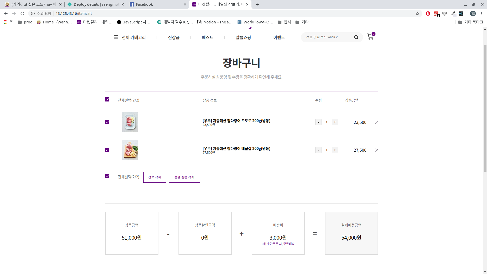

리액트의 state와 setState, 그리고 불변성 유지라는 개념에 아직도 그렇게까지 익숙하지는 않다. 그래도 이번 프로젝트를 하면서 조금 더 익숙해졌는데 그 계기는 바로 장바구니 페이지 였다.

<br>

<div style="display: flex; justify-content: center;">
    
</div>

<br>

장바구니에서는 담긴 품목들의 개수를 각기 조절할 수 있다. 개수가 담긴 데이터는 state에 담아 관리해야 한다.

하지만 문제는 이 state라는 것이 여기 한군데만 쓰이는게 아니라 같은 페이지의 여러 곳에서 쓰였기 때문에 상품과의 연관성을 잃어서는 안됐다. 객체 형태로 데이터를 계속 수정해가면서 관리해야 했다는 뜻이다.

그래서 처음엔 nested 된 state 구조에 접근해 하나하나 바꾸는 방법을 찾았다. 하지만 결국 알게된 것은 리액트는 state가 nested 된 상태 자체를 권장하지 않는다는 사실 뿐이었다.

```jsx
_itemCount = e => {
  const editTargetIdx = e.target.id.split('.')[0] // number
  const editTarget = this.state.itemList[editTargetIdx] // object

  const tempArr = [...this.state.itemList]
  const tempObj = { ...editTarget }

  if (e.target.textContent === '+' && tempObj.ea < tempObj.max_ea) {
    tempObj.ea = tempObj.ea + 1
    tempArr[editTargetIdx] = tempObj

    this.setState({ itemList: tempArr })
  } else if (e.target.textContent === '-' && tempObj.ea > tempObj.min_ea) {
    tempObj.ea = tempObj.ea - 1
    tempArr[editTargetIdx] = tempObj

    this.setState({ itemList: tempArr })
  }
}
```

결국 승현님께서 위와 같이 state를 불러온 뒤 새 배열과 객체에 복사, 수정 후 그 결과물을 통째로 setState 하는 방식을 알려주셨다. state에 직접 접근하여 수정하는 건 안되지만 연산이 끝난 데이터를 통으로 덮어쓰는 방식은 가능하다.

이러한 방식을 사용하면 불변성을 유지하면서도 nested 된 형식의 데이터를 state에서 다룰 수 있다. 전개연산자나 concat()을 사용하면 쉽게 새 배열, 객체를 만들 수 있다는 사실을 기억해두면 좋겠다.
