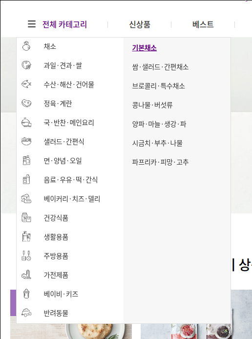
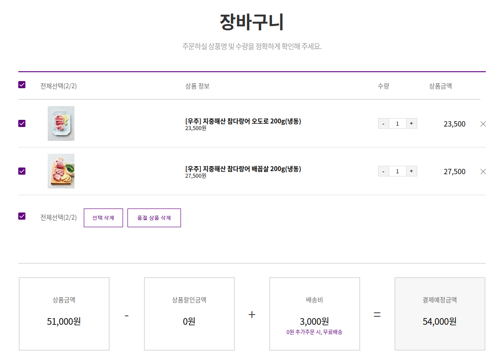

### 1. 프로젝트 소개

<iframe width="560" height="315" src="https://www.youtube.com/embed/k5k7bzLEmSM" frameborder="0" allow="accelerometer; autoplay; encrypted-media; gyroscope; picture-in-picture" allowfullscreen></iframe>

#### 1) 주제 📑

- 신선식품 새벽배송서비스 마켓컬리 웹사이트 클로닝 프로젝트 🌾👩🏻‍🌾🌾👨🏻‍🌾🌾
- React.js를 사용한 첫 번째 팀 프로젝트이자 Git을 사용한 첫 번째 협업 경험

#### 2) 구성원 👩‍💻👨‍💻

- 프론트엔드 3명, 백엔드 2명

#### 3) 기간 📆

- 2020.02.24 ~ 2020.03.07 (12일간)

### 2. 적용 기술 🛠

- React.js(Class형 컴포넌트), JavaScript(ES6), SASS, Git, Slick.js

### 3. 사이트 주요 기능

다음은 사이트 주요 기능이다.

직접 구현한 기능은 ✔️, 팀원이 구현한 기능은 ✅로 표시했다.

#### 1) 📃 회원가입 / 로그인 페이지

- ✅ 이메일 및 패스워드 양식 확인 기능 (이메일 및 아이디 중복 확인)
- ✔️ 로그인/로그아웃 기능 (sessionStorage)

#### 2) 📃 메인 페이지 / 이벤트용 메인 페이지

- ✔️ 검색 기능
- ✔️ Carousel 기능(Slick.js, CSS)
- ✔️ 네비게이션 바 호버 시 펼쳐지는 2-Depth(대분류/소분류) 드롭다운 메뉴
- ✔️ Scroll 위치를 따라다니는 사이드바
- ✅ Scroll 위치에 따라 생기는 애니메이션

#### 3) 📃 상품 목록 페이지 / 상품 상세 페이지

- ✔️ Pagination
- ✔️ 상세 페이지 동적 라우팅 및 html 삽입
- ✔️ 장바구니 담기 버튼 클릭시 장바구니 목록에 추가

#### 4) 📃 장바구니 페이지 / 주문서 페이지 / 주문내역 페이지

- ✔️ 체크박스, 가격 및 수량 카운트, 삭제 등 기능
- ✅ Daum PostCode API를 활용하여 주소 검색 기능
- ✔️ 결제 완료시 주문내역 리스트에 상품 추가

#### 💡 담당한 기능 :

- **Nav 바** : 마우스 호버 시 펼쳐지는 드롭다운 메뉴
- **장바구니** : 체크박스, 가격 및 수량 카운트, 삭제 등 기능
- **메인 페이지** : 슬라이드와 백엔드에서 수신한 데이터에 맞게 조건부 렌더링되는 컴포넌트

상하단 `Nav 바`, `Footer`, `메인페이지` 및 `장바구니`를 주로 담당하고 그 외 필요한 부분(토큰 관련 기능, 페이지네이션, 동적 라우팅 등)에 추가 작업을 진행했다.

### 4. 기록하고 싶은 코드

#### 1) 2020-03-07 (기억하고 싶은 코드) nav 바 2단 호버 ([링크](<https://saengmotmi.netlify.app/development/(%EA%B8%B0%EC%96%B5%ED%95%98%EA%B3%A0-%EC%8B%B6%EC%9D%80-%EC%BD%94%EB%93%9C)-nav-%EB%B0%94-2%EB%8B%A8-%ED%98%B8%EB%B2%84/>))

<br>

<div align="center">
    
</div>

<br>

#### 2) 2020-03-08 (기억하고 싶은 코드) 장바구니 상품 개수 증감 버튼 ([링크](<https://saengmotmi.netlify.app/development/(%EA%B8%B0%EC%96%B5%ED%95%98%EA%B3%A0-%EC%8B%B6%EC%9D%80-%EC%BD%94%EB%93%9C)-%EC%9E%A5%EB%B0%94%EA%B5%AC%EB%8B%88-%EC%83%81%ED%92%88-%EA%B0%9C%EC%88%98-%EC%A6%9D%EA%B0%90-%EB%B2%84%ED%8A%BC/>))

<br>

<div align="center">
    
</div>

<br>

#### 3) 2020-04-21 마켓컬리 클로닝 추가 작업 전 리팩토링 중 ([링크](https://saengmotmi.netlify.app/development/%EB%A7%88%EC%BC%93%EC%BB%AC%EB%A6%AC-%ED%81%B4%EB%A1%9C%EB%8B%9D-%EC%B6%94%EA%B0%80-%EC%9E%91%EC%97%85-%EC%A0%84-%EB%A6%AC%ED%8C%A9%ED%86%A0%EB%A7%81-%EC%A4%91/))

```jsx
renderProducts = (
  title,
  products,
  events,
  categories,
  data,
  mdButtonSelect,
  mdButtonValue,
  recipes,
  reviews,
  moveX
) => {
  // highlight-next-line
  const title_table = {
    '이 상품 어때요?': 1,
    '알뜰 상품': 1,
    '오늘의 신상품': 1,
    '지금 가장 핫한 상품': 1,
    '3천원의 행복': 1,
    '이벤트 소식': 2,
    'MD의 추천': 3,
    '컬리의 레시피': 4,
    '인스타그램 고객 후기': 5,
  }

  // highlight-next-line
  switch (title_table[title]) {
    case 1:
      return <Recommend title={title} products={products} /> // highlight-line
    case 2:
      return <EventProduct title={title} events={events} />
    case 3:
      return (
        <MdProducts
          title={title}
          categories={categories}
          data={data}
          mdButtonSelect={mdButtonSelect}
          mdButtonValue={mdButtonValue}
          mdClick={this.mdClick}
        />
      )
    case 4:
      return <RecipeProducts title={title} recipes={recipes} />
    case 5:
      return <InstaPictures title={title} reviews={reviews} moveX={moveX} />
    default:
      break
  }
}
```

### 5. 느낀 점

#### 1) 잘한 점 🙆🏻🙆🏻‍♂️

커머스 웹사이트에서 필요한 기본적인 기능을 대부분 다뤄봤다는 점에서 성취감을 느꼈다.

컴포넌트를 재활용해 서로 다른 상품을 표시하거나, 상품 목록을 슬라이드로 구현하거나, 페이지네이션, 토큰을 이용한 로그인/로그아웃, 장바구니 등등 다양한 기능을 구현했다. 다음에는 이 경험을 토대 삼아 더 나은 방식의 구현 방법을 고민해볼 수 있게 됐다.

특히 장바구니 기능을 구현해볼 수 있어서 좋았다. 체크박스나 상품의 증감 등을 표현하기 위해서 직접 DOM으로 접근했으면 편했을 텐데 리액트의 `State`를 사용하는 방법을 떠올려야 했기 때문에 어려움을 느꼈다.

처음엔 어떤 걸 상태값으로 관리해야 할지도 감이 잘 오지 않았고, 조건이 추가 될 때마다 State를 마구잡이로 추가하다보니 로직의 길이와 복잡도가 불필요하게 상승했다.

`불변성(Immutability)`이라는 개념도 어색했다. nested 돼있는 데이터를 수정하기 위해 spread 연산자와 setState를 적절히 사용했어야 했는데 역시 이해가 쉽지 않았다. 하지만 결국 허들을 넘었고, 기능을 구현했기 때문에 다음에 구현한다면 더 효과적인 구성을 고민해볼 수 있겠다는 자신감이 생겼다.

상품을 보여주는 슬라이드를 CSS와 `Slick` 라이브러리, 두 가지 방식으로 구현해본 것도 좋았다. 특히 라이브러리는 처음 써봤는데 커스텀 하기 위해 documenation을 읽고 뜯어 수정해보면서 직접 구현하는 방법과의 차이를 느낄 수 있었다.

백엔드 팀원이 작성한 Postman API Documentation을 읽으며 다양한 형태의 `fetch` 요청을 경험해보기도 했다. 패스 파라미터와 쿼리 스트링을 parsing 해 변수로 관리하며 해당 값이 업데이트 될 때 `componentDidUpdate` 라이프사이클을 사용해 화면을 변화시키는 기능을 구현했다.

#### 2) 아쉬운 점 🙅🏻🙅🏻‍♂️

비주얼적으로 화려한 애니메이션을 구현해볼 기회를 갖지 못한 점이 아쉬웠다. 프론트엔드 개발자라면 눈에 보이는 부분을 자유자재로 다룰 수 있도록 노력해야 한다고 생각한다. 그 점에서 `transition`, `animation` 등의 CSS 속성을 손에 익을 정도로 사용해보지 못한 아쉬움이있다. 반응형 또한 일부라도 구현해보고 싶었는데 일정 상 포기할 수 밖에 없었다.

팀원 간의 소통도 아쉬웠다. Git 충돌로 인한 이슈는 거의 없었던 편이나, 각자 담당한 기능 파트에만 집중한 느낌이었다. 유기적인 팀워크를 발휘하기 위해 헤드 역할을 담당할 사람이 필요했는데 서로 리더십을 발휘하지 못했던 것 같다.

매주 스프린트와, 매일 스탠드업 미팅을 하며 진도를 체크했지만 각자 처음 구현해보는 기능의 생소함에 파묻혀 의도한 진도를 지키지 못하는 경우가 허다했다. 이 경우 각자의 workload를 체크하고 계획을 유동적으로 수정해나갔어야 했는데 그렇게 하지 못했다.

향후 프로젝트에서는 위에서 느낀 아쉬운 점을 보완해 프로젝트를 더욱 원활히 진행할 수 있는 방안을 고민해보려 한다.
