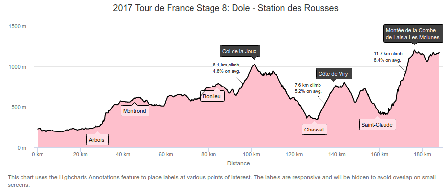
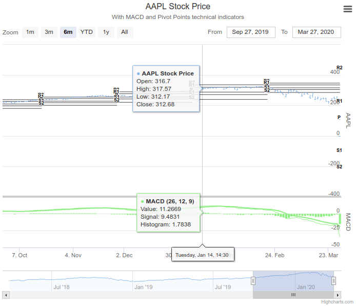

### 1. 하이차트 Annotations

<div align="center">
  
</div>

<br>

이번 기업협업에서 구현할 서비스의 대부분이 차트로 구성되어 있기 때문에 일단은 차트 라이브러리에 익숙해지는 시간이 필요한 상황이다. 일단 형민님이 사용해본 경험이 있는 하이차트를 사용하기로 했고 라이브러리의 Docummenation을 열심히 보고 따라하기로 했다.

여러 가지 차트 모양 중 [Annotations](https://www.highcharts.com/docs/advanced-chart-features/annotations-module)를 화면에 띄워보는 걸로 시작하기로 했다.

하이차트에는 다양한 속성이 존재하고 내가 원하는 형태에 맞게 타입을 넣어주는 형태다. 예를 들면 다음과 같은 형태다.

```jsx

this.state = {
  data: {
    chart: {
      ...
    },

    caption: {
      ...
    },

    series, [
      data: [
        ...
      ]
    ]
  }
}

...
<HighchartsReact
  highchart={Highcharts}
  options={data}
></HighchartsReact>
```

문서를 보니 Annotations 속성의 핵심 컨셉은 배열 아래 여러 개의 아이템이 객체로 있는 형태인 듯 하다.

```javascript
annotations: [{
  labels: [{
    point: { x: 0, y: 0 },
    text: ‘Label’
  }]
}]
```

그런데 예제와 똑같은 코드를 복사 붙여넣기 했음에도 불구하고 그래프만 뜨고 말풍선이 뜨지 않았다. 검색해보니 [이런](https://github.com/highcharts/highcharts-react/issues/54) 게시물이 있었고, 다음과 같은 코드를 상단에 추가했다.

```javascript
import Highcharts from 'highcharts'
import AnnotationsModule from 'highcharts/modules/annotations'
import HighchartsReact from 'highcharts-react-official'
AnnotationsModule(Highcharts) //highlight-line
```

기존에는 Highcharts라는 컴포넌트를 임포트 해서 HighchartsReact라는 컴포넌트에 props로 넣어주고 있었다. 그런데 Annoations는 일종의 확장 기능으로서 제공되는 내용인듯 했다.

그래서 [HOC(Higher-Order-Components)](https://ko.reactjs.org/docs/higher-order-components.html)식으로 Highcharts를 AnnotationsModule이라는 컴포넌트로 감싸서 확장시켰더니 말풍선이 정상적으로 나타났다.

HOC는 내가 요즘 좀 더 깊이 공부해보고 싶은 개념 중 하나였으니 빠른 시일 내에 꼭 포스팅 해보는 걸로!

### 2. 서로 다른 데이터를 바인딩 하기

<div align="center">
  
</div>

<br>

하이차트 내에 있는 하이스탁 까지 사용해야 할 수 있어 살펴보고 있다. 위 그림을 보게 되면 서로 다른 데이터가 x축 이동에 따라 y축의 서로 다른 점이 동시에 셀렉트 되고 있다. [공식문서](https://www.highcharts.com/docs/stock/technical-indicator-series)에서는 yAxis Binding이라고 표현하고 있다.

순서는 다음과 같다.

1. y축을 만든다

```javascript
yAxis: [
  {
    // Main series yAxis:
    height: '75%', // y축 1번은 상단의 절반을 차지하고 있음
    resize: {
      enabled: true,
    },
    labels: {
      align: 'right',
      x: -3,
    },
    title: {
      text: 'AAPL',
    },
  },
  {
    top: '75%',
    height: '25%',
    labels: {
      align: 'right',
      x: -3,
    },
    offset: 0,
    title: {
      text: 'MACD',
    },
  },
]
```

2. id를 linkTo로 묶어준다

```javascript
series: [
  {
    type: 'ohlc',
    id: 'aapl', //highlight-line
    name: 'AAPL Stock Price',
    data: data,
    zIndex: 1,
  },
  {
    type: 'pivotpoints',
    // highlight-next-line
    linkedTo: 'aapl', // 위의 series[0]에 들어 있는 id와 series[1]이 linkedTo로 연결 되었다
    zIndex: 0,
    lineWidth: 1,
    dataLabels: {
      overflow: 'none',
      crop: false,
      y: 4,
      style: {
        fontSize: 9,
      },
    },
  },
  {
    type: 'macd',
    //highlight-next-line
    yAxis: 1, // yAxis에 설정한 y축 배열 두개 중  1을 적은 듯 하다
    linkedTo: 'aapl',
  },
]
```
