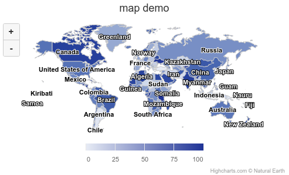
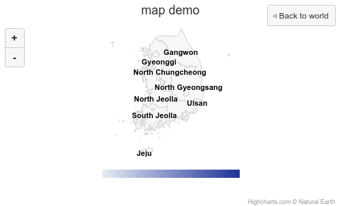

### react에서 highchart map 드릴다운, 업 구현하기

워낙에 제이쿼리로 구현된 자료 밖에 없어서 삽질을 했는데 다 해놓고 나니 별거 없어서 조금 허탈하긴 하다. 일단 아래는 구현이 완료된 화면이다.

<div align="center" width="500"></div>
<div align="center" width="500"></div>

<br>

일단 하이차트에서 map 기능을 사용하기 위해서는 highmaps를 임포트 하거나 highcharts에 maps 모듈을 import 해야 한다. 둘중 어떤 방식을 택하든 상관 없지만 나는 후자의 방식을 선택했다. 나는 drilldown 기능도 써야했기에 drilldown 모듈도 같이 import 했다.

모듈은 HOC로 하이차트에 씌워준다.

```javascript
import HighchartsReact from 'highcharts-react-official'
import highchartsMap from 'highcharts/modules/map'
import drilldown from 'highcharts/modules/drilldown'

highchartsMap(Highcharts)
drilldown(Highcharts)
```

다음은 초기 설정이다. series/mapData, data에 각각 지도와 지도 영역(ex. 행정구역) 별로 올라갈 데이터를 넣어 준다.

그리고 series/event에는 드릴다운 시 실행시킬 함수를 넣어준다. 해당 함수엔 클릭 시 해당 영역이 어디인가에 대한 정보가 담긴 이벤트 객체를 인자로 넘겨준다.

```javascript
this.state = {
  data: {
    chart: {
      width: 500,
      heigth: 300,
    },

    title: {
      text: 'map demo',
    },

    mapNavigation: {
      enabled: true,
    },

    colorAxis: {
      min: 0,
    },

    series: [
      {
        name: 'world',
        mapData: wdMapData, //highlight-line
        data: wdData, //highlight-line
        states: {
          hover: {
            color: '#BADA55',
          },
        },
        dataLabels: {
          enabled: true,
          format: '{point.name}',
        },

        events: {
          click: event => this.drillDownContries(event), //highlight-line
        },
      },
    ],

    drilldown: {
      drillUpButton: {
        relativeTo: 'spacingBox',
        position: {
          y: 0,
          x: 0,
        },
      },
    },
  },
}

render() {
  const { data } = this.state;

  return (
    <HighchartsReact
      constructorType={"mapChart"} //highlight-line
      highcharts={Highcharts}
      options={data}
      ref={(ref) => (this.HighchartsReact = ref)}
    />
  );
}
```

드릴다운 이벤트 함수는 다음과 같이 작성했다.

```javascript
drillDownContries = e => {
  const chart = this.HighchartsReact.chart

  if (e.point['hc-key'] !== null) {
    chart.addSingleSeriesAsDrilldown(e.point, {
      //highlight-line
      name: 'kr',
      mapData: eval(e.point['hc-key'] + 'MapData'), //highlight-line
      data: eval(e.point['hc-key'] + 'Data'), //highlight-line
      states: {
        hover: {
          color: '#BADA55',
        },
      },
      dataLabels: {
        enabled: true,
        format: '{point.name}',
      },
    })
    e.point.doDrilldown() //highlight-line
    chart.applyDrilldown() //highlight-line
  }
}
```

순서는 이렇다.

1. chart 컴포넌트를 ref로 잡아둔다. constructorType도 "mapChart"로 선언해준다.
2. `chart.addSingleSeriesAsDrilldown()`, `e.point.doDrilldown()`, `chart.applyDrilldown()` 메소드를 차례로 실행시킨다.
3. `addsingSeriesAsDrilldown()`의 첫 번째 인자는 드릴다운이 시작될 위치, 즉 e.point(클릭 된 지점)가 되어야 한다. 두번째 인자로는 드릴다운 이후 보여질 지도의 정보가 들어가야 한다.

역시나 다 써놓고 나니 너무 간단해서 허무하지만 숱한 에러와 구글링을 뚫고 기능을 구현한 내 자신에게 소소한 칭찬을 보내본다...
