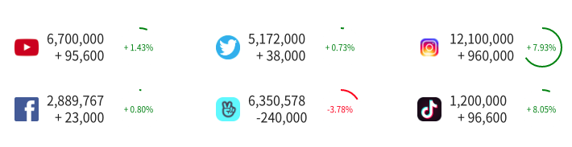
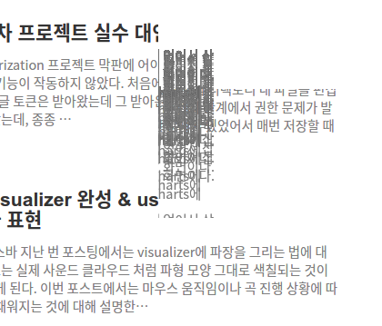

### 1. ES6 문법을 사용한 React 컴포넌트 재활용 (Destructuring, Default Parameter Value, Spreat Operator)

하이차트의 경우 차트를 그려주기 위한 기본 코드의 양이 꽤 되는 편이다. 그래서 차트 모양만 담은 코드를 별도 파일로 저장해두고 필요한 곳에서 import 해서 사용 중이다.

그런데 차트가 들어 있는 컴포넌트를 여러 곳에서 다양한 옵션으로 써야 할 상황이 생겼다. 컴포넌트에 프로퍼티를 주는 것만으로 차트의 타이틀과 가로, 세로, 범례 옵션 등이 변경되는 기능을 추가하고 싶었다.

현재 컴포넌트 계층 구조는 다음과 같다.

> 대시보드 컴포넌트(MainDashBoard.js)
>
> > 차트 컴포넌트(MainChartTop.js)
> >
> > > 차트 옵션 컴포넌트(MainChartTopOptions.js)

나는 차트 컴포넌트에 프로퍼티를 넘겨주고, 차트 컴포넌트는 다시 차트 옵션 컴포넌트에 그 값을 넘겨주는 구조로 변경하기로 했다.

```jsx
/// 대시보드 컴포넌트
<MainChartTop
  height="580"
  legend={{
    align: 'center',
    verticalAlign: 'bottom',
    layout: 'horizontal',
  }}
/>
```

상위 컴포넌트에서 받아오는 프로퍼티 값을 바로 destructuring 했다. 그리고 그 값을 곧바로 차트 옵션의 파라미터에 넣어줬다.

```js
const MainChartTop = ({ width, height, title, legend }) => {
  const [data, setData] = useState(
    MainChartTopOptions(width, height, title, legend) // highlight-line
  );
// 생략
```

차트 옵션 컴포넌트에서는 default parameter value를 사용해 프로퍼티 값이 들어오지 않을 경우에 차트가 어떤 값을 가지게 될 것인지를 지정해줬다.

```js
export const MainChartTopOptions = (
  width, // highlight-start
  height,
  title = "title",
  legend = {
    align: "center",
    verticalAlign: "bottom",
    layout: "horizontal",
  } // highlight-end
) => {
  return {
    chart: {
      width: width,
      height: height,
      backgroundColor: "rgba(255,255,255,0.5)",
      zoomType: "x",
    },

    title: {
      text: title,
    },

    rangeSelector: {
      selected: 1,
    },

    legend: {
      align: legend.align,
      verticalAlign: legend.verticalAlign,
      layout: legend.layout,
    },
// 생략
```

spread 연산자를 사용하면 다음과 같은 활용도 가능하다.

```jsx
const chartOption = { width: '400', height: '300' }
<MainSocialPie socialData={socialData} {...chartOption} />
```

```jsx
const MainSocialPie = ({ socialData, width, height }) => {
  const [data, setData] = useState(MainSocialPieOptions(width, height));
// 생략
```

<br>

### 2. Canvas 태그로 부채꼴 그리기

<br>

<div align="center"></div>

<br>

위 그림에서 입력 값의 크기에 따라 원이 그려지도록 했다.

그림을 그리는 부분의 코드는 다음과 같다.

```js
const drawArc = (ref, endAngleProps) => {
  const ctx = ref.getContext('2d')
  //highlight-next-line
  const startAng = -Math.PI / 2 // -90도
  //highlight-next-line
  const endAngle = Math.PI * 2 * endAngleProps - Math.PI / 2 // 360도 * x% - 90도

  ctx.moveTo(25, 25)
  // arc(x, y, radius, startAngle, endAngle, anticlockwise)
  ctx.arc(25, 25, 26, startAng, endAngle, true) //highlight-line
  ctx.closePath()
  ctx.fillStyle = 'white'
  ctx.fill()
}
```

<br>

### 3. fetch 리턴 시 까지 로딩 애니메이션 보여주기

서버로부터 데이터를 받아 차트가 그려지기 전에 로딩 애니메이션을 보여달라는 요청이 있었다. 드디어 children 컴포넌트를 사용할 때가 왔군... 배우기만 배웠지 실제 프로젝트에 적용 해본 건 이번이 처음이다. 코드는 다음과 같이 작성하면 된다.

```jsx
const LoadingLayout = ({ children, data }) => {
  return (
    <ChartWrapper data={data}>
      <div className="loading">
        <div className="layer"></div>
        
      </div>
      {children}
    </ChartWrapper>
  )
}

const ChartWrapper = styled.div`
  position: relative;
  .loading {
    position: absolute;
    display: ${props => {
      return props.data.series[0].data.length > 0 ? 'none' : 'flex'
    }};
    justify-content: center;
    align-items: center;
    top: 0;
    left: 0;

    width: 100%;
    height: 100%;
    z-index: 1;

    .layer {
      position: absolute;
      top: 0;
      left: 0;

      background: black;
      opacity: 0.5;
      width: 100%;
      height: 100%;
      z-index: 2;
    }

    img {
      background: transparent url(${loading}) no-repeat center center;
      background-size: 30px 30px;
      z-index: 3;
    }
  }
`
```

props로 받은 차트 컴포넌트를 `{children}` 같은 식으로 자리에 넣어 준다.

```jsx
return (
  <LoadingLayout data={data}>
    <HighchartsReact highcharts={Highstocks} options={data} />
  </LoadingLayout>
)
```

적용하는 쪽에서는 위와 같이 컴포넌트 사이에 children이 될 컴포넌트를 끼워넣으면 된다. 참고로 LoadingLayout 컴포넌트에 data라는 프로퍼티는 데이터를 받아오는 비동기 처리가 끝났음을 알리는 state 값이다.

<br>

### 4. 크롬 브라우저에서 react 블로그 glitch 발생

<br>

<div align="center">으악!</div>

<br>

크롬 브라우저에서 화면 스크롤 하면 랜덤한 영역이 위 사진 처럼 녹아내리는 glitch가 발생했다. 일반적인 상황에서는 문제가 없었는데 꼭 내 블로그에서만 저런 현상이 일어났다. 파이어폭스와 크롬 스텔스 모드, 크롬 재설치+초기화 후 동기화 하지 않은 상태에서 테스트 했을 때는 문제가 없는데 확장 프로그램을 설치하는 순간 glitch가 발생했다. 웹 개발 하는 입장에서 크롬을 안 쓸 수도 없는 입장이라 곤란했다.

흠... 이런 저런 검색을 하다가 우연히 브라우저 하드웨어 가속 옵션 문제라는 글을 보고 꺼봤더니 일단 정상 작동한다. 아무래도 확장 프로그램과 크롬 브라우저의 하드웨어 가속 기능이 충돌하는 듯 하다. 그런데 동일 세팅의 윈도우 환경에서는 문제가 발생하지 않는다.

우분투에서도 모든 사이트에서 glitch가 발생하는 게 아니라 1) gatsby로 빌드된 내 블로그에서 2) 확장 프로그램이 설치되어 있고 3) 하드웨어 가속이 켜져있는 경우 에만 발생한다는 점이다. 정확한 원인은 모르겠지만 일단 되긴 되니까 이대로 써야겠다. 그래서 윈도우 쓰자니 너무 못생겼고... 자꾸 맥으로 갈아타고 싶은 충동이 문득문득 올라온다.
