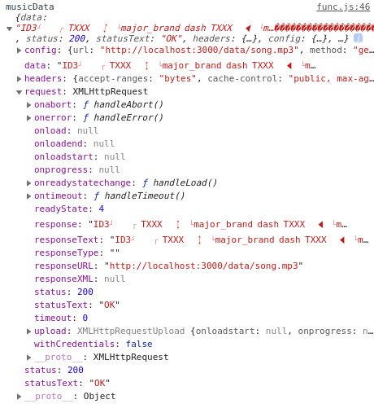
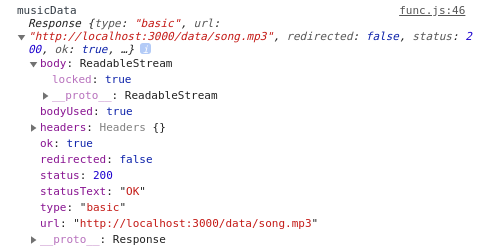

### fetch vs axios

이번에 next.js의 SSR(Server Side Rendering)을 알아보며 fetch, 그리고 그와 빈번히 비교되는 axios에 대해 검색해보게 됐다. 이 기능들은 폴리필(polyfill)이라 불리며, 서버와의 비동기 통신을 구현하기 위해 필요한 기능이나 조금의 차이가 있다.

위키피디아는 폴리필을 다음과 같이 설명한다.

> 폴리필(polyfill)은 웹 개발에서 기능을 지원하지 않는 웹 브라우저 상의 기능을 구현하는 코드를 뜻한다.
> 
> 기능을 지원하지 않는 웹 브라우저에서 원하는 기능을 구현할 수 있으나, 폴리필 플러그인 로드 때문에 시간과 트래픽이 늘어나고, 브라우저별 기능을 추가하는 것 때문에 코드가 매우 길어지고, 성능이 많이 저하된다는 단점이 있다.

즉 특정 상황이나 브라우저 종류에 따라 사용할 수 없는 기능을 채워준다는 뜻이다.

나는 보통 fetch를 사용해왔는데 server side 측(ex. getSeverSideProps)에서는 fetch를 쓸 수 없다. 이 경우 axios는 좋은 대안이 될 수 있다. 다만 axios가 fetch 보다 사용자 편의적인 기능을 많이 지원하는 만큼 다소 무거운 편이라는 평이 있으니 목적에 맞게 사용하면 되겠다.

이번 프로젝트에서 나는 next.js를 채택했고 음원 데이터를 server side에서 처리해 보여주고 싶었다. 이에 따라 axios를 사용해 음원 데이터를 받으려 했다. 하지만 아래 그림과 같이 정상적으로 수신되지 않았다.

결과를 자세히 보면 데이터를 `XMLHttpRequests`로 수신하고 있는 것을 볼 수 있다. axios는 브라우저 상에서 실행될 경우 `XMLHttpRequests`로 요청을 만들어 데이터를 처리하는데 node.js 환경이 아닐 경우 readable 객체를 처리할 수 없다.

원인은 `XMLHttpRequests`에서 stream 데이터를 지원하지 않는 것이다. 해당 요청에서 지원하는 requestType은 [MDN](https://developer.mozilla.org/ko/docs/Web/API/XMLHttpRequest/responseType)에서 확인할 수 있다. text, arraybuffer, blob, document, json, ms-stream 등이다.

다음은 fetch로 처리한 같은 음원 데이터다. readable stream으로 수신되고 있는 것을 확인할 수 있다.

만약 stream 데이터를 server side에서 처리할 경우가 있다면 axios 대신 isomorphic-fetch 등을 사용하면 되겠다.

참고 자료 : [stream으로 데이터 전송 방법 및 axios 사용 문제점](https://yogae.github.io/etc/2019/06/11/node_client_stream.html)