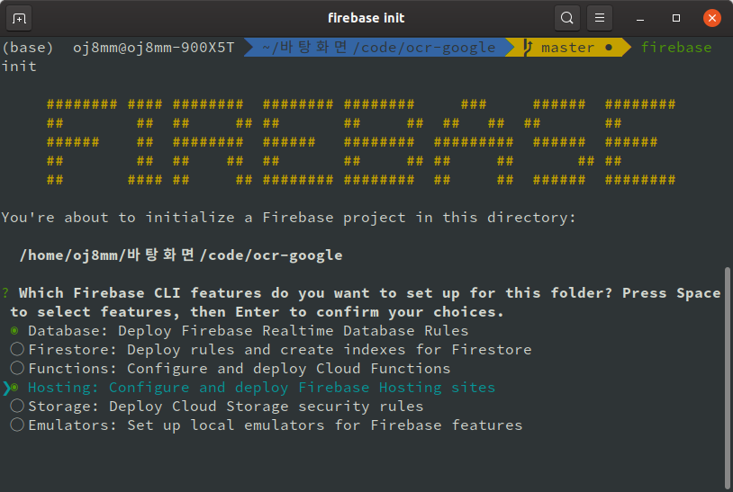
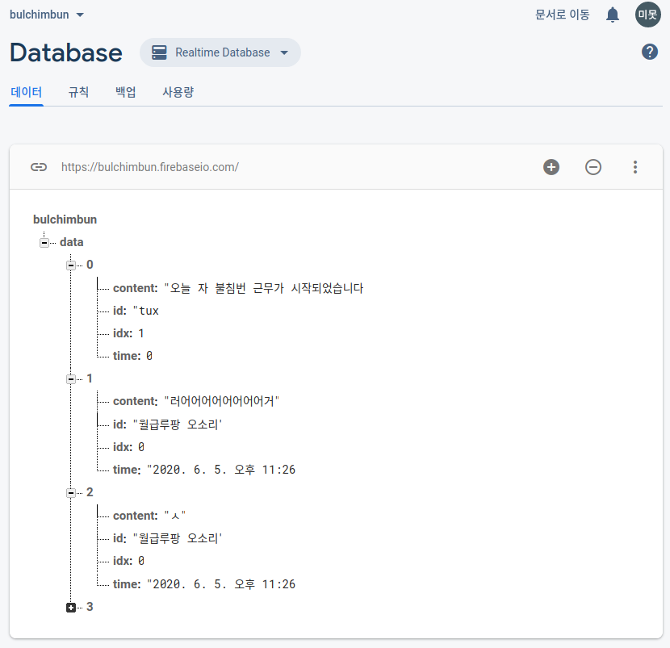

## 호밀 밭의 불침번 시-작

구직도 끝났겠다 사이드 프로젝트 마려운... 그런 간질간질한 타이밍에 머리를 스쳐간 아이디어가 있었다. 예전에 모 동아리(?)에서 활동하던 시절에 내부적으로 사용하던 `불침번`이라는 익명 게시판이 있었다.

이 기획의 흥미 포인트는 1) 익명 과 2) 운영 시간 제한 에 있었다.

우선 따로 홍보를 하지 않아 private한 특성을 가지고 있는 서비스였다. 그럼에도 익명이라는 특성 때문에 서로 진솔한 고민을 내놓게 되는게 매력이었다.

거기에 정확히 기억은 나지 않지만 운영 시간이 새벽 시간대로 정해져 있었다. 정해진 시간에만 열리고 나머지 시간에는 닫히는 컨셉이었다. 새벽 감성 증폭에 크게 기여한 장치였다.

이 서비스에 애착도 있었고 CRUD를 혼자 구현해보고 싶은 마음에 개발에 착수했다. 오픈 시간은 밤 11시에 열려 새벽 4시 정각에 닫히면 적당하겠다(근데 이건 정하기 나름이니)고 생각했다.

## FireBase 설치

우선 설치가 필요하다. react 유저인 나는 언제나 CRA를 전제로 깔고 있으니 혹시 다른 환경에서 활용하셔야 하는 분들은 주의가 필요하겠다.

CRA 프로젝트를 생성하고(`npm creact-react-app 프로젝트명`) npm에서 firebase CLI(Command Line Tool)을 설치한다.

```
npm i -g firebase-tools
```

설치가 완료되면 터미널에 `firebase login`을 입력해 사용할 구글 계정을 등록해준다.

이제 프로젝트 폴더로 이동해 `firebase init` 명령어를 사용해 프로젝트에 firebase를 활용할 수 있도록 초기화를 진행하자.

<div align="center"><div>

그러면 위와 같은 화면이 뜨는데 `database`와 `hosting`에 각각 커서를 두고 space를 눌러 선택해주자. 두 기능을 모두 체크했다면 enter를 눌러 다음으로 넘어간다.

그 다음 "Use an existing project", "미리 생성해둔 파이어베이스 프로젝트", Database Rules를 물어보는 항목은 그냥 엔터, public 디렉토리를 물어보는 항목도 엔터, SPA 프로젝트 여부를 물어보는 항목에는 y를 입력해준다. public/index.html을 덮어쓰겠냐는 항목에는 n을 입력한다.

잘 따라왔다면 프로젝트 폴더에 `firebase.json`과 `.firebaserc` 파일이 생성되었을 것이다.

react 프로젝트의 build와 firebase deploy를 한꺼번에 처리하면 편하기 때문에 `package.json`에 다음 내용을 추가한다.

```js
"scripts": {
  // 기존 스크립트들
  "deploy" : "react-scripts build && firebase deploy"
}
```

마지막으로 프로젝트 폴더에 firebase를 dev dependency로 설치해준다.

```
npm i -S firebase
```

## 도메인이 필요하니 FireBase Hosting

이건 파이어베이스 프로젝트 들어가서 하라는 대로 하면 잘 된다. 넘 쉬워서 설명은 생략. 기본 도메인은 `프로젝트명.web.app`과 `프로젝트명.firebaseapp.com`으로 할당 된다.

만약 커스텀 도메인이 필요하다면 `커스텀 도메인 추가` 버튼을 눌러 별도로 추가할 수도 있다.

내가 만든 react app을 build한 뒤 deploy하면 그 결과물을 저 도메인으로 접속할 수 있게 된다.

## 서버가 없으니 FireBase Realtime Database

내가 아직 다룰 수 있는 백엔드 스택이 없어서 말로만 듣던 Google Firebase를 활용해보기로 했다.

firebase에는 다양한 기능이 있다. 나는 그 중에 JSON 형태로 DB를 관리할 수 있는 Realtime DataBase를 사용하기로 했다.

파이어베이스 콘솔에 들어가서 realtime database(cloud firestore가 아니다!)를 활성화 해준다.

<div align="center"><div>

위와 같이 DB가 만들어진다. 엔드포인트 주소는 `프로젝트이름.firebaseio.com/블라블라` 형태로 데이터에 접근할 수 있고 JSON 형태로 적용하면 된다.

DB를 사용하려면 기본 설정이 필요하다. [공식 문서](https://firebase.google.com/docs/database/web/start?authuser=0)를 참고하는게 가장 좋다.

`firebase.js` 쯤의 이름을 가진 파일을 만들고 공식 문서에서 제공하는 코드 스니펫을 참고하자.

config에 들어갈 내용은 `프로젝트 설정(톱니 아이콘) - 일반 탭 - 내 앱 - Firebase SDK snippet - 구성 라디오 버튼`에서 복사하면 된다.

```js
// Set the configuration for your app
// TODO: Replace with your project's config object
var config = {
  apiKey: 'apiKey',
  authDomain: 'projectId.firebaseapp.com',
  databaseURL: 'https://databaseName.firebaseio.com',
  storageBucket: 'bucket.appspot.com',
}
firebase.initializeApp(config)
```

아래와 같이 별도 함수로 만들어서 앱 시작시(ex. componentDidMount) 초기화 해주면 된다.

```js
let database

export const fire = () => {
  !firebase.apps.length && firebase.initializeApp(config)
  database = firebase.database()
}
```

초기화 된 DB 인스턴스에 접근하려면 다음과 같이 사용하면 된다.

```js
// firebase.js
export const getFireDB = () => database.ref('/data').once('value')

// App.js
import { fire, getFireDB } from './global/firebase'

const [comments, setComments] = useState(null)

const getComments = () =>
  getFireDB().then(res => {
    setComments(res.val())
  })

// 초기화
useEffect(() => {
  fire()
  getComments()
}, [])
```

위 코드에서 볼 수 있다 시피 초기화 `database`의 `ref()` 메서드에 경로를 path parameter로 넘겨 주면 해당 노드의 JSON이 넘어오게 된다. 이어 `once()` 메서드를 사용하면 DB와 웹 소켓 통신이 아닌 일회성 통신을 할 수 있게 된다.

그렇게 얻어진 DB의 내용은 promise로 넘어온다. then이나 await 등으로 받아서 그 결과물은 `val()` 메서드로 접근할 수 있다.

값을 완전히 덮어 쓸 때는 `set()` 메서드를, 업데이트 해줄 때는 `update()` 메서드를 사용한다. 아래는 DB에 달려있는 comment 내용을 업데이트 해주는 부분의 코드다.

```js
export const writeComment = (len, id, content, now) => {
  return firebase
    .database()
    .ref(`/data/${len}`)
    .update({
      content: content,
      id: id,
      time: now,
    })
}
```

## 참고

- [Firebase & React 시작하기](https://chanspark.github.io/2017/12/06/Firebase-%EA%B3%B5%EB%B6%80.html)
- [웹에서 데이터 읽기 및 쓰기](https://firebase.google.com/docs/database/web/read-and-write?authuser=0#read_data_once)
