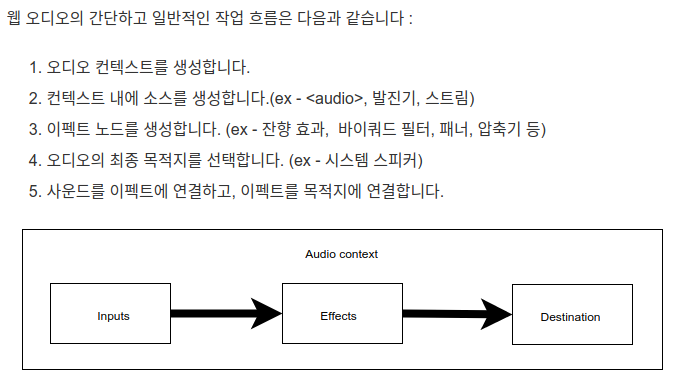
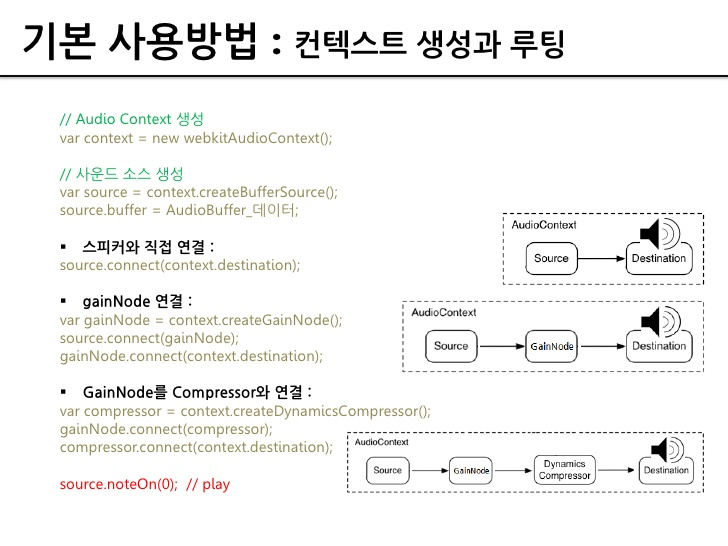

이 모든 건 사쏘공(사클이 쏘아올린 작은 공) 때문이다. 내가 해놓고도 대체 뭘 만들어 놓은 건지 파악이 안되는 지경에 이른 코드를 소생시키기 위해 팔을 걷어붙여야 하는 시기가 왔다.

처음에는 Redux 도입만 하면 될 줄 알았는데, 되짚어보다보니 어떤 값들을 전역변수로 관리해야 할지도 모르는 상태라는 걸 깨달았다. 돌고 돌아 결국 되는대로 갖다 붙였던 Web Audio API를 다시 들여다볼 수 밖에 없게 됐다.

<br>

<div align="center">
  
  <a href="https://developer.mozilla.org/ko/docs/Web/API/Web_Audio_API">출처 : Web Audio API, MDN</a> 
</div>

<div align="center">
  
  <a href="https://www.slideshare.net/deview/2-hello-world-web-aaudioapi">출처 : https://www.slideshare.net/deview/2-hello-world-web-aaudioapi</a> 
</div>

<br>

우선 Web Audio API의 구조는 위와 같다. AudioContext를 생성하고 그 안에 사운드 소스를 받은 뒤 Node를 연결해 필요한 조작을 한 뒤 Destinatinon에 연결해 출력하는 구조다.

일단 음악 재생, 중지, 일시정지 기능과 볼륨 조절이 가능한 예제를 다시 만들어보았다. 다음과 같이 3개의 버튼과 1개의 인풋박스를 만들고 각각에 맞는 함수를 작성했다.

```jsx
<div id="App">
  <button type="button" onClick={playMusic}>
    재생
  </button>
  <button type="button" onClick={stopMusic}>
    중지
  </button>
  <button type="button" onClick={pauseMusic}>
    일시정지
  </button>
  <input onChange={event => setVolume(Number(event.target.value))} />
</div>
```

먼저 componentDidMount와 함께 getMusic() 이라는 함수를 실행해 음원 데이터를 받아오도록 했다.

```js
const getMusic = async () => {
  const audioCtx = new (window.AudioContext || window.webkitAudioContext)()

  const musicData = await fetch('http://localhost:3000/song2.mp3')
  const musicDataBuffer = await musicData.arrayBuffer()
  const decodedData = await audioCtx.decodeAudioData(musicDataBuffer)
  const source = audioCtx.createBufferSource()
  const gainNode = audioCtx.createGain()

  source.buffer = decodedData
  source.connect(gainNode)
  gainNode.connect(audioCtx.destination) // 출력을 연결, 기본은 스피커

  setSource(source)
  setCtx(audioCtx)
  setNode(gainNode)
  console.log('ready')
}

useEffect(() => {
  !source && getMusic()
}, [source])
```

- audioCtx는 위에서 언급한 AudioContext 객체다. 이 안에서 음원과 관련된 모든 처리가 일어난다.
- musicData는 음원데이터를 fetch로 받아와 arrayBuffer 객체에 받은 결과다.
- decodedData는 arrayBuffer 형식의 데이터를 디코딩 하는 비동기 함수의 결과다.
- source는 audioCtx에 새로운 음원 데이터 input을 위한 객체다.
- gainNode는 input - gainNode - destination 형태로 배치되어 볼륨 조절을 담당할 Node다.

변수 선언 이후에 해줄 건 이 객체들을 알맞게 조합하는 일이다.

- source.buffer에 decodedData(음원)을 연결한다.
- source를 볼륨 조절을 위해 만들어 둔 gainNode에 연결해준다.
- gainNode를 다시 Destination에 연결해 출력해준다. 기본 값은 스피커다.

이후 source(start, stop)와 ctx(suspend, resume)와 node(volume)의 용도가 있기 때문에 별도 변수에 담아준다. 참고로 createBufferSource() 등으로 생성했던 음원 데이터는 일단 한번 재생이 끝나고 나면 재접근할 수 없다. 다시 재생하기 위해서는 객체를 다시 만들어야 한다는 뜻이다.

다음은 재생과 정지를 담당하는 코드다. 위에 비해서는 비교적 간단하다. 볼륨 조절도 `node.gain.value`와 같은 식으로 접근하면 된다. 볼륨은 -1에서 1사이의 값이다.

```js
const playMusic = () => {
  const duration = source.buffer.duration
  source.start(0, 0, duration) // setTimeout, startSec, playTime
  console.log('play')
}

const stopMusic = () => {
  source.stop()
  setSource(null)
  setCtx(null)
  console.log('stop')
}

const pauseMusic = () => {
  isPause ? ctx.resume() : ctx.suspend()
  setIsPause(!isPause)
}

useEffect(() => {
  if (source && node.gain.value !== volume) {
    node.gain.value = volume
  }
}, [volume])
```

여기까지는 비교적 간단했지만 넋놓고 로직을 짰다간 스파게티를 면하지 못할 것이다. 그럼 다음 포스팅 때도 무사한 코드를 가져올 수 있기를 바라며 이만...
