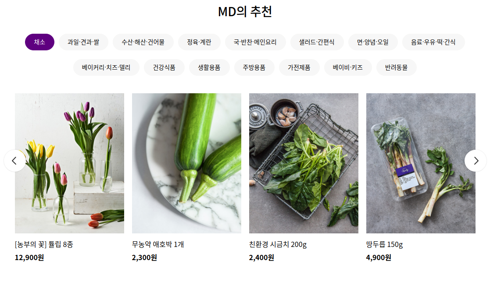

1차 프로젝트로 진행했던 마켓컬리 클로닝에서 미진했던 부분에 추가 작업을 하려 코드를 다시 보는 중이다. 다시 보는 김에 코드를 리팩토링 하고 있는데 가장 마음에 걸렸던 부분이 메인 페이지 카테고리 별 뷰에서 `map()`을 이용해 아이템을 보여주는 부분의 코드다. 아래와 같은 데이터를 처리하는 부분이었다.

```json
[
  "section_id": "today_recommendation",
  "section_type": "product_list",
  "title": "이 상품 어때요?",
  "products": [
    {
      "no": no,
      "name": name,
      "price": price,
      "original_price": original_price,
      "thumbnail_image_url": thumbnail_image_url,
      "sticker_image_url": null,
      "tracking_data": {
        "recommend_product_pool": recommend_product_pool
      }
    },
    // 생략
  ]
  // 생략
]
```

<br>

<div align="center"></div>

<br>

위와 같은 카테고리가 대략 9~10개 정도 있는데 매 카테고리마다 아래와 같이 작성했었다. 두 코드블럭이 한쌍이라고 생각하면 50 x 9 = 450줄 정도를 차지했던 셈이다. 실제 원래 코드는 514줄이었다. 하나의 컴포넌트 안에 담기기에는 너무 많은 양이다.

```jsx
<div className={section_id}>
  {title === "이 상품 어때요?" && (
    <>
      <p className="main-font">{title}</p>
      <div
        style={{
          position: "relative"
        }}
      >
        <button
          onClick={this._moveLeft}
          className="btn-scroll btn-scroll-left"
        ></button>
        <button
          onClick={this._moveRight}
          className="btn-scroll btn-scroll-right"
        ></button>
      </div>
      <div
        style={{ overflow: "hidden", width: "1050px" }}
        className="goods-item"
      >
        {productsArr}
      </div>
    </>
  )}
```

```jsx
const categoryList =
  categories &&
  categories.map((param, idx) => {
    return (
      <button
        key={'mdcate' + idx}
        style={
          this.state.mdButtonSelect === idx ? this.state.buttonStyle : null
        }
        className="md-cate-button"
        id={param['no'] + '.' + idx}
        onClick={this._mdClick}
      >
        {param['name']}
      </button>
    )
  })
```

일단 `map()`으로 처리되는 부분들은 title 값을 기준으로 각기 다른 형태의 컴포넌트가 보여져야 한다. 이 컴포넌트 또한 `map()`으로 만들어지고 있는 상황이기 때문에 props로 넘어오는 title 값을 switch문으로 매칭해 보여줄 컴포넌트를 리턴하게 하는 함수를 작성했다.

위에서 두번째 코드블럭은 별도의 함수형 컴포넌트로 작성해 분리했다. 아래 코드블럭 switch문의 return 부분에 들어가 있는 것을 확인할 수 있다.

그 결과 코드를 337줄(514 -> 177줄) 정도 줄여낼 수 있었다.

```jsx
renderProducts = (
    title,
    products,
    events,
    categories,
    data,
    mdButtonSelect,
    mdButtonValue,
    recipes,
    reviews,
    moveX
  ) => {
    const title_table = {
      "이 상품 어때요?": 1,
      "알뜰 상품": 1,
      "오늘의 신상품": 1,
      "지금 가장 핫한 상품": 1,
      "3천원의 행복": 1,
      "이벤트 소식": 2,
      "MD의 추천": 3,
      "컬리의 레시피": 4,
      "인스타그램 고객 후기": 5
    };

    switch (title_table[title]) {
      case 1:
        return <Recommend title={title} products={products} />;
      case 2:
        return <EventProduct title={title} events={events} />;
      case 3:
        return (
          <MdProducts
            title={title}
            categories={categories}
            data={data}
            mdButtonSelect={mdButtonSelect}
            mdButtonValue={mdButtonValue}
            mdClick={this.mdClick}
          />
        );
      case 4:
        return <RecipeProducts title={title} recipes={recipes} />;
      case 5:
        return <InstaPictures title={title} reviews={reviews} moveX={moveX} />;
      default:
        break;
    }
  };

  render() {
    return(
      <div className={section_id}>
        {this.renderProducts(
          title,
          products,
          events,
          categories,
          data,
          mdButtonSelect,
          mdButtonValue,
          recipes,
          reviews,
          moveX
        )}
      </div>
    )
  }
```
