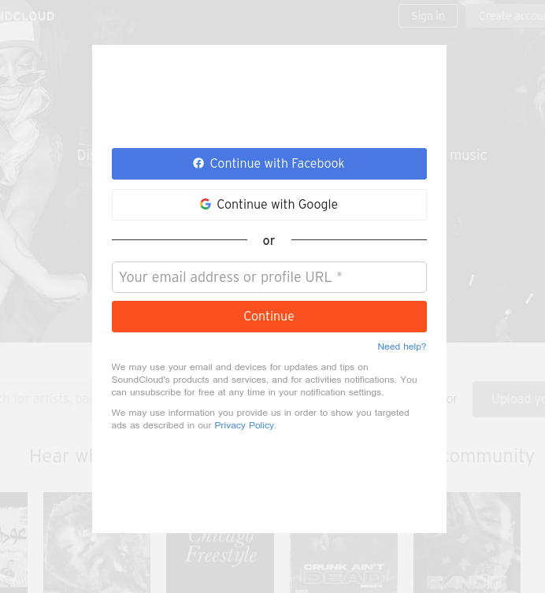

사운드클라우드 사이트에서 상단 내비게이터 Sign In을 클릭할 경우 토글되는 회원가입/로그인 모달이 있다. 이 모달은 Sign In을 클릭할 시 위에서 떨어지고, 하얀 박스 외의 영역을 클릭할 시 윗 방향으로 다시 딸려 올라가는 식으로 작동한다.

<div align="center">
  
</div>

핵심 로직은

- 모달 창이 띄워질 경우 흰색 영역과 바깥 영역을 구분한다
- 같은 함수로 토글을 구현하면서 두 번의 다른 동작을 구현한다(올라가는 동작, 내려오는 동작)
  - setTimeout을 사용해 애니메이션이 완료된 다음 모달 창의 display 상태를 바꿔준다
- 모달 창이 부드럽게 오르내리는 기능을 구현한다

```javascript
const modalShow = () => {
  if (!isEntered) {
    setModalOn(!modalOn)

    if (!modalOn) {
      setTimeout(() => {
        setModalOnDisp(!modalOnDisp)
      }, 600)
    } else {
      setModalOnDisp(!modalOnDisp)
    }
  }
}
```

```jsx
const [modalOn, setModalOn] = useState(true);
const [modalOnDisp, setModalOnDisp] = useState(true);
const [isEntered, setIsEntered] = useState(false)

// 컴포넌트 내부 render 영역
<LoginContainer modal={[modalOn, modalOnDisp]} onClick={modalShow}>
  <LoginWrapper
    modal={[modalOn, modalOnDisp]}
    onMouseEnter={() => setIsEntered(!isEntered)} // 흰색 창 안쪽과 바깥을 구분
    onMouseLeave={() => setIsEntered(!isEntered)}
  >
    <div>
      <Button type="button">Continue with Facebook</Button>
      <div
        type="button"
        className="g-signin2"
        data-onsuccess="onSignIn"
        ref={googleLoginBtn}
      >
        Login with Google
      </div>
      <Line>or</Line>
      <Input type="text" placeholder="Your email address or profile URL *" />
      <Button type="button">Countinue</Button>
    </div>
  </LoginWrapper>
</LoginContainer>
```

```css
const LoginWrapper = styled.div`
  display: ${(props) => (props.modal[1] ? 'none' : 'flex')};
  flex-direction: column;
  justify-content: center;
  margin: 0 auto;
  background-color: white;
  width: 450px;
  height: 620px;
  padding: 25px;
  position: absolute;
  top: 100px;
  left: 40%;

/* keyframe 사용 */
  @keyframes modalTransOff {
    0% {top: 100px;}
    20% {top: 200px;}
    100% {top: -1500px;}
  }

  @keyframes modalTransOn {
    0% {top: -1500px;}
    80% {top: 200px;}
    100% {top: 100px;}
  }

/*  모달 창의 상태에 따라 서로 다른 애니메이션을 적용해준다 */
  ${(props) => (props.modal[0] ? css`animation: modalTransOff ease-in-out 0.6s;` : css`animation: modalTransOn ease-out 0.6s;`)}
`;
```
