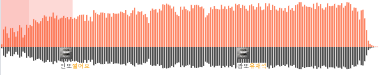

사운드클라우드 클론 프로젝트 중 당면한 과제는 스트리밍 피드 페이지 로드 시 빠르게 파장 데이터가 표시된 플레이어를 로드하는 것이었다. 예시 화면은 아래와 같다.

<div style="display: flex; justify-content: center;">
  
</div>

우리 팀이 고민했던 부분은 음원의 파장을 프론트와 백 어느 쪽에서 그려줄 것인가에 대한 것이었고 결국 백에서 그려주는 걸로 결정했다.

예를 들어 개별 음원 파일의 용량이 5mb이고 화면에 5개의 플레이어 안에 파장이 페이지 로드와 동시에 그려져야 하는 상황을 가정해보자. 그렇다면 25mb의 데이터를 전부 다운 받고 음원을 읽어서 파장으로 그려주는 작업이 모두 componentDidMount에서 실행되어야 하는데 그렇게 되면 페이지 로드 시 성능이 너무 떨어질 것이 분명했다.

그래서 파일 업로드 시 서버 단에서 음원과 초 당 파장 높이를 배열로 담은 데이터를 별도로 가지고 있다가 페이지 로드시 음원과 파장 데이터를 별도로 보내주는 방식을 택하기로 했다.

해당 데이터의 예시는 이렇다.

```json
const data = [0.015069325568668135, 0.0986801882207322, 0.11539670445859204, 0.07732765908365595, 0.05148016305434155, 0.10634254099495452, 0.1071024330073748, 0.08283768478401773, 0.05776393661364017, 0.08872800308812762, 0.12276561358799432, 0.10971316653066178, 0.05288557740821105, 0.06706831316453873, 0.12482540906224632, 0.10755971460745124, 0.12351917980976125, 0.11766009492578655, 0.1580020478707111, 0.15135310579814465, 0.13950752360051444,...];
```

음원 데이터의 처리에 관해서는 민규님이 포스팅을 하시면 링크(<-여기)에 걸어두기로 한다.

결국 프론트 단에서는 1) 배열 데이터를 받아온다 2) 데이터를 적절히 스케일링 한다 3) 그려준다 의 단계를 거치게 된다.

```javascript
// 데이터 정리
const data = [0.015069325568668135, 0.0986801882207322, 0.11539670445859204, ...];
const dataUpscale = [];

for (const i of data) {
  dataUpscale.push(i.toFixed(3));
}
```

```javascript
// canvas 태그에 그려준다
const canvasRefTop = useRef(null)
const canvasRefBot = useRef(null)

const ctxTop = canvasRefTop.current.getContext('2d')
const ctxBot = canvasRefBot.current.getContext('2d')

let i = 0
let j = ''

ctxTop.fillStyle = theme.orange // 색상 부여
ctxBot.fillStyle = 'black'

for (j of dataUpscale) {
  ctxTop.fillRect(i, 80, 2.2, -300 * j) // x, y 시작점, width, height
  ctxBot.fillRect(i, 0, 2.2, 150 * j)
  i += 3
}

<canvas width="640" height="80" ref={canvasRefTop} />
<canvas width="640" height="50" ref={canvasRefBot} />
```

그러면 다음과 같은 결과물이 나온다

<div style="display: flex; justify-content: center;">
  
</div>

참고) useRef Hook을 쓸 때는 꼭 current를 사용해야 ref의 리턴 값을 사용할 수 있다... 이거 빼먹어서 한참 고생 ㅠ
