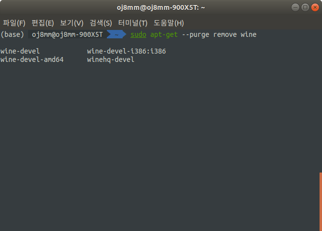
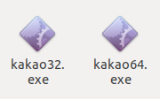

우여곡절 끝에 카카오톡을 설치하고 구버전인데다 불안정하게나마 사용 중이다. [소헌](https://soheon-lee.github.io/)님이 내 컴퓨터에서 카카오톡 아이콘을 보더니 대번에 글을 써달라고... 여러 포스팅들을 보고 긁어온 수준이겠지만 연습한다는 생각으로 한번 써보겠다.

<br>

<div align="center">그러하다...</div>

<br>

### 0. 카카오톡은 리눅스 환경에서 지원되지 않는다

우분투를 처음 깔고나서 충격 받았던 점 중 하나는 바로 리눅스에서 카카오톡이 지원되지 않는다는 사실이다. 그래서 윈도우 환경에서 돌아가는 프로그램을 에뮬레이팅 해주는 프로그램들의 도움이 필요하다.

검색을 해보면 일반적으로 PlayOnLinux와 Wine을 사용하는 듯 한데 이 둘은 서로 성격이 다른 프로그램이며 경우에 따라 같이 쓰이기도 하는 듯 하다.

자잘한 오류들이 있기도 하고, 무엇보다도 포스팅을 위해 우선 내 컴퓨터에 설치된 카카오톡을 깔끔하게 삭제하고 시작하겠다. 아직 내가 우분투에 그렇게 익숙하지 않아 삭제 방법은 다음 [포스트](https://velog.io/@filoscoder/ubuntu-18.04-wine-%EC%99%84%EC%A0%84%ED%9E%88-%EC%A0%9C%EA%B1%B0%ED%95%98%EA%B8%B0)를 참고했다.

우선 Wine 관련 모든 프로그램을 삭제한다.

```bash
sudo apt-get purge wine(까지 타이핑 후 Tab을 누르면서 관련된 프로그램을 찾아 삭제)
```

<br>

<div align="center"></div>

<br>

참고한 포스팅에는 `remove --purge`명령을 썼는데 [찾아보니](https://gintrie.tistory.com/23) `purge`와 같다고 한다. 참고로 `purge`와 `remove` 명령의 차이는 설정파일을 남길 것인지 라고 한다. `purge`는 설정파일까지 전부 삭제한다

다음은 저장공간에 남은 폴더와 파일 삭제다.

```bash
cd ~ ## 홈 폴더로 이동
rm -rf .wine
rm .config/menus/applications-merged/wine*
rm -rf .local/share/applications/wine*
rm .local/share/desktop-directories/wine*
rm -rf .winetricks
```

마지막으로 apt 업데이트를 해준다.

```bash
sudo apt-get update
sudo apt-get autoclean
sudo apt-get clean
sudo apt-get autoremove
```

이제 터미널에 `wine` 명령어를 쳐보면 찾을 수 없다는 메시지가 뜬다.

### 2. Wine 설치

#### 1) What is Wine?

Wine은 현재 5.5 버전까지 출시되어 있고 최신 stable 버전은 2020년 1월 21에 나온 5.0이다. [Wine 공식 홈페이지](https://www.winehq.org/)의 설명은 다음과 같다.

> Wine(원래 "Wine Is Not an Emulator"의 약어)은 리눅스, macOS, BSD와 같은 POSIX 호환 운영체제에서 Windows 프로그램을 실행할 수 있는 호환성 레이어입니다. 가상 머신이나 에뮬레이터와 같이 내부 Windows 로직을 시뮬레이션하는 대신 Wine은 Windows API 호출을 POSIX 시스템 호출로 즉시 대체합니다. 다른 방식과 다르게 성능이나 메모리 문제가 적으며, Windows 프로그램을 데스크톱에 깔끔하게 통합할 수 있습니다.

설명에 따르면 Wine 완전한 가상 환경을 구축한 다음 그 안에서 윈도우 프로그램을 실행시키는게 아니라 윈도우 API 호출만 다른 방식으로 대체해 윈도우 환경을 흉내내기 때문에 성능 면에서 장점이 있다는 걸로 보인다.

#### 2) 설치

설치는 이 [포스트](https://www.hahwul.com/2018/08/install-kakaotalk-on-ubuntu-18.04.html)를 보고 따라했다.

먼저 Wine을 설치해준다.

```bash
sudo apt install wine-stable
WINEARCH=win32 WINEPREFIX=~/.wine wine wineboot ## 설치 후
```

그 다음 dll 등을 설치해주기 위한 WineTricks를 설치한다.

```bash
apt-get install cabextract
wget https://raw.githubusercontent.com/Winetricks/winetricks/master/src/winetricks
chmod 777 winetricks
./winetricks ## 실행
```

WineTricks가 설치 되면

- Select the default wineprefix
- Install a Windows DLL or component

을 차례로 선택하고 gdiplus, riched30, wmp9, msxml6, d3dx9_43을 설치한다.

### 3. 카카오톡 설치

32비트 구버전 카카오톡을 설치할 예정이긴 한데, 처음 깔았을 때 64비트 카카오톡 설치에 성공했던 것 같은 기억이 있어서 64비트도 함께 설치해보려 한다.

최신 설치 파일은 [카카오톡 공식 홈페이지](https://www.kakaocorp.com/service/KakaoTalk), XP 버전 파일은 [여기](http://app.pc.kakao.com/talk/win32/xp/KakaoTalk_Setup.exe)다.

<br>

<div align="center">네네 선생님</div>

<br>

근데 최신 설치파일은 설치에 실패했다... XP 설치 파일로 다시 진행한다. 터미널에 `winecfg`를 입력해 실행환경을 윈도우7에서 XP로 바꿔주자.

파일이 다운로드 된 폴더로 이동한 뒤 다음 명령어를 입력한다.

```bash
wine ./파일명
```

Wine 기본 설정을 바꾸지 않았다면 파일이 설치되는 경로는 `/home/user/.wine/drive_c/Program Files/Kakao/KakaoTalk`다.

여기까지 잘 따라했다면 카카오톡이 정상적으로 실행될 것이다.

<br>

<div align="center">짜잔 어게인</div>

<br>

### 4. 설치 후 이슈

#### 1) 폰트

추가 예정.

#### 2) 방화벽 문제 (오류코드 50114)

방화벽 문제(추정)으로 로그인에 실패(오류코드 50114)할 수 있다.

<br>

<div align="center"></div>

<br>

그럴 경우 다음과 같은 명령어를 터미널에 입력한다.

```bash
sudo ufw enable
sudo ufw allow 22/tcp
sudo apt-get install ssh
```

참고자료 :

- [ubuntu 18.04: wine 완전히 제거하기](https://velog.io/@filoscoder/ubuntu-18.04-wine-%EC%99%84%EC%A0%84%ED%9E%88-%EC%A0%9C%EA%B1%B0%ED%95%98%EA%B8%B0)

- "그리고 하모니카 스크립트로 카톡이 설치 안 되시는 분들은 (제가 알기로 하모니카에서 제공하는 스크립트로 카톡 다른 분들도 설치 잘 된다고 하던데요) PlayonLinux 에서 Wine 5.0 버젼으로 세팅해서 설치하면 추가적인 DLL 설치 필요없이 카톡이 잘 된다는 정보를 입수했습니다." (https://hamonikr.org/board_hkrme/67113)

- https://www.hahwul.com/2018/08/install-kakaotalk-on-ubuntu-18.04.html

- https://hiseon.me/linux/ubuntu/ubuntu-kakaotalk/

- https://joelweon.github.io/2019/05/08/linux-wine-kakao-install.html

- https://ubuntucar.tistory.com/47

- https://gist.github.com/BEMELON/70f173af95480389445b6f52c6ffada7
