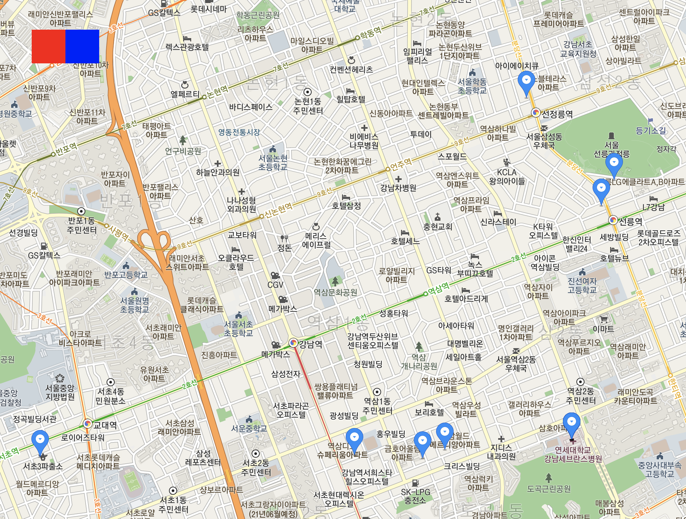

9기 1차 프로젝트 멘토링 중 급하게 카카오 맵 API를 리액트에 적용한 예시를 보여줄 일이 생겼다.

아래 코드는 예제 코드로서 기본적으로 지도를 생성하고 마커를 띄우고 다시 지우는 기능을 하는 내용이다. 6기 제이님이 블로깅 해둔 `울면서 카카오맵 적용하기` 시리즈([링크](https://velog.io/@bearsjelly/React-kakao-%EC%A7%80%EB%8F%84-%EB%9D%84%EC%9A%B0%EA%B8%B0-1-%EC%95%B1%ED%82%A4-%EB%B0%9B%EC%95%84%EC%98%A4%EA%B8%B0))가 도움이 됐다.

### 아주 간단하다!

<br>

<div></div>

<br>

컴포넌트가 불려오면 카카오 API를 통해 가져온 지도를 로드하고(`createMap()`) data1.json 파일을 fetch 함수를 통해 가져온다(`getLocation()`). 해당 파일에는 상담사들의 이름과 지도상 좌표들이 표시되어 있다.

만약 화면에 그려진 마커가 업데이트 될 일이 있다면 기존에 찍어뒀던 마커를 전부 제거한 후(`deleteMarker()`) 다시 새로 받아온 data2.json의 내용을 기반으로 상담사들의 위치를 지도 위에 찍어준다.

```js
import React, { useState, useEffect } from 'react'
const APP_KEY = '카카오 API 사이트에서 부여한 값'
const divBtnOpt = {
  width: '50px',
  height: '50px',
  position: 'fixed',
  top: '100px',
  zIndex: '10',
}

const App = () => {
  const [map, setMap] = useState(null)
  const [markerArr, setMarkerArr] = useState([])
  const [locationArr, setLocationArr] = useState([])

  const getLocation = async id => {
    const data = await fetch(`http://localhost:3000/data${id}.json`)
    const dataJSON = await data.json()
    setLocationArr(dataJSON.location)
  }

  const createMap = () => {
    const script = document.createElement('script')
    script.async = true
    script.src = `https://dapi.kakao.com/v2/maps/sdk.js?appkey=${APP_KEY}&autoload=false`
    document.head.appendChild(script)
    script.onload = () => {
      const { kakao } = window
      kakao.maps.load(() => {
        let container = document.getElementById('Mymap')
        let options = {
          center: new kakao.maps.LatLng(37.506502, 127.053617),
          level: 7,
        }
        const createdMap = new kakao.maps.Map(container, options)
        setMap(createdMap)
      })
    }
  }

  const createMarker = () => {
    const { kakao } = window
    const tempArr = []
    locationArr.forEach(e => {
      tempArr.push(
        new kakao.maps.Marker({
          map: map,
          position: new kakao.maps.LatLng(e.mapY, e.mapX),
        })
      )
    })
    setMarkerArr(tempArr)
  }

  const deleteMarker = () => markerArr.forEach(e => e.setMap(null))

  useEffect(() => {
    getLocation(1) // location 정보 fetch
    createMap()
  }, [])

  // marker 생성 + 표시
  useEffect(() => map && locationArr.length && createMarker(), [
    map,
    locationArr,
  ])

  return (
    <div className="App">
      <div
        onClick={() => getLocation(2)}
        style={{ ...divBtnOpt, backgroundColor: 'red', left: '100px' }}
      />
      <div
        onClick={deleteMarker}
        style={{ ...divBtnOpt, backgroundColor: 'blue', left: '150px' }}
      />
      <div id="Mymap" style={{ width: '100vw', height: '100vh' }}></div>
    </div>
  )
}

export default App
```

주의해야 할 컨셉 몇 가지가 있다.

### 외부에서 가져온 스크립트를 사용하게 된다

바닐라 자바스크립트에 대한 이해도가 낮고 리액트도 처음인 상황에서 접근해야 했다면 매우 곤란했을 것이다. 기본적으로 `createMap()`의 작동을 살펴보면 script 태그를 만들고 외부의 스크립트를 가져온다. 스크립트가 로드 되면 전역객체(window)에 삽입된 kakao라는 객체를 사용해 지도와 관련된 자바스크립트 객체들을 컨트롤 하게 된다.

### 한번 생성한 마커 객체는 잘 갖고 있어야 한다

다양한 기능이 있겠지만 일단 이번 예제에서 마커를 생성하는 방법이 두 가지 있었다. 하나는 `kakao.maps.Marker()` 생성자를 사용하는 것, 다른 하나는 `setMap()` 메서드를 사용하는 방법이다. 두 방식 간에 정확히 어떤 차이가 있는지는 모르겠지만 전자는 마커 객체를 생성할 때, 후자는 마커 객체를 release 할 때 사용했다.

한번 생성한 마커 객체의 컨트롤은 배열이나 객체에 담아 state로 관리해야 한다. 그렇지 않으면 컨트롤을 잃어버려 한번 생성한 마커의 이미지를 바꾸거나 삭제하는 등의 조작을 할 수 없게 된다. 이번 예제에서는 배열에 담은 마커 객체들에 반복문을 통해 null을 할당해 제거해줬다. 물론 내용이 업데이트 되었을 때 useEffect로 화면을 업데이트 해주는 걸 잊지 말아야 겠다.

### 지도에 폭과 높이를 부여해야 화면에 보인다

자잘한 내용이지만 은근히 문제가 될 수 있는 내용이라 추가해둔다. 내 경우에는 지도가 씌워질 div 태그의 가로와 세로를 각각 100vw, 100vh로 부여했다.

### 참고

- [Kakao 지도 Web API Sample](https://apis.map.kakao.com/web/sample/)
- [React, kakao 지도 띄우기 #1 앱키 받아오기](https://velog.io/@bearsjelly/React-kakao-%EC%A7%80%EB%8F%84-%EB%9D%84%EC%9A%B0%EA%B8%B0-1-%EC%95%B1%ED%82%A4-%EB%B0%9B%EC%95%84%EC%98%A4%EA%B8%B0)
