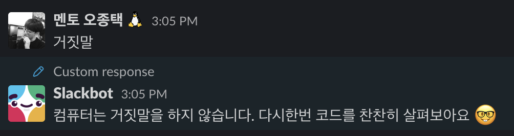

### 1. fetch 잔혹사

fetch 함수는 백엔드 서버와의 비동기 통신에 사용된다. 첫 번째 인자에는 통신에 필요한 URL을, 두 번째 인자에는 알맞은 형태의 객체를 넣어 줘야 한다. 바로 다음과 같은 형태다.

```js
fetch('url', {
  method: 'GET',
  headers: {
    Authorization: 'token',
  },
})
```

그런데 이 함수를 처음 사용하는 입장에서 형태 상 실수하기 쉬운 것이 사실이다. 다양한 오답이 등장한다.

- headers를 Headers라고 작성 (대문자)
- headers에 객체 `{ Authorization: "token" }` 대신 직접 "token"을 입력
- fetch의 response가 json이 아닌 http response임에도 불구, `.json()` 메서드로 형태를 변환하려고 시도
- POST 요청 시 body를 작성
- POST 요청 시 백엔드 서버 측에서 요구하는 키값을 정확히 입력하지 않았거나, invaild한 value를 입력 (ex. type, django password_validation)
- Authorization에 다른 키값을 넣음 ex. id_token: "token"

등등등...

창의적인 오답에 속지 않도록 주의하자. 통신 관련 문제의 해결은 언제나 개발자 도구의 network 탭을 켜는 것으로 부터 시작된다. 에러 코드, request payload, console만 확인해도 대부분의 문제를 해결할 수 있을 것!

### 2. 마우스 이벤트 전파 (캡처링, 버블링)

리액트로 진행하는 프로젝트라고 해서 리액트 관련 질문만 들어오는 게 아니다. 리액트도 결국 자바스크립트다. 이번에 발생했던 문제는 마우스 이벤트 중 이벤트 전파와 연관이 있었다.

상황은 이랬다. 부모 컴포넌트에서 current index를 관리하며 해당 인덱스가 3이 되면 모달 창이 열린다. 인덱스가 이외의 숫자가 되면 모달 창이 닫힌다. 부모 li 태그에는 모달 창을 띄우는 onClick 이벤트가 있었고, 그 태그의 자식 태그로서 모달 창을 닫는 button 태그에 onClick 이벤트가 달려 있었다.

```jsx
// current tab index : 0 => 3이 되면 모달 창이 열림

<li onClick={() => setIdx(3)}>
  <button onClick={() => setIdx(0)} />
</li>
```

창은 열리는데 다시 닫는 기능이 작동하지 않았다. setState는 정상적으로 작동을 하고 있는데도 인덱스가 계속 3에 고정되어 있었다.

곰곰히 생각해본 결과 문제는 이벤트 버블링이었다. target의 클릭 이벤트가 먼저 트리거 되고, 최상위의 window 객체를 향해 이벤트가 버블링 되면서 부모 요소의 클릭 이벤트가 한번 더 트리거 된 탓에 인덱스가 바뀌지 않았던 것이다. 결국 button 태그에 걸린 함수에 `stopPropagation()`을 적용해 해결했다.

문제도 해결하고 제대로 된 설명도 해줄 수 있어서 너무나 뿌듯...

### 3. fixed라는 유령이 전 브라우저를 떠돌고 있다

나는 분명 `position: fixed`를 줬고 개발자도구 상에서도 scratch가 그어지지 않았는데 absolute 처럼 작동하는 상황. 납득이 가질 않았다. 한참을 삽질하다 결국 GG.

이럴 땐 슬랙에 "거짓말"을 치고 언제나 구글로 달려가야 한다.

<div align="center">그래... 언제나 인간이 잘못이지...</div>

스오 선생님에 따르면 fixed 속성이 적용된 요소의 부모에 `transform`이나 `perspective` 속성이 있으면 고장이 나버린다고 한다.

정말 몰랐음...
