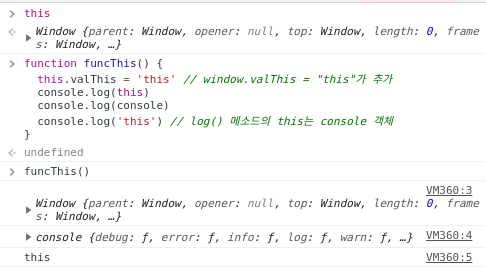
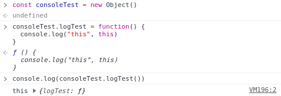
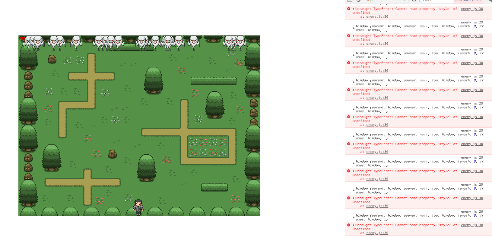
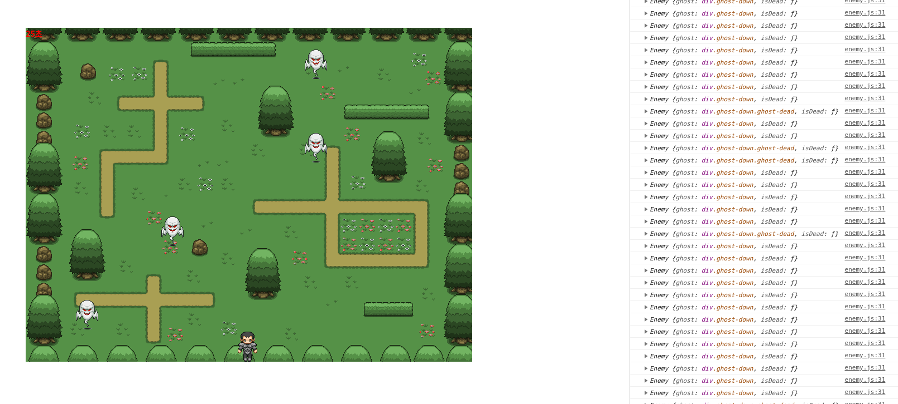

React를 사용하면서 this, this, this 엄청나게 사용했는데 실제로 어떻게 작동하는지 제대로 정리한 적이 없는 것 같아 웹 서칭을 통해 이해한 내용을 정리해보자.

## this, 왜 쓰나?

JavaScript에서 this는 함수의 `실행 문맥`이다. 쉽게 말해 '이 함수를 누가 불러냈냐'는 거다. 이름만 보더라도 this는 언어 문법의 대명사("걔", "그거", "거시기 그 있잖여")와 같다. 지칭 대상을 간편하게 줄여 쓸 수 있도록 해준다.

예컨대 `callMeSuperPowerObjectInJavaScript.start()` 같은 코드를 `this.start()`와 같이 줄여 쓸 수 있도록 해준다.

하지만 함수 호출 방식이 달라지면 문맥이 달라진다. this에 바인딩 할 객체가 달라진다는 것이고, this의 바인딩이 동적으로 결정된다는 말이다. 반대로 `bind(this)` 메소드나 ES6의 `arrow function(() => {})`을 사용하는 경우 바인딩 되는 객체가 정적으로 결정된다.

다음과 같은 코드가 있다.

```js
console.log(this)

function funcThis() {
  this.valThis = 'this' // window.valThis = "this"가 추가
  console.log()
  console.log('this') // log() 메소드의 this는 console 객체
}
```

실행 결과는 다음과 같다.

<br>

<div align="center"></div>

<br>

우선 콘솔에 곧바로 `this`를 실행하면 그 결과는 전역 객체인 `window`를 가리킨다는 사실을 알 수 있다.

`this.valThis`에서의 `this` 또한 같은 대상을 가리킨다. 캡처 화면에 직접 보이지는 않지만 콘솔에 찍힌 `window` 객체를 열어 보면 `valThis: "this"`라는 결과를 확인할 수 있다.

하지만 `log()`는 console 객체를 this의 대상으로서 가리킨다. 해당 메소드가 console 객체라는 맥락 속에서 실행되고 있었다는 뜻이다.

<br>

<div align="center"></div>

<br>

## 곤란해지는 경우?

함수가 호출되는 맥락을 정확히 지정해줘야 할 경우가 있다. 처음으로 JavaScript의 class 개념을 공부할 때 직접 작성했던 코드 중 일부를 가져왔다.

`setInterval()`로 Enemy class를 생성하여 화면 상단에서 아래로 이동시키는 동작이다.

```js
class Enemy {
  constructor() {
    this.ghost = document.createElement('div')
    this.createGhost()
  }

  createGhost() {
    //createElement를 사용해 고스트를 생성
    let randX = Math.random() * 755
    this.ghost.className = 'ghost-down'

    this.ghost.style.left = parseInt(randX) + 'px'
    this.ghost.style.top = '0'
    bg.appendChild(this.ghost)
  }

  moveDown = () => {
    //highlight-next-line
    setInterval(function() {
      console.log(this)
      this.ghost.style.top = parseInt(this.ghost.style.top) + ghostStep + 'px'
      this.isDead()
    }, ghostStepInterval)
  }
}
```

실행 결과는 실망스럽다. 생성된 Enemy들이 정상적으로 생성은 되나 아래로 이동하지는 않는다.

<br>

<div align="center"></div>

<br>

이유가 뭘까? 답은 this의 binding이 어디에 되어 있는가를 따져보면 찾을 수 있다.

console.log를 보면 `moveDown()` 메소드 내부에 작성된 `setInterval()` 안쪽의 this가 window 전역 객체로 나타나고 있음을 확인할 수 있다. 내부적으로 실행된 익명 함수의 this가 window에 binding 되어 있는 것이다.

정상적으로 동작하기 위해서는 this.ghost(div 태그)에 접근해 style의 top 속성을 읽어와야 한다. 하지만 Enemy.ghost가 아니라 window.ghost를 찾으려 하기 때문에 속성에 접근을 못하고 있는 상황이다.

따라서 이 경우 Enemy를 정상적으로 가리킬 수 있도록 arrow function을 써야 한다. 혹은 setInterval 내부의 익명함수를 `bind(this)`로 binding 해줘야 한다. bind에 대한 보다 자세한 설명은 추후 apply, call과 함께 정리해보도록 하자.

```js
moveDown() {
  setInterval(
    (function () { // bind(this)와 같은 효과를 보려면 () => {}로 써준다
      //highlight-next-line
      console.log(this); // 이 경우 this는 정상적으로 Enemy를 가리킨다
      this.ghost.style.top =
        parseInt(this.ghost.style.top) + ghostStep + "px";
      this.isDead();
      //highlight-next-line
    }).bind(this),
    ghostStepInterval
  );
}
```

다음과 같이 정상 작동한다.

<br>

<div align="center"></div>

<br>

참고 :

- [함수 호출 방식에 의해 결정되는 this](https://poiemaweb.com/js-this)
- [[javascript] this는 어렵지 않습니다.](https://blueshw.github.io/2018/03/12/this/)
- [화살표 함수에 대해서](https://wonism.github.io/arrow-function/)
