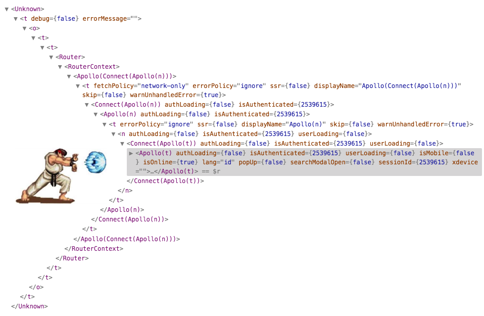

 

 

react는 공식문서에서 앞으로도 클래스형 컴포넌트를 지원할 계획이라고 밝혔다. 하지만 차세대 패러다임은 분명히 함수형 컴포넌트와 React Conf 2018에서 처음 소개된 Hook이 될 것이라고도 명시하고 있다. 다음 인용을 통해 페이스북이 분명히 후자를 권장한다는 사실을 알 수 있다.

> 현재 존재하고 있는 모든 Class 사례를 변경하고 싶지만, 미래에도 계속 Class 컴포넌트들을 지원할 예정입니다. 페이스북에서 수만 개의 Class 컴포넌트들을 작성했으며, 그들을 재작성할 계획이 전혀 없습니다.

이제 페이스북이 이렇게 후자의 조합을 강력히 권장하는 이유에 대해 간단히 정리해보자.

## Why Hooks?

컴포넌트의 가장 주된 존재 이유는 '재사용성'이 아닐까. 중복되는 부분을 컴포넌트로 별도 분리하면 유사한 구조와 기능을 별도의 단위로 묶어 반복 사용, 효율적인 코드를 작성할 수 있다.

하지만 클래스형 컴포넌트를 사용해본 결과 render props(얼핏 대강 개념만 들어봄, [참고](https://medium.com/@la.place/react-render-props-pattern-1c53a6b9645c)), HOC(Higher Order Component, 뭔지는 아는데 사용해본 적은 없음) 등의 패턴으로는 기대했던 만큼 재사용이 어려웠다고 한다. 이 상황의 대표적인 예시가 [HOC Wrapper hell](https://medium.com/@jackyef/react-hooks-why-we-should-embrace-it-86e408663ad6)이다.

 

HOC Wrapper hell

 

또한 각 컴포넌트마다 lifecycle API를 사용하느라 로직을 컴포넌트와 분리하기 힘들어지는 단점, 불필요하게 길어지는 코드, 클래스 내에서의 `this`의 용법("this : 여기가 어디여?") 등으로 인한 혼란은 덤이었다.

기존에 함수형 컴포넌트는 클래스형 컴포넌트에서 react 라이브러리에서 { Component }를 extend함으로써 지원되는 lifecycle API를 사용할 수 없었다.

그러나 hooks가 등장하면서 클래스형이 아니고서라도 클래스형 컴포넌트가 지원하는 기능들을 'hook'해올 수 있게 되면서 함수형 컴포넌트만 가지고서도 react의 거의 대부분의 기능들을 작성할 수 있게 되었다.

## What's diff?

함수형 컴포넌트와 Hooks의 조합은 앞서 언급한 클래스형 컴포넌트의 단점을 상당 부분 상쇄한다. 라이프사이클 API, setState 등의 동작도 거의 동일하게 지원한다.

그러면서도 함수형은 클래스형에 비해 기본적으로 작성해야 하는 코드의 양이 적다. `this`도 사용할 필요 없다. 모든 동작이 함수를 단위로 일어나기 때문에 클래스 내에 단 하나씩만 존재하는 라이프사이클 API에 로직이 종속될 필요도 없다. `useState`로는 `setState`를, `useEffect`로는 `componentDidMount`/`Update`/`Unmount`를 커버할 수 있다. `shouldComponentUpdate` 같은 lifecycle API 없이도 rendering 최적화가 가능하다.

useState, useEffect 외에도 react는 useRef, useMemo, useCallback, useContext, useReducer 같은 다양한 hook들을 기본적으로 지원한다. 나아가 필요에 따른 custom hook을 직접 작성할 수도 있다.

참조 :

- [Hook의 개요](https://ko.reactjs.org/docs/hooks-intro.html)
- [React의 새로운 패러다임, React Hooks](https://velog.io/@vies00/React-Hooks)
