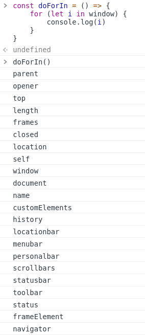

## for ... of / for ... in

그간 `for of`문은 많이 사용했다. 내가 처음으로 접했던 언어인 파이썬에서 사용하는 for문의 용법(iterable한 대상의 item을 차례로 순회)과 비슷했기 때문이다. 배열이나 문자열의 각 아이템을 하나씩 꺼내올 때 사용했다.

용법은 다음과 같다.

```js
const arr = [a, b, c]

for (let i of arr) {
  console.log(i)
}

// a, b, c
```

ES6에서 추가된 for of는 iterator 기반의 반복문이다. iterator는 generator와 함께 따로 정리하기로 하자. (참고 : MDN [반복기 및 생성기](https://developer.mozilla.org/ko/docs/Web/JavaScript/Guide/Iterators_and_Generators))

MDN에서는 [Symbol.iterator]에 대해 언급하고 있는데 아직 조금 어렵고 생소한 개념이라 이것 또한 추후에 별도 정리하는 걸로 하자.

> for...of 구문은 컬렉션 전용입니다. 모든 객체보다는, [Symbol.iterator] 속성이 있는 모든 컬렉션 요소에 대해 이 방식으로 반복합니다. (출처 : MDN)

첨언하자면 ES7의 async/await도 iterator와 generator 기반으로 작성된 기능이다. 좋은 글이니 꼭 시간을 두고 이해하도록 하자. (참고 : [ES6의 제너레이터를 사용한 비동기 프로그래밍](https://meetup.toast.com/posts/73))

한편 `for in`도 새로 추가된 구문이다. 많이 사용하진 않았는데 싫어서라기 보다는 선뜻 떠오른 상황이 좀 적기도 했다.

어쨌든 배열이 아닌 객체에서는 순서가 없는데 `for in`을 사용하면 객체의 키값을 차례로 순회할 수 있게 된다.

```js
// 출처 : MDN
const object = { a: 1, b: 2, c: 3 }

for (const property in object) {
  console.log(`${property}: ${object[property]}`)
}

// expected output:
// "a: 1", "b: 2", "c: 3"
```

window 객체에 존재하는 `for in` 구문으로 접근해본 결과다. 해당 객체에 접근 가능한 모든 키값을 가져오는 걸 볼 수 있다.

<br>

<div align="center"></div>

<br>

`for of`와는 미묘한 차이가 있다. `for in`이 모든 열거가능한(enumerable) 객체의 속성을 순회한다면, `for in`은 앞서 언급했듯 [Symbol.iterator] 속성이 있는 객체에 대해서만 순회할 수 있다.

이는 [Symbol.iterator]를 일반 객체에 추가 한다면 해당 객체 또한 `for of`를 사용할 수 있게 된다는 뜻이기도 하다. 이렇게만 정리해 두고 일단 넘어가자.

```js
var iterable = {
  [Symbol.iterator]() {
    return {
      i: 0,
      next() {
        if (this.i < 3) {
          return { value: this.i++, done: false }
        }
        return { value: undefined, done: true }
      },
    }
  },
}

for (var value of iterable) {
  console.log(value)
}
// 0
// 1
// 2
```

## 구조 분해 할당(Destructuring)

구조 분해 할당은 배열과 객체의 속성을 해체해 그 값을 개별 변수에 담아주는 문법이다.

이미 심심찮게 써먹어온 문법이라 친숙한 편이다. 일단 Hooks의 useState 자체가 공식문서에서 구조 분해 할당을 사용하도록 가이드 하고 있다.

```js
// before
const arr = useState("init")
const state = arr[0]
const setState = arr[1]

// after
const [state, setState] = useState("init") // useState는 [a, b] 형태의 배열을 리턴
```

구조 분해 할당은 배열 뿐만 아니라 객체도 활용할 수 있다.

```js
const App = (props) => <div>{props.hi}</div>
const App = ({hi}) => <div>{hi}</div>
```

스프레드 연산자와 함께 활용할 수도 있다.

```js
// 배열
const [a, ...b] = [1, 2, 3];
console.log(a); // 1
console.log(b); // [2, 3]

// 객체
const setFunc = {
  actionFunc1: actionFunc1,
  actionFunc2: actionFunc2,
  actionFunc3: actionFunc3,
}
export default connect(_, ...setFunc)(App)
```

## 기본 함수 매개 변수 (Default Function Parameter)

이 역시 상당히 유용하게 써먹은 문법이다. 만약 함수의 파라미터에 값이 없거나 `undefined`가 전달 될 경우 미리 설정한 값을 기본값으로 사용할 수 있다.

```js
export const MainChartTopOptions = (
  width,
  height,
  title = "title", // highlight-start
  legend = {
    align: "center",
    verticalAlign: "bottom",
    layout: "horizontal", // highlight-end
  }
) => {
  return {
    chart: {
      width: width,
      height: height,
      backgroundColor: "rgba(255,255,255,1)",
      zoomType: "x",
    },

    credits: {
      enabled: false,
    },

    navigator: {
      enabled: true,
    },

    plotOptions: {
      series: {
        marker: false,
        pointWidth: 5,
        showInNavigator: true,
      },
    },

    title: {
      text: title,
    },

    legend: {
      align: legend.align,
      verticalAlign: legend.verticalAlign,
      layout: legend.layout,
    },
// ...
```

## 축약 메소드 표현

이건 좀 의외인 부분이었다. 원래 이렇게 쓰는가보다 했어서.

ES5에서 메소드를 선언하려면 프로퍼티 값으로 함수 선언식을 할당한다.

```js
// ES5
const obj = {
  location: 'SongDo',
  sayHi: function() {
    console.log('Hi! ' + this.location)
  },
}

obj.sayHi() // Hi! Lee
```

ES6에서는 메소드를 선언할 때, function 키워드를 생략한 축약 표현을 사용할 수 있다.

```js
// ES6
const obj = {
  location: 'SongDo',
  // 메소드 축약 표현
  // highlight-next-line
  sayHi() {
    console.log('Hi! ' + this.location)
  },
}

obj.sayHi() // Hi! Lee
```

## 템플릿 리터럴

[예전에](https://saengmotmi.netlify.app/development/2020-01-06-%ED%8C%8C%EC%9D%B4%EC%8D%AC-%EA%B3%B5%EB%B6%80/) 한번 블로그에 지나가는 식으로 쓴 적이 있었던 문법인데 문자열과 변수를 함께 다룰 수 있도록 해주는 아주 소중한 문법이다. 사용법은 간단하다.

```js
// before
const HelloFunc = (name, age) => {
  return "안녕, " + {name} + "." + " 넌 " + {age} + " 살이구나!"
}

// after
const HelloFunc = (name, age) => {
  return `안녕, ${name}. 넌 ${age} 살이구나!`
}
```

위에서 직접 비교함으로서 볼 수 있듯 문자열 속에 변수를 섞어 쓰게 되면서 코드의 길이가 줄고 가독성이 훨씬 좋아졌다. 무엇보다도 공백을 함께 사용할 수 있다는 점이 가장 인상적으로 보인다.

잘 사용할 일은 없었지만 공백 뿐만 아니라 줄 바꿈 또한 템플릿 리터럴을 사용하면 한번에 표현할 수 있다. `\n` 등을 쓰지 않아도 된다는 뜻이다.

```js
console.log("string text line 1\n"+
"string text line 2");
// "string text line 1
// string text line 2"

console.log(`string text line 1
string text line 2`);
// "string text line 1
// string text line 2"
```

템플릿 리터럴에서 한 단계 더 나아간 형태로 `tagged templetes`라는 것도 있다. `styled components`나 `css-in-js` 같은 스타일링 문법에서 봤던 그거 맞다.

형식은 다음과 같다.

```js
myFunc`string ${val1} string ${val2}`
```

[MDN](https://developer.mozilla.org/ko/docs/Web/JavaScript/Reference/Template_literals)에서 다음과 같은 예제를 확인할 수 있다. `person`과 `age`의 입력에 따라 다른 문자열을 리턴하는 `myTag()`에 관한 설명이다.

```js
var person = 'Mike';
var age = 28;

function myTag(strings, personExp, ageExp) {

  var str0 = strings[0]; // "that "
  var str1 = strings[1]; // " is a "

  // 사실 이 예제의 string에서 표현식이 두 개 삽입되었으므로
  // ${age} 뒤에는 ''인 string이 존재하여
  // 기술적으로 strings 배열의 크기는 3이 됩니다.
  // 하지만 빈 string이므로 무시하겠습니다.
  // var str2 = strings[2];

  var ageStr;
  if (ageExp > 99){
    ageStr = 'centenarian';
  } else {
    ageStr = 'youngster';
  }

  // 심지어 이 함수내에서도 template literal을 반환할 수 있습니다.
  return str0 + personExp + str1 + ageStr;

}

var output = myTag`that ${ person } is a ${ age }`;

console.log(output);
// that Mike is a youngster
```

참고 :

- [화살표 함수](https://poiemaweb.com/es6-arrow-function)
- [객체 리터럴 프로퍼티 기능 확장](https://poiemaweb.com/es6-enhanced-object-property)
