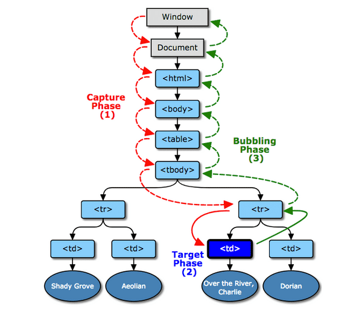
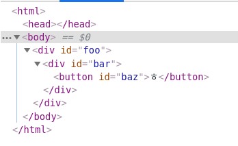
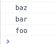
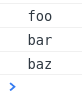

이벤트 버블링, 캡처링이 대강 어떤 건지만 알고 있다가 오늘 조금 확실하게 이해하게 된 듯 하여 바로 정리! (준석님 감사합니다!)

## 이벤트 캡처링, 버블링

다음은 이벤트 객체가 DOM 트리에서 어떤 식으로 전파되는지를 나타낸 그림이다.

<br>

<div align="center">이벤트 버블링 / 캡처링 (출처 : w3.org)</div>

<br>

그림에서 확인할 수 있다시피 이벤트 객체(event)는 window에서 출발해 target이 되는 DOM 까지 전파(propagation) 된다. 이러한 전파는 `캡처링(capturing) -> 대상(target) -> 버블링(bubbling)` 순서로 일어난다. 타겟은 해당 이벤트가 일어난 특정 DOM이 되는데, 여러 DOM이 위치상 겹쳐 있다면 가장 최하단 node에 위치한 태그가 타겟이 된다.

앞선 설명에 의하면 어쩐지 캡처링, 타겟, 버블링 과정에서 거치게 되는 모든 node에서 이벤트가 일어날 것만 같다. 하지만 결코 그렇지 않다는 사실을 이미 경험적으로 알고 있다.

결론적으로 이야기하자면 **캡처링과 버블링은 둘 중 하나만 선택적으로 일어난다.** 어느 방향으로 이벤트가 전파될 것인지는 개발자가 정하기 나름이다.

이 사실을 이해하기 위해서는 그동안 당연히 파라미터가 2개일거라고 생각해온 이벤트 리스너의 옵션을 살펴봐야 한다.

## addEventListener()

MDN에서 `addEventListener()`의 정의를 살펴보면 숨겨져 있는(은 아니고 나만 몰랐던) optional parameter가 있다는 사실을 알 수 있다.

```js
target.addEventListener(type, listener[, options]);
target.addEventListener(type, listener[, useCapture]); // highlight-line
target.addEventListener(type, listener[, useCapture, wantsUntrusted  ]); // Gecko/Mozilla only
```

여기서 두 번째 줄, 세 번째 옵션에 useCapture라는 파라미터가 있다.

해당 옵션의 설명을 읽어보자. 이 옵션은 default가 false인 boolean 값이며, **false는 버블링**(공기 방울이 물속에서 아래에서 위로 떠오른다는 사실을 기억하자), **true일 경우는 캡처링** 방향으로 이벤트 전파가 일어나게 된다.

useCapture가 꺼져있을 때는 버블링, 켜져있으면 캡처링으로 생각하면 기억하기 편하겠다.

> DOM 트리의 하단에 있는 EventTarget 으로 전송하기 전에, 등록된 listener 로 **이 타입의 이벤트의 전송여부를 나타내는 Boolean** 입니다. 트리에서 위쪽으로 버블링되는 이벤트는 캡처를 사용하도록, 지정된 listener를 트리거하지 않습니다. 이벤트 버블링과 캡쳐는 두 요소(엘리먼트)가 해당 이벤트에 대한 핸들(함수)를 등록한 경우, 다른 요소 내에 중첩된 요소에서 발생하는 이벤트를 전파하는 두 가지 방법 입니다. 이벤트 전파 모드는 요소가 이벤트를 수신하는 순서를 판별합니다. 자세한 설명은 DOM Level 3 Events 과 JavaScript Event order 를 참조하세요. 값을 지정하지 않으면, **useCapture 의 기본값은 false** 입니다.

## Go & Check it

이 사실을 확인해보기 위해 useCapture 옵션의 boolean 값을 바꿔가며 onClick 이벤트를 트리거 시켜보자.

다음과 같은 구조의 html 태그를 준비하고, 이벤트 리스너를 달아주자. 클릭 이벤트가 트리거 되면 이벤트 리스너의 콜백함수는 해당 태그의 id 값을 console에 출력한다.

<br>

<div align="center"></div>

<br>

```js
const events = ['foo', 'bar', 'baz'].map(e => {
  const func = () => {
    console.log(e)
  }
  document.getElementById(e).addEventListener('click', func, false)
  return func
})
```

useCapture가 false일 때는 이벤트의 전파가 버블링 방향으로 일어난다. 결과는 예상대로 버블링 방향으로 일어났음을 확인할 수 있다.

<br>

<div align="center">최하단 baz가 가장 먼저, 최상단 foo가 가장 나중에</div>

<br>

반대로 useCapture가 true일 때는 이벤트의 전파가 캡처링 방향으로 일어난다. 역시 캡처링 방향으로 일어났음을 확인할 수 있다.

<br>

<div align="center">최상단 foo가 가장 먼저, 최하단 baz가 가장 나중에</div>

<br>

버블링이건 캡처링이건 이벤트의 전파를 막고 싶다면 `event.stopPropagation()`을 사용하면 된다.

react에서는 이벤트 리스너가 아니라 컴포넌트에 프로퍼티로 이벤트를 부착하는 경우가 많다. 캡처링을 사용하고 싶을 경우에는 `onClickCapture`와 같은 별도의 이벤트를 사용하면 되겠다.

## 이벤트 델리게이션 (delegation, 위임)

이벤트 델리게이션은 이벤트를 감지하기 위해 모든 DOM에 이벤트 리스너를 부착할 필요 없이 대표 DOM에만 대표로(이벤트 리스닝을 위임받아서) 부착하면 된다는 개념이다. 이벤트 리스너를 적게 설정하는 만큼 컴퓨팅 자원을 절약할 수 있다는 장점이 있다.

이렇게만 보면 곁가지로 이벤트 델리게이션은 별도의 개념 같지만 그 핵심에는 이벤트 버블링이 들어 앉아있다. 이벤트 버블링의 활용 패턴 쯤으로 보아도 무방하다.

참조 :

- [EventTarget.addEventListener()](https://developer.mozilla.org/ko/docs/Web/API/EventTarget/addEventListener)
- <속 깊은 자바스크립트>, 양성익, 168p
