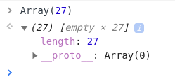
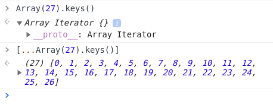

## drop the quiz

며칠 전 한쪽 방향으로 무한히 넘길 수 있는 슬라이더를 구현하려면 어떻게 해야 하냐는 질문이 들어왔었다. 나도 직접 구현 해본 기능이 아니라서 `pop()`이랑 `shift()`를 이용하면 어떻겠냐고 대답했다. 예를 들어 오른쪽 화면 바깥으로 나간 배열 item을 뽑아 다시 왼쪽 끝으로 보내주는 식으로 말이다.

하지만 준석님이 등판한다면 어떨까? 불필요하게 복잡하고 react에서 그렇게 하려면 불변성도 유지해줘야 하고 여러모로 귀찮은 점이 많지 않겠냐는 지적이 있었다.

그리곤 아니나 다를까 코드카타 문제가 하나 떨어졌다.

1. 슬라이더 아이템이 들어간 원본 배열을 만들고,

2. range를 정해 현재 인덱스를 중심으로 n개의 아이템을 추출하라.

이 코드는 다음과 같은 동작을 하게 된다. range가 5이고 인덱스가 2일 때,

[0, 1, 2, 3, 4]를 출력한다. 이 때 왼쪽으로 이동하는 버튼을 클릭하게 되면 현재 위치를 나타내는 인덱스가 1 감소하면서,

[26, 0, 1, 2, 3]을 출력한다.

## 1) 배열 만들기

먼저 배열을 만들어 준다.

```js
const items = [...Array(27).keys()].map(e => `${e + 1}이다~`)
```

배열을 만드는 방법에는 여러가지가 있겠지만 Array 생성자를 사용하는 방법도 있다. `Array()`를 실행하면 빈 배열([])이 생성되고 그 인자로 숫자를 넘겨주면 그 숫자만큼의 length 속성이 부여된다. length가 n인 빈 배열이 되는 것이다.

<br>

<div align="center"></div>

<br>

이어서 `Array.prototype.keys()`는 배열의 각 인덱스를 키 값으로 가지는 새로운 Array 이터레이터 객체를 반환한다. (참고 : [MDN](https://developer.mozilla.org/ko/docs/Web/JavaScript/Reference/Global_Objects/Array/keys))

이 이터레이터를 다시 스프레드 연산자를 사용해 할당하면 0부터 n까지 인덱스를 갖는 배열이 만들어진다.

<br>

<div align="center">덕분에 진짜 별걸 다 본다</div>

<br>

그리곤 이 친구를 다시 `map()`을 이용해서 각 인덱스에 아이템을 할당한다.

비슷하지만 조금 다르게 이런 방식으로 만들 수도 있다.

```js
Array(27)
  .fill() // 비어있는 length가 undefined로 채워진다
  .map((_, i) => `${i}이다`) // 각 아이템이 i로 채워진 새로운 배열을 리턴
```

여기까지 오는데 왜 벌써 진이 다 빠지는거 같지...

## 2) 현재 인덱스를 중심으로 + n개의 아이템 추출

먼저 현재 인덱스를 넣으면 해당 위치의 아이템을 가져오는 함수를 작성하자. 이 함수는 인자로 정수인 index를 받는다. 단, 이 값은 음수일 수도 있고 매우 클 수도 있다.

```js
const getItem = index => {
  let i = index

  return items[i]
}
```

가장 간단하게는 이렇게 할 수 있겠다. 하지만 이건 그냥 `items[index]`와 결과가 다르지 않고, 문제에서 요구하는 바를 충족시키지 못한다.

다음은 items의 인덱스가 배열의 길이를 초과하지 못하도록 `%` 연산자를 추가한 경우다.

```js
const getItem = index => {
  let i = index

  return items[i % items.length]
}
```

하지만 이 역시도 음수 케이스는 처리하지 못한다. 그래서 index가 양수가 될 때까지 배열의 총 길이 만큼 더해줘야 한다.

```js
const getItem = index => {
  let i = index
  while (i < 0) {
    i += items.length
  }
  return items[i % items.length]
}
```

이제 index를 넣으면 아이템을 리턴하는 함수를 짰으니 다음과 같이 우리가 원하는 대로 아이템을 뽑아낼 수 있게 되었다.

```js
;[
  getItem(index - 2),
  getItem(index - 1),
  getItem(index),
  getItem(index + 1),
  getItem(index + 2),
]
```

그러나 매번 이렇게 해줄 수는 없고 range가 홀수인지 짝수인지에 따라 배열의 형태가 변할 수 있다는 점을 추가로 고려해야 한다.

이제 range와 현재 index를 받아 슬라이더의 아이템이 들어있는 배열을 리턴하는 함수까지 작성해보자.

range가 홀수인지 짝수인지에 따라 최종 리턴할 배열의 가운데 위치가 달라진다. range에서 절반을 나누고 올림한 다음 배열의 인덱스를 구하는 것이므로 1을 빼주면 짝수와 홀수 가리지 않고 가운데 위치를 얻을 수 있다.

```js
const center = Math.ceil(range / 2) - 1
```

이제 이 센터를 중심으로 원하는 만큼 아이템을 얻어오면 된다.

```js
const getItems = (range = 5, index = 0) => {
  const center = Math.ceil(range / 2) - 1

  return Array(range)
    .fill()
    .map((_, i) => getItem(i - center + index))
}

getItems(5, 8)
// [ '7이다', '8이다', '9이다', '10이다', '11이다' ]
```

머리 아파 ㅠ
