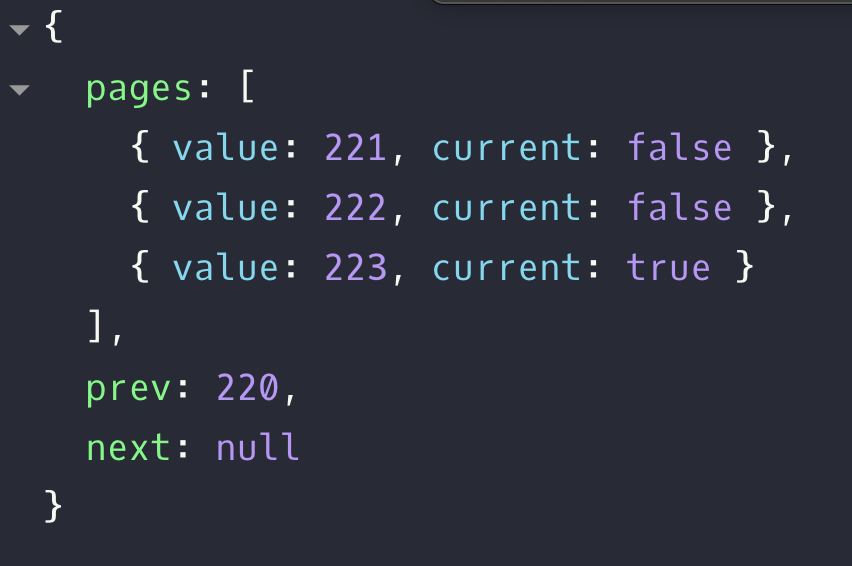

### Pagenation 구현하기!

준석님이 주고 가신 문제 상황은 다음과 같다.

```js
함수 인자 = {
  현재페이지: state,
  총아이템수: 221,
  한페이지당아이템수: 20,
  페이지수: 10,
}
current===4일때 => {
  pages: [
    {value: 1, current: false},
    {value: 2, current: false},
    {value: 3, current: false},
    {value: 4, current: true},
    {value: 5, current: false},
  ],
  prev: null,
  next: 11,
}
current===7 일때 => {
  pages: [
    {value: 6, current: false},
    {value: 7, current: true},
    {value: 8, current: false},
    {value: 9, current: false},
    {value: 10, current: false},
  ],
  prev: 5,
  next: 11,
}
current===11 일때 => {
  pages: [
    {value: 11, current: true},
    {value: 12, current: false},
  ],
  prev: 10,
  next: null,
}
```

문제를 받아들고 나서 엄청 막 그렇게 어렵겠다 생각은 안 들었는데 정작 직접 구현해보자니 너무 너무 귀찮은 것이었다.

그래도 한번 풀어두면 피가 되고 살이 될 거 같아서 풀어봤다.

다음과 같이 구현했다.

```js
const config = {
  currentPage: 223,
  totalPage: 223,
  itemPerPage: 20,
  limit: 5,
}

const item = (page, currentPage) => ({
  value: page,
  current: currentPage === page ? true : false,
})

const pagenation = ({ currentPage, totalPage, itemPerPage, limit }) => {
  const modPage = Math.floor((currentPage - 1) / limit) * limit
  const pageArr = Array(limit)
    .fill()
    .map((e, i) => item(i + modPage + 1, currentPage))
    .filter(e => e.value <= totalPage)

  return {
    pages: pageArr,
    prev: modPage ? modPage : null,
    next: modPage + limit + 1 <= totalPage ? modPage + limit + 1 : null,
  }
}

pagenation({ ...config })
```

그럼 답은 요래 나온다.

<br>

<div align="center"></div>

<br>

##### 주1 : 본 게시물의 제목은 원래 황삐님이 지은 `티키타카 코드타카`를 레퍼런스 삼고 있습니다.

##### 주2 : 저는 원래 뜻대로라면 `티키타카 코드카타`가 되어야 한다는 사실을 알고 있습니다.

##### 주3 : 따라서 `티키타카 준석타카`가 틀린 표현인걸 알고 있으나, 그냥 어감이 좋아서 쓰고 있습니다... 이걸 왜 태클 거는거야 ㅠ
