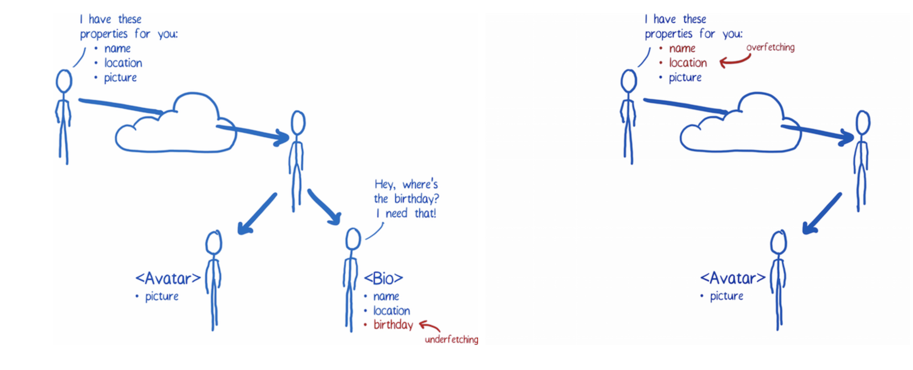
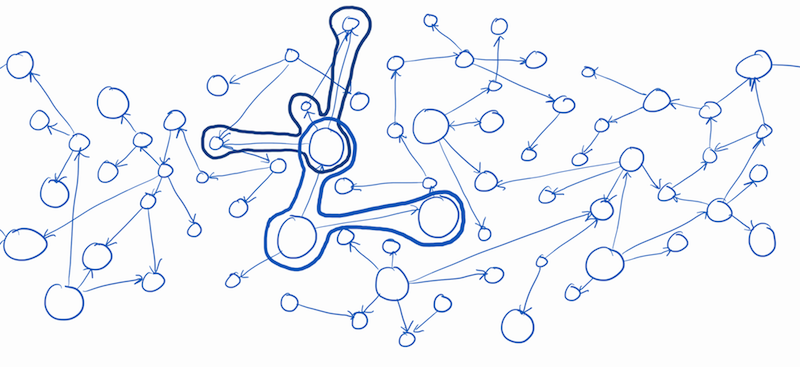
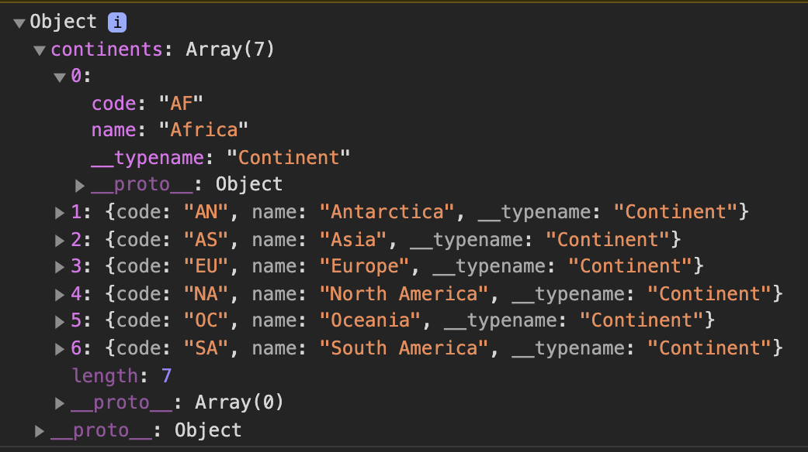
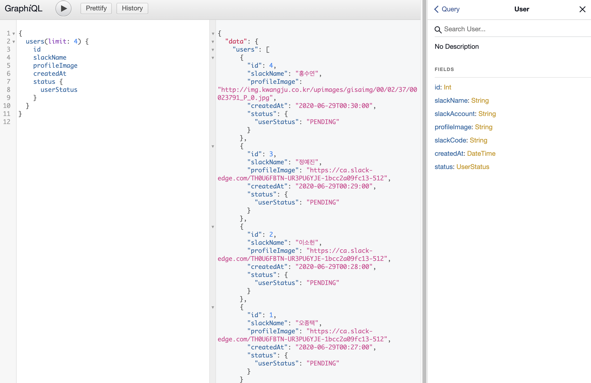

### Why GraphQL?

a, b, c, d 데이터를 보내주는 API가 있다. 그런데, 프론트 쪽에서 요청이 들어왔다.

> "a, b, c, d를 받아오는 엔드포인트는 있는데 e가 없네요. e를 포함하는 걸로 수정해 주실 수 있나요?"

착한 백엔드 개발자는 군말 없이 새로운 내용을 추가해 프론트에 넘겨줬다. 그런데 다음 날,

> "기획이 바뀌어서 이제 a만 필요한데 b, c, d, e는 빼주실 수 있나요?"

착한 백엔드 개발자는 다시 a만 남기고 나머지 데이터를 제거해 주었고 프론트엔드 개발자는 새로운 주소를 들고 싱글벙글 돌아갔다. 하지만 퇴근길 그의 머릿 속에는 어쩐지 내일 a를 빼고 b, c, d를 다시 포함해달라고 하는 것은 아닐까 하는 걱정이 들어차 있었다.

<br>

<div align="center">출처 : https://code-cartoons.com/a-cartoon-intro-to-facebook-s-relay-part-1-3ec1a127bca5</div>

<br>

RESTful API를 사용하는 상황에서 흔히 발생할 수 있는 상황이다. 전자의 경우 필요한 내용보다 적게 받아오는 under fetching, 후자의 경우 많이 받아오는 over fetching의 상황이다.

Facebook이 2015년 오픈소스로 공개한 GraphQL(gql)은 이런 상황에서 유용한 대안이 될 수 있다. (정확히 말하자면 Facebook은 GraphQL의 문법만 정의해뒀다. 실제 사용하기 위해서는 Apollo, Relay 등의 라이브러리 구현체를 쓰면 된다. 어찌 보면 유연한 방식이라고도 할 수 있겠다.)

### gql은 "API에 대한 쿼리 언어"다

공식 문서에 따르면 그렇다. gql API에 대해 클라이언트가 쿼리를 요청하는 상황을 나타낸 듯하다. 이름이 비슷한 sql과는 비슷하면서도 조금 다른데, sql이 백엔드 서버와 DB 간의 통신에 사용되었다면 gql은 백엔드 서버와 프론트엔드 간의 통신에 유용하게 사용된다. 두 언어 간 사용되는 목적과 환경이 다르기 때문에 상호보완적이라고도 말할 수 있을 듯 하다.

<br>

<div align="center">이렇게 흩어진 데이터를 묶어 보여주는 게 그래프 같아서 붙은 이름이다</div>

<br>

반면 gql은 기존 RESTful API가 가지고 있던 약점을 상당 부분 커버하면서도 레거시와 혼합하여 쓰일 수 있다. gql은 여러 개로 흩어져 있는 API를 하나로 묶어 스스로가 데이터의 관문이 된다는 점이 가장 큰 차이점이라고 할 수 있겠다.

gql에서 API는 하나만 존재한다. 클라이언트 단에서 원하는 데이터의 형태 등을 정의해 쿼리를 날리면 해당 형태에 맞는 응답을 보내는 구조다. 응답의 형태만큼 별도의 API를 만들어야 했던 기존 방식에 비해 요청의 효율이 좋다.

그림으로 단순화 해서 나타내면 다음과 같은 형태다.

<br>

<div align="center">출처 : GraphQL 개념잡기 - Kakao Tech</div>

<br>

클라이언트에서 보내는 쿼리와 응답의 형태를 보면 더욱 명료하다. 클라이언트에서 원하는 형태로 쿼리를 날리고 그 형태 그대로 데이터를 받아오고 있는 걸 알 수 있다.

```js
const GET_CONTINENTS = gql`
  query {
    continents {
      code
      name
    }
  }
`
```

<div align="center"></div>

<br>

### 뜯어볼 수록 괜찮은 GraphQL

gql은 효율적인 요청 구조를 가지고 있다는 것 외에도 다양한 장점을 가지고 있다.

- Apollo Provider 등을 통해 Redux, Context API 등 전역 상태 관리 라이브러리를 대체할 수 있다.
- 보다 편리하게 Caching 기능을 지원하여 유저에게 더 나은 사용자 경험을 제공할 수 있다.
- Http 프로토콜 외 Websocket 프로토콜 또한 지원하여 실시간 subscription 기능도 제공한다.
- PlayGround를 제공하여 API에 대한 자동 문서화(type 및 parameter 확인) 및 테스트가 아주 편리하다.
- 등등...

```jsx
const httpLink = createHttpLink({
  uri: GRAPHQL_URL,
})

const client = new ApolloClient({
  link: httpLink,
  cache: new InMemoryCache(),
})

ReactDOM.render(
  <React.StrictMode>
    // highlight-next-line
    <ApolloProvider client={client}>
      <GlobalStyle />
      <Routes />
    </ApolloProvider>
  </React.StrictMode>,
  document.getElementById('root')
)
```

ApolloProvider가 마치 redux Provider 같은 역할을 하게 된다

<br>

<div align="center">정말정말 편한 playground</div>

<br>

놀라운 건 이 모든 것들이 GraphQL이 단일 gateway 구조를 가짐으로서 발생한 부수적인 효과라는 점이다. 역시 구조적인 문제는 구조로 해결해야 한다는 점을 새삼 깨닫는다. structure는 위대해...

다음 포스팅에는 query와 mutation에 대한 개념을 정리하고, apollo client(어느 글에선가 apollo가 django라면 relay는 flask라는 말을 보고)를 사용해 query와 mutation을 이용한 간단한 예제 프로젝트를 구현해보겠다.

### GraphQL 학습 자료

가장 먼저 GraphQL 공식 문서가 있다. ([링크](https://www.howtographql.com/))

그 공식 문서를 한국어로 번역해둔 아주 훌륭하신 분들이 있다. ([링크](https://graphql-kr.github.io/))

### 참고 자료

- [GraphQL 개념 잡기](https://tech.kakao.com/2019/08/01/graphql-basic/)
- [A cartoon guide to Facebook’s Relay, part 1](https://code-cartoons.com/a-cartoon-intro-to-facebook-s-relay-part-1-3ec1a127bca5)

<br>

\#wecode \#위코드
