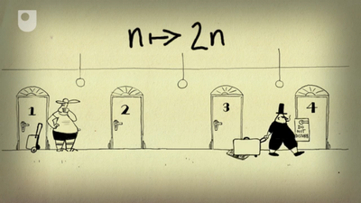
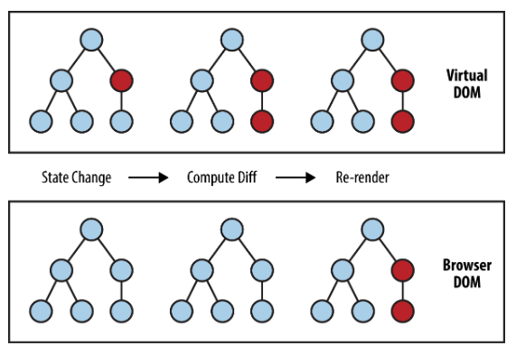

리액트를 사용하며 입버릇처럼 "불변성을 유지한다" 혹은 "불변성을 지켜준다" 같은 말들을 달고 살았는데 그 의미를 진짜 알고 쓴 것 같지는 않았다. 뭔가 어떤 비열하고 나쁜 자식으로부터 불변성이라는 연약한 인질을 보호해야 줘야 하는 것 같기도 하고... 대강 리액트가 가상돔을 업데이트 할 때 불변객체라는 전제 하에 성능을 최적화 할 수 있다고만 알아두고 넘어갔다.

심지어 리덕스를 공부할 때는 이 불변성이라는 친구가 순수함수라는 개념과 함께 뒤섞이기도 해서 정말 고약한 기분이 들었다. 그러다 얼마전 그 의미가 조금 더 살갗에 와닿게 이해 된듯한 기분이 들었다. 느낌이 날아가기 전에 글로 정리해보려 한다.

## 불변객체란? 보다는 왜 불변객체를 써야 하는지를 알아보자

유인동님의 함수형 프로그래밍 강의 중 모나드를 설명하는 대목에서 참으로 인상 깊은 말을 들었는데 대강 이런 말이었다. "기술의 명세보다 그 기술이 주고자 하는 가치를 생각하면 보다 쉽게 이해될 수 있다." 그것이 무엇이냐? 라는 것보다도 그걸 왜 써야 하는지에 초점을 맞추면 오히려 본질이 쉽게 다가올 수 있다는 말이다. 좋은 말씀이다.

그래서 뒤에 장황하게 늘어놨다가 다 지우고 결론 부터 말하기 위해 다시 올라와서 쓰고 있다. 불변객체를 쓰는 이유는 **단순하게 만들기 위해서**다. 무엇을? 우리는 리액트의 상황을 국한지어 생각해보고 있으므로 **"가상돔의 변화를"**이라고 대답할 수 있다.

비유로 시작해보자.

어떤 호텔이 있다. 이 호텔은 건물로 입장하는 손님들 모두에게 고유한 번호를 부여한다. 손님들은 1층 로비에 있는 식당만 이용하고 나가기도 하고, 호텔의 숙박 시설을 이용하기도 한다.

어느날 돈독이 오른 호텔의 사장이 이렇게 말했다.

> "객실 내에 있는 방, 화장실, 침실 전부 숙박 가능한 단위로 쪼개서 손님을 받자!"

이럴 수가! 모든 방을 돌아다니며 손님의 체크인, 체크아웃을 확인했다. 그런데 이제 방 안의 방까지 확인 해야 한다.

직원들은 열흘 밤낮을 방 안의 방을 체크하며 눈물을 흘렸다. 노력에도 불구하고 방금 체크하고 지나가자마자 손님이 체크인, 아웃을 하는 경우도 있어 현황이 언제나 맞다는 보장도 없었다.

과로에 지친 직원 중 하나가 묘안을 냈다.

> "어떤 방에서 손님 하나라도 체크인 하거나 체크아웃 하게 되면 그 방을 폭파시키고 새로운 방을 주면 되지 않을까?"

<br>
<div align="center">힐베르트의 호텔이 생각난다면 그건 기분 탓이다</div>
<br>

이게 도대체 무슨 미친 소리란 말인가? 사실 놀랍게도 이 호텔은 방이 무한히 많아서 방을 마음대로 만들 수 있었다. 또한 산이 깊고 물이 맑아 손님들의 인심도 순한 고을이었다. 그렇다면 방 안에 손님과 관련된 어떤 변화가 있을 때마다 방은 폭파될 것이고, 그 폭발음을 듣고 직원들은 해당 방에 있던 손님들을 새 방으로 옮겨주기만 하면 된다.

... 갑자기 이게 뭔가 싶겠지만 이 비유는 나름대로 리액트가 불변객체를 활용해 가상돔을 업데이트 하는 로직을 설명해 본 것이다.

## 다시 돌아온 코어 자바스크립트

잠시 우회해보자.

표지가 아주 예뻐서 그런진 몰라도 아주 재밌게 읽었던 코어 자바스크립트의 1장 제목은 '데이터 타입'이다. 음, 자바스크립트의 데이터 타입이라. 잠시 복습을 해보자면 크게 기본형(혹은 원시형이라 불리며 `Number`, `String`, `Boolean`, `null`, `undefined`, `Symbol`)과 참조형(`Object`)로 나뉜다고 배웠다.

흔히 기본형 데이터와 참조형 데이터 사이의 차이를 다음과 같이 설명하곤 한다.

> **기본형**은 할당이나 연산 시 **값 자체(123, "가나다")**를, **참조형**은 해당 데이터가 저장된 곳의 **메모리 주소(#123a)**를 참조한다

하지만 코어 자바스크립트에 따르면 조금 다르다.

> "엄밀하게는 둘 모두 복제를 하긴 합니다. 다만 기본형은 **값이 담긴 주솟값을 바로 복제**하는 반면 참조형은 **값이 담긴 주솟값들로 이루어진 묶음을 가리키는 주솟값을 복제**한다는 점이 다릅니다."

참조형 데이터는 주솟값의 묶음을 가리키는 주솟값을 값으로 가진다. 값을 확인하기 위해서는 기본형과 비교했을 때 한 층 더 들어가야 한다. 중첩 객체의 경우 한 번 더 들어가야 한다. 음?

아래 예시를 보자. 정확한 서술은 아니더라도 최대한 이해를 돕기 위해 단순화해서 설명해보겠다.

```js
const a = 'a' // #1001
const b = 'b' // #1002

const arr = ['a', 'b'] // #3001~ -> (#1001, #1002)
const obj = {
  // #5001~ -> (#1001, #1002, #3001 -> (#1001, #1002))
  a: 'a',
  b: 'b',
  arr: arr,
}
```

쉽게 말하면 사용자가 손에 쥐고 볼 수 있는 값이 `#1001`, `#1002`인지 `#3001~`, `#5001~`인지의 차이라고 할 수 있다.

## 리액트의 가상돔 업데이트 최적화 전략 : 방 폭파

아직 긴가민가 하다. 여기에 호텔 비유를 합쳐보자.

기본형 데이터는 개별 손님과도 같다. 1번 키(`#1001`)를 받은 제임스는 제임스다. 2번 키(`#1002`)를 받은 썸머도 마찬가지로 썸머다. 바뀔 수 없다. 직원들이 오늘 처음 보는 손님에게 인사를 해야 한다는 규칙이 있다면 직원들은 제임스와 썸머의 얼굴이 다르기 때문에 곧바로 인사를 해야 하는지 여부를 판단할 수 있다.

그러나 객실의 경우 이야기는 달라진다. 직원들이 오늘 체크아웃 한 손님의 방을 치워야 하는 상황을 가정해보자. 직원이 1001호(`#3001~`)에 들어간다. 1001호의 침실, 화장실, 방을 모두 체크한다. 1002호(`#5001~`)에 들어간다. 1002호의 침실, 화장실, 방을 모두 체크한다. 1003호에 들어간다... 끝이 없다. 방의 깊이가 깊어질 수록 객실 하나의 상태를 체크하는데 훨씬 많은 시간이 들어갈 것이다.

그런데 만약 객실 문짝만 봐도 상태가 바뀌었는지 알 수 있다면 어떨까? 과로에 정신이 나간 직원의 아이디어가 빛을 발하기 시작한다. 1001호에 변화가 생겼다. **폭파한다.** 이제 다시는 1001호를 체크하지 않아도 된다. 대신 1010호의 문짝만 체크하면 된다. 마치 제임스와 썸머의 얼굴을 확인하듯이 지나가며 바로바로 확인할 수 있게 된 것이다. 손님들이 잘 폭파시켜주겠다는 약속을 지켜주기로 한 덕분이다.

거의 다 왔다.

리액트는 가상돔을 업데이트 하며 화면을 그려낸다. 화면 업데이트는 렌더 단계(render phase), 커밋 단계(commit phase)로 나눠진다. 전자는 실제 돔에 반영할 변경 사항을 파악하는 단계이고, 커밋은 파악된 변경 사항을 실제 돔에 반영하는 단계다.

업데이트의 기준은 이전 상태와 현재 상태가 달라졌는지의 여부다. 가상돔은 객체로 구성되어 있다. 두 객체를 어떻게 비교할까? 일단 두 객체의 트리를 따라 내려가면서 각각의 값을 모두 비교하는 수 밖에 없다.

최악이다. 더 끔찍한 것은 이 객체 트리에 어떤 변화가 있는지 모르기 때문에 언제 업데이트를 시작해야 할지 조차 모른다는 점이다.

<br>
<div align="center"></div>
<br>

하지만 최상위 메모리의 주소 만으로 이전과 현재의 변화 여부를 알 수 있다면 어떨까? 변화가 생겼다면 내용을 싹 긁어(재사용) 새 객체에 담아주는 것이다. 원래 #5001번 주소값을 가지고 있던 가상돔 객체의 주소가 #7002번 주소로 바뀌었으므로 더 이상 안쪽을 들여다 보지 않고도 업데이트 여부를 알 수 있다.

업데이트의 타이밍 또한 `this.setState()` 함수가 호출한 render가 불렸을 때로 한정할 수 있다. 단, 객체 내부의 내용이 "불변"하다는 전제가 지켜졌을 때의 이야기다.

## 덧붙여

리덕스도 마찬가지다. 순수 함수란 입력이 같을 경우 출력이 동일한 함수를 뜻한다. 부작용(side effect)이 없다는 뜻이다. 리덕스의 상태 업데이트는 `dispatch`를 통해서만 가능하도록 하고 있다. 리액트가 `setState`로만 상태를 변경시키도록 하는 이유와 같다.

싱글 스레드인 자바스크립트에는 별로 해당되지 않는 이슈인가 싶긴 하지만, 멀티 스레드와 프로세스를 지원하는 언어에서는 동시성(concurrency) 문제와 연관하여 불변객체는 중요한 개념이다.

하나의 객체를 두고 여러 스레드가 동시에 접근해 작업을 한다면 어떨까? 현재 자신이 작업하고 있는 내용이 다른 스레드가 건드리지 않은, 순수한 객체라는 사실을 보장할 수 있을까? 그래서 방어적 복사(depensive copy)를 활용해 복사본을 만든 뒤, 외부로부터 접근 받을 일이 없음을 보장하도록 만든다.

갈 길이 멀다...

`#위코드` `#WeCode`
