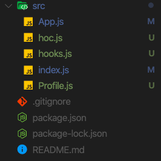
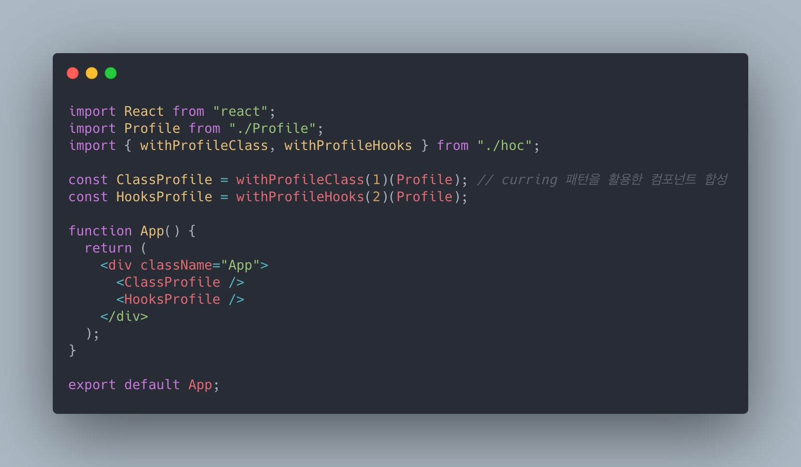
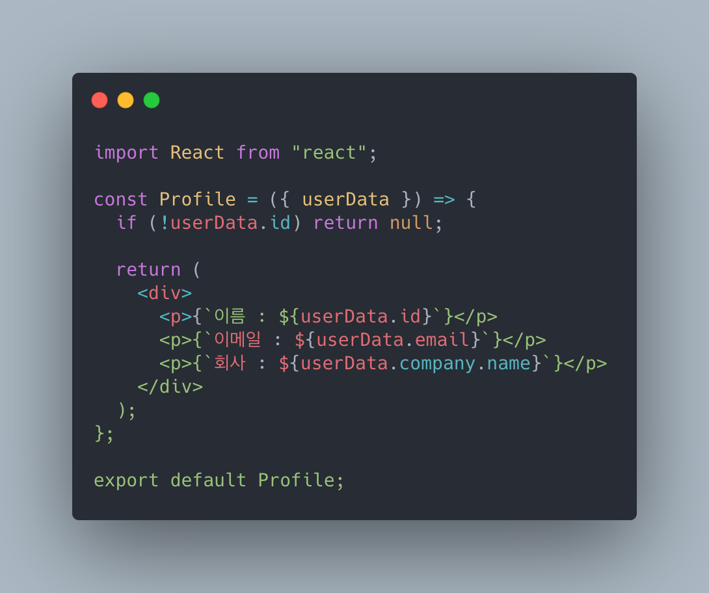
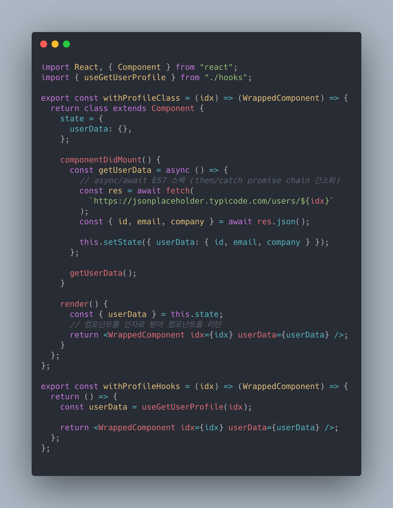
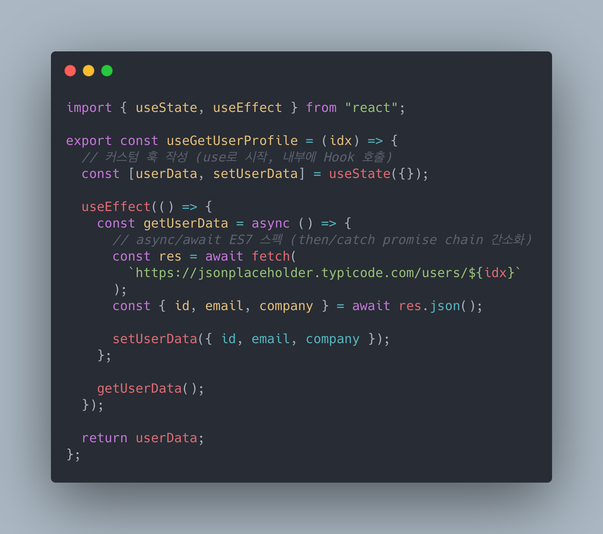
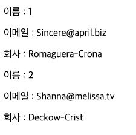

## 재사용의 미학, 리액트

지난 세달 동안 코드를 많이 쳤다고는 못하겠지만 새로운 것들을 얕고 다양하게 맛봤다. 그러나 최근 들어서는 자바스크립트를 자바스크립트 답게, 리액트를 리액트 답게 쓰는 것에 대한 갈증을 느끼고 있다.

되짚어보자면 그러한 고민의 연장선상에서 나눌 수 있는 것들이 많았다. 어제는 9기가 수료했고 10기의 2차 프로젝트가 끝났다. 특히 10기의 2차 프로젝트 마지막 날, 한 팀에서 버그를 수정하고 있었는데 로직과 레이아웃이 서로 강하게 결합되어 있어 재사용하기 어려운 상황이었다.

우리는 습관처럼 "컴포넌트는 재사용 가능한 UI의 단위"라는 말을 구호처럼 외쳐왔지만 실질적으로 컴포넌트를 분리하고, 재사용하기 위한 방법론을 나누는데는 충분히 익숙지 않았던 것 같다.

코드 리뷰를 하다 보면 다음과 같은 패턴이 빈번히 등장한다. 물론 이제 막 리액트를 배우는 입장에서는 당연히 더 나아가 생각하기 어려울 수 있다. 그러나 컴포넌트의 재사용성을 높이는 패턴을 익히는 것의 중요성은 새로운 라이브러리를 학습하는 것 이상으로 생산성에 중요한 기여를 할 수 있다고 생각한다.

```jsx
// before -> 두 개의 내용을 표현하기 위한 두 개의 파일
isMyID ? <ProfileMyID /> : <ProfileOtherID />

// after -> 두 개의 내용을 표현하기 위한 하나의 파일
const MY_ID = '12345'
const OTHER_ID = '54321'

isMyID ? <Profile userID={MY_ID} /> : <Profile userID={OTHER_ID} />
```

## HOC, 커스텀 훅을 활용한 관심사 분리

위와 같이 props를 활용하여 컴포넌트 재사용을 꾀할 수 있다. 다만 이 경우 레이아웃과 로직이 합쳐진 컴포넌트를 사용하게 되어 컴포넌트 내부가 정도 이상으로 복잡해질 경우 관리가 어려워질 수 있다. 또한 다른 컴포넌트에 공통되는 로직을 재사용할 수도 없다. 이 경우 '관심사의 분리(separation of concerns, SoC)' 원칙 관점에서 접근하면 보다 재사용성을 높이는 방향으로 컴포넌트를 구성할 수 있다.

이러한 목표를 달성할 수 있는 몇 가지 방법이 있다. 이번에 다뤄볼 `HOC(Higher Order Component)`, `커스텀 훅`이 있고, 아직 컨셉이 잘 와닿지 않는 `Render Prop`과 레이아웃 컴포넌트를 만들 때 말고는 아직 뚜렷한 사용처가 생각나지 않는 `Children` 등이 있다.

HOC는 다음과 같이 컴포넌트를 함수의 인자로 받아, 새로운 컴포넌트를 리턴하는 패턴을 뜻한다. 흔히 사용해봤을 법한 HOC로는 react-router-dom의 `withRouter()`나 react-redux의 `Connect()`가 대표적이다.

```js
const EnhancedComponent = higherOrderComponent(WrappedComponent)
```

커스텀 훅은 Hooks의 도입과 함께 가능해진 패턴이다. `use-`로 시작하는 함수명 + 함수 내에서 Hooks를 호출하는 것을 조건으로 갖는다. 로직을 분리하여 다른 함수 컴포넌트 내에서 블록 조립하듯 간단히 재사용할 수 있다는 장점이 있다.

```js
컴포넌트(결과물) = 로직 + 컴포넌트(레이아웃)
```

곧바로 코드로 확인해보자. 예제는 최대한 단순한 구조로 구성했다. json placeholder에서 /users를 호출하는 로직을 presentational 컴포넌트와 분리시켜보았다. 즉 다음과 같은 구조를 갖게 된다.

<br>

<div align="center">파일 구성</div>

<br>

위와 같은 파일 구성을 갖고 있다.

<br>

<div align="center">App.js</div>

<br>

App.js는 프로젝트 내 최상위 컴포넌트로서 커링 패턴(인자를 하나씩 분리해서 받는 함수)의 HOC를 사용해 각기 클래스, 함수 컴포넌트에 로직을 부여하고 있다. `withProfile-`의 첫 인자에는 `/user/idx`에 들어갈 인덱스를 받고 두 번째 인자에는 해당 로직을 씌울 컴포넌트를 받는다.

참고로 일반적으로 HOC에는 `with-`로 시작하는 이름을 붙여준다.

<br>

<div align="center">Profile.js</div>

<br>

Profile.js는 위에서 내려온 userData를 화면에 보여주는 역할을 하는 컴포넌트다. 이 컴포넌트의 역할은 화면을 그리는 것에 국한되어있다. 호출이 들어왔을 경우와 그렇지 않은 경우만을 판단하고 그 외의 로직은 존재하지 않는다.

<br>

<div align="center">hoc.js</div>

<br>

hoc.js에는 `with-`로 시작하는 함수가 두 개 작성되어 있다. 각각 클래스형 컴포넌트와 함수 컴포넌트로 작성되었다. 마지막 인자로 받는 컴포넌트의 파라미터는 다른 내용들로 감싸진다는 의미에서 `WrappedComponent`라고 적어주었다.

`withProfileHook` 같은 경우 함수 컴포넌트 형태이기 때문에 `useGetUserProfile`이라는 커스텀 훅을 사용할 수 있다. 굳이 상태 및 라이프 사이클 관련 로직을 분리해보았다.

<br>

<div align="center">hooks.js</div>

<br>

`withProfileClass` 내부에 작성된 로직과 동일하다. 커스텀 훅은 위에서 언급했다시피 `use-`로 시작하고 내부에 다른 hooks를 호출하는 함수다.

<br>

<div align="center">결과물</div>

<br>

`withProfileClass`와 `withProfileHooks`의 결과물은 위에서 확인할 수 있듯이 동일하다. 내 개인적인 취향에는 블럭처럼 로직을 쌓아올릴 수 있는 커스텀 훅 방식이 더 직관적이고 간결해 마음에 든다.

`#WeCode` `#위코드`
