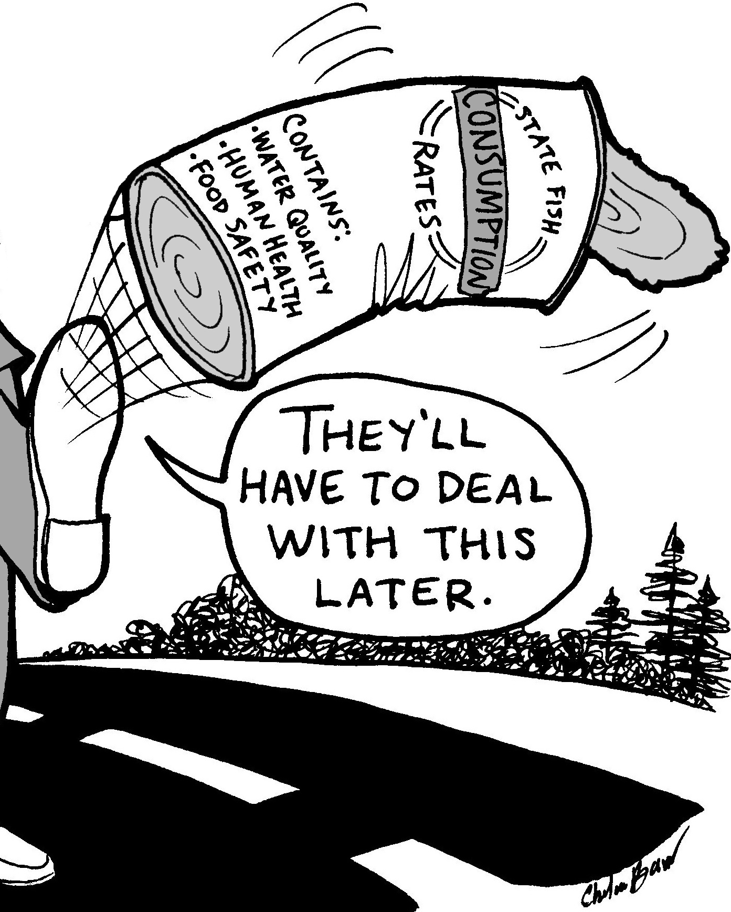
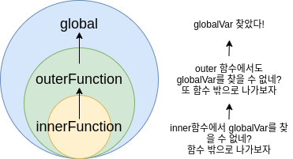

### "Kick the can down the road"

---

  

 

결국 돌아오고 말았다. 코어 자바스크립트는 솔직히 스키밍으로만 3회독 하고 있는 중이고 그 중에서 휘황찬란한 단어들이 많이 나오는 실행 컨텍스트 파트는 그간 건너뛰어 버리곤 했다. 각잡고 스터디로 진행하는 이상 그럴 수는 없게 되었다.

대표님께서 심심찮게 하시는 말씀이 있는데, 바로 `"Kick the can down the road"`다. 내리막 길에서 걷어찬 캔은 내 시야에서만 사라졌을 뿐 언젠가 반드시 다시 만나게 되리라는 뜻이고, 그렇게 다시 만났다 ㅎ

그렇게 펼쳐보게 된 실행 컨텍스트에 대한 내용을 보니 죄책감은 배가 되었는데 다음 인용으로 설명을 대신하고자 한다.

> 실행 컨텍스트는 실행할 코드에 제공할 환경 정보들을 모아놓은 객체로, 자바스크립트의 동적 언어로서의 성격을 가장 잘 파악할 수 있는 개념입니다. (...) 실행 컨텍스트는 자바스크립트에서 가장 중요한 핵심 개념 중 하나입니다. 사실 클로저를 지원하는 대부분의 언어에서 이와 유사하거나 동일한 개념이 적용되어 있습니다. 실행 컨텍스트를 정확히 이해하는 것은 자바스크립트 뿐 아니라 일반적인 개발자로서의 실력 향상에도 큰 도움이 될 것입니다.
>
> 정재남, <코어 자바스크립트>

 

### 그래서, 왜 실행 컨텍스트를...?

---

`실행 컨텍스트(Execution Context)`를 공부하다보면 실행 컨텍스트가 어떻게 만들어지고, 그 내부가 어떤 요소들로 구성되어 있고, 클로저와 호이스팅이 어쩌구... 하는 식으로 나도 모르게 끌려가고 있는 걸 깨닫게 된다.

물론 실행 컨텍스트라는 개념이 자바스크립트의 특징 중 하나라 그럴 것이다. 다만 어떤 기술이든 그렇듯 실행 컨텍스트 또한 필요에 따라 등장했을 것이고 그건 아마 코드의 실행 순서와, 각각의 실행에서 참조해야 하는 변수, 식별자 등을 효과적으로 관리하기 위한 목적으로 도입되었다는 것만은 확실하다.

아래 도식은 정말 정말 많이 생략된 그림이고 엄밀하게 실행 컨텍스트에 대한 내용으로 볼 수 없을지도 모르지만, 내가 생각하는 핵심적인 컨셉을 잘 나타내는 그림이라 가져와 보았다.

 

  https://soojae.tistory.com/24

 

서두에서 실행 컨텍스트에 대해 `"실행할 코드에 제공할 환경 정보들을 모아놓은 객체"`로 정의한 바 있다. 이렇게 정보들을 어딘가에 모아 두는 이유는 자명하다. `언젠가 필요할 때 꺼내어 쓰기 위함`이다.

<코어 자바스크립트>에서는 실행 컨텍스트를 다음과 같은 요소들로 설명하고 있다.

- `VariableEnvironment`: 현재 컨텍스트 내의 `식별자`들에 대한 정보 + 외부 환경 정보, 선언 시점의 `LexicalEnvironment`의 스냅샷으로, 변경 사항은 반영되지 않음.
- `LexicalEnvironment`: 처음에는 `VariableEnvironment`와 같지만 변경 사항이 실시간으로 반영됨.
- `ThisBinding`: `this` 식별자가 바라봐야 할 대상 객체.

이 중 현재 중요하게 다뤄볼 내용은 두 번째 항목의 `LexicalEnvironment`이다. 실행 컨텍스트를 생성할 때 `VariableEnvironment`에 정보를 먼저 담은 다음, 이를 그대로 복사해서 `LexicalEnvironment`를 만들고, 이후에는 이를 주로 활용하게 된다.

모든 소스 코드는 실행에 앞서 `평가` 과정을 거치고 코드를 `실행`하기 위한 준비를 한다. 즉, 자바스크립트 엔진은 소스코드를 '소스코드의 평가'와 '소스코드의 실행'으로 나눌 수 있다.

소스코드 평가 과정에서는 실행 컨텍스트를 생성하고 변수, 함수 등의 선언문만 먼저 실행하여 생성된 변수나 함수 식별자를 키(key)로 실행 컨텍스트가 관리하는 `스코프`(lexical environment의 환경 레코드)에 등록한다.

이러한 준비 과정이 `VariableEnvironment`에 정보를 담는 과정이고, 흔히 우리가 `호이스팅(Hoisting)`이라고 부르는 현상이기도 하다. MDN에서는 사실 호이스팅은 ECMAScript 명세에 없는 표현이며, 사실 실행 컨텍스트의 동작과 연관이 깊다고 설명한다.

> 호이스팅(hoisting)은 ECMAScript® 2015 언어 명세 및 그 이전 표준 명세에서 사용된 적이 없는 용어입니다. 호이스팅은 JavaScript에서 실행 콘텍스트(특히 생성 및 실행 단계)가 어떻게 동작하는가에 대한 일반적인 생각으로 여겨집니다. 하지만 호이스팅은 오해로 이어질 수 있습니다. (MDN)

다시 원래 맥락으로 돌아와 위에 첨부한 그림을 보자. 가장 안쪽의 `inner()`라는 함수가 실행되고, 만약 해당 함수 내에서 `globalVar`라는 식별자를 찾고자 한다면, 먼저 `inner()` 함수를 실행한다.

이러한 검색을 가능하도록 하는 것이 바로 실행 컨텍스트의 `VariableEnvironment`, `LexicalEnvironment`다.

### 스코프 체인 숲 속에서 식별자를 찾아 헤메는 한 마리 맹수랄까...

다음 두 개의 인용을 보자.

> lexical environment에 대한 한국어 번역은 문서 마다 제각각 다른데 '어휘적 환경', '정적 환경'이라는 단어가 가장 많이 등장합니다. '어휘적'은 lexical을 영어사전에 대입해서 치환한 것으로 의미가 와 닿지 않고, '정적'이라는 말은 수시로 변하는 환경 정보를 의미하는 lexical environment에 대한 적절한 번역이라고 볼 수 없습니다. 이보다는 '사전적인'이 더욱 어울리는 표현이라 생각합니다.

> "현재 컨텍스트의 내부에는 a, b, c와 같은 식별자들이 있고 그 외부 정보는 D를 참조하도록 구성돼있다"라는, 컨텍스트를 구성하는 환경 정보들을 사전에서 접하는 느낌으로 모아놓은 것이죠.

 

### 예상 면접 질문

---

- 1번
- 2번
- 3번

 

### 참고 자료

---

- 정재남, <코어 자바스크립트>
- 이웅모, <모던 자바스크립트 Deep Dive>
