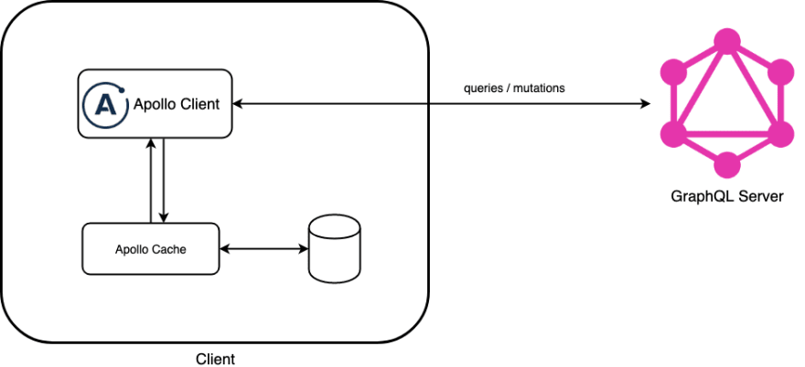
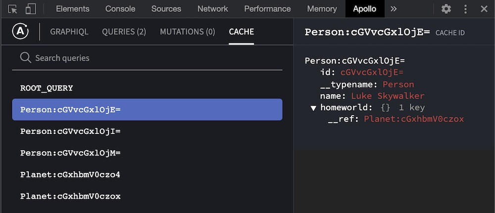
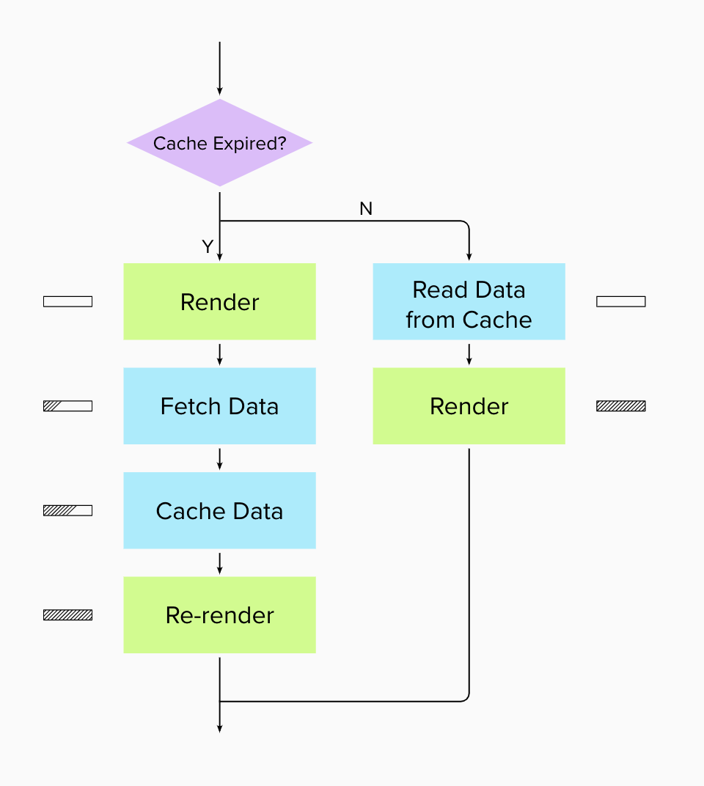

## 1. 프론트엔드의 영원한 숙제, 상태 관리(state management)

프론트엔드 개발을 공부하다보면 많은 고민과, 그 고민으로부터 파생된 기술 스택들은 결국 `상태 관리의 어려움`으로부터 파생되었다는 사실을 새삼 깨닫게 됩니다.

이러한 어려움을 논하기에 앞서 먼저 React가 상태를 다루는 방법들에 대하여 짚어보겠습니다.

### 1) Stateless Component

말 그대로 상태를 갖지 않는 컴포넌트 입니다. 단순히 정적으로 UI만 그려내고, 간단한 함수 컴포넌트를 생각해볼 수 있습니다. 달리 표현해보자면 `() => UI` 와 같은 형태의 함수로 환원해 볼 수도 있습니다.

```jsx
export default function App() {
  return <div>상태가 없는 컴포넌트 입니다</div>
}
```

### 2) Component with `Local State`

지역 상태를 가지는 컴포넌트 입니다. React에서는 이를 state라고 부르며, state가 가지는 값에 따라 컴포넌트는 경우에 맞는 적절한 UI를 출력합니다. 클래스형 컴포넌트나, useState 훅을 사용하는 함수 컴포넌트가 이에 해당합니다. 달리 표현해보자면 `(state) => UI` 와 같이 표현할 수 있겠습니다.

```jsx
const { useState } from "react"

export default App() {
	const [month, setMonth] = useState(5)

	return <div>{month}월은 어린이날{month === 5 ? "입" : "아닙"}니다</div>
}
```

### 3) Component with Local State Shared with Parent

React의 데이터 흐름은 기본적으로 단방향입니다. 단방향이라는 뜻은 위에서 아래로, 부모에서 자식으로 흐른다는 뜻입니다. 하지만 경우에 따라 특정 컴포넌트의 상태를 다른 컴포넌트에서 컨트롤 해야 할 수 있습니다.

이 경우 공식문서에 나와 있듯 `상태 끌어올리기 (Lifting State Up)` 패턴을 사용합니다.

```jsx
function App() {
  const [month, setMonth] = useState(5)

  return (
    <>
      <PlusBtn setMonth={setMonth} />
      <Presenter month={month} />
    </>
  )
}

function PlusBtn({ setMonth }) {
  return <button onClick={prev => setMonth(prev + 1)}>+</button>
}

function Presenter({ month }) {
  return (
    <div>
      {month}월은 어린이날{month === 5 ? '입' : '아닙'}니다
    </div>
  )
}
```

### 4) Using State Management Library

---

하지만 부모/자식 요소를 오르내리는 상태가 많아지거나, 연결된 컴포넌트가 서로 멀어질 수록 컴포넌트에 정의되는 props가 복잡해지고, `Props Drilling` 같은 문제를 고려하면 성능적으로도 불리하다는 점을 고려하지 않을 수 없습니다.

이러한 단점을 보완하기 위하여 Context API, Redux, MobX 같은 상태 관리 기술들이 등장했습니다. 이러한 기술을 사용하면 반드시 `Lifting State Up` 패턴을 따르지 않더라도 멀리 떨어진 컴포넌트를 손쉽게 연결할 수 있습니다.

```jsx
// src/count/count-context.js
import { useState, useMemo, ****createContext**,** useContext } from 'react'

export const CountContext = createContext()

function useCount() {
  const context = useContext(CountContext)

  if (!context) {
    throw new Error(`useCount must be used within a CountProvider`)
  }

  return context
}

export function CountProvider(props) {
  const [count, setCount] = useState(0)

  const value = useMemo(() => [count, setCount], [count])

  return <CountContext.Provider value={value} {...props} />
}

// src/count/page.js
import React from 'react'
import { CountProvider, useCount } from './count-context'

function Counter() {
  const [count, setCount] = useCount()

  const increment = () => setCount(c => c + 1)

  return <button onClick={increment}>{count}</button>
}

function CountDisplay() {
  const [count] = useCount()

  return <div>The current counter count is {count}</div>
}

function CountPage() {
  return (
    <div>
      <CountProvider>
        <CountDisplay />
        <Counter />
      </CountProvider>
    </div>
  )
}
```

### 5) Using State Management Library To Handle Asynchronous Action

---

```jsx
import { call, put, takeEvery, takeLatest } from 'redux-saga/effects'
import Api from '...'

// Worker saga will be fired on USER_FETCH_REQUESTED actions
function* fetchUser(action) {
  try {
    const user = yield call(Api.fetchUser, action.payload.userId)
    yield put({ type: 'USER_FETCH_SUCCEEDED', user: user })
  } catch (e) {
    yield put({ type: 'USER_FETCH_FAILED', message: e.message })
  }
}

// Starts fetchUser on each dispatched USER_FETCH_REQUESTED action
// Allows concurrent fetches of user
function* mySaga() {
  yield takeEvery('USER_FETCH_REQUESTED', fetchUser)
}
```

## 2. UI State vs Server Cache

[](https://youtu.be/seU46c6Jz7E) _react-query 개발자 Tanner Linsley의 발표_

이쯤 해서 다시 검토해보겠습니다. 모든 상태는 두 가지 타입 중 하나에 속합니다. `UI State` 이거나, `Server Cache`이거나.

**`UI State`** - State that's only useful in the UI for controlling the interactive parts of our app (like modal isOpen state).

- Non-Persist
- Synchronous
- Client-Owned
- Reliably Up-To-Date

**`Server Cache`** - State that's actually stored on the server and we store in the client for quick-access (like user data).

- Remotely Persisted
- Asynchronous
- Shared Ownership
- Potentially Out-Of-Date

<br>

이러한 관점에서는 상태 관리에서 겪는 어려움은 대부분 서로 다른 두 가지 타입의 상태를 구분하지 못할 때 발생한다고 보고 있습니다. 서로 다른 카테고리의 상태를 하나로 합쳐 관리하려고 했을 때 오는 곤란함이 아닐까 하는 의문을 가져볼 수 있는거죠.

서버 사이드의 상태를 다룰 때 클라이언트에서는 보통 다음과 같은 어려움을 겪을 수 있다고 하네요.

- Caching
- Dedupling Requests
- Background Updates
- Outdated Requests
- Mutations
- Pagnation / Incremental
- GC / Memory

<br>

이러한 관점에서 다시 전역 상태 관리 라이브러리를 사용해 server cache를 관리하는 상황을 되돌아봅시다. 이해를 돕기 위해 전역 상태 관리 목적으로 널리 사용되고 있는 redux로 특정해보겠습니다.

일반적으로 서버에서 가져온 비동기 데이터를 관리하기 위해 `redux`, `react-redux`와 그것의 미들웨어 라이브러리인 `redux-saga`, 그리고 보일러 플레이트를 줄이기 위해 `redux-tookit` 조합을 활용합니다.

각 라이브러리의 고유한 사용법, 특히 redux-saga의 경우 제너레이터 문법과 `take`, `put`과 같은 전용 헬퍼 함수들의 사용법을 익히기 위한 러닝 커브가 상당하다는 문법은 꾸준히 제기되어 왔습니다. 하지만 문제는 러닝 커브에서만 그치지 않습니다.

전역 상태 관리 라이브러리로 server cache를 관리하는 것은 크게 다음과 같은 두 가지의 구조적 문제점을 가지고 있습니다.

- **필요로 하는 값은 redux에 존재한다는 가정**
  - 만약 원하는 값이 있도록 하는 Action이 발생하지 않을 경우, 언제나 필요한 값이 있다고 완전히 보장하기 어려워 런타임에서 에러가 발생할 수 있음
- **특정 시점에 capture된 데이터가 outdated 되지 않음**
  - 접근하고자 하는 데이터가 outdated 된 cache일 가능성은 언제나 존재함
  - 동일한 데이터를 client store와 server 두 곳에서 다루고 있어 single source of truth 원칙을 위배함

<br>

UI State는 떼어 놓고 server cache 만을 생각해보겠습니다.

server cache를 진짜 cache로 관리한다면 문제는 훨씬 간단해집니다. 어울리지 않게 cache 역할을 하고 있는 redux가 server cache를 관리하지 않을 수 있습니다.

Apollo InMemoryCache를 참고 해보겠습니다.

아폴로 클라이언트는 Redux처럼 앱 전체를 Provider로 감싸고 props로 client 인스턴스를 받습니다. 이 클라이언트 인스턴스를 통로 삼아서 gql 서버로의 요청을 보내게 됩니다.

```jsx
const cache = new InMemoryCache();
const link = createHttpLink({
  uri: "http://localhost:8001/graphql",
});
const client = new ApolloClient({
  cache,
  link: ApolloLink.from([authLink, link]),
});

class Routes extends React.Component {
  render() {
    return (
      <ApolloProvider client={client}>
        <Router>
```

  <div>
    

  </div>

<br />

> 이 apollo client는 내부적으로 [InMemoryCache](https://www.apollographql.com/docs/react/caching/cache-configuration/#inmemorycache)라는 라이브러리를 사용하고 있습니다. (apollo 3.0부터는 완전 내부화 되어 별도 설치해주지 않아도 됩니다)
>
> 아주 단순화해서 설명하자면 graphql 서버에 대해 보냈던 요청을 key(쿼리) value(응답) 형태로 client(Provider에 위치)에 cache로 저장합니다. (redis 같은 캐시 서버에 비유해도 괜찮을까요?)
>
> 그 후 만약 동일한 쿼리(key)를 보낸다면 네트워크 요청을 보내지 않고 캐시에서 곧바로 꺼내어 재사용할 수 있겠네요. 물론 당연하게도 이러한 네트워크 정책은 개발자가 정해주기 나름입니다!

<div>
    
  </div>

<br />

또한 앞서 설명드린 복잡하고 방대한 보일러플레이트 코드의 피로도 역시 생략할 수 있겠네요.

무엇보다도 server cache에 대한 복잡한 비동기 처리(`error`, `loading`, `success`)가 불필요 해지면 `redux-saga` 와 같은 미들웨어 라이브러리를 쓸 당위성도 줄어듭니다. 오직 UI State만을 가볍게 전역으로 관리한다면 반드시 `redux` 만이 해답이 아닐 수도 있는 것이죠.

<br>

### Example

---

```jsx
// global state
const globalState = {
  `projects`,
  `teams`,
  `tasks`,
  `users`,
  themeMode,
  sidebarStatus,
}
```

```jsx
// global state without server state
const globalState = {
  themeMode,
  sidebarStatus,
}
```

그러한 관점에서 새롭게 등장한 접근 방식이 `react-query` , `swr` 등의 라이브러리 입니다.

> "Hooks for fetching, caching and updating asynchronous data in React" (react-query)

> "SWR is a strategy to first return the data from cache (stale), then send the fetch request (revalidate), and finally come with the up-to-date data." (SWR)

<div>
  
</div>

<br />

## 3. react-query

`react-query`를 사용한 코드는 다음과 같습니다. `graphql apollo`의 `useQuery`와 같은 함수명인 점에 눈길이 갑니다.

- _Apollo useQuery 참고_

  ```jsx
  import { gql, useQuery } from '@apollo/client'

  const GET_DOGS = gql`
    query GetDogs {
      dogs {
        id
        breed
      }
    }
  `

  function Dogs({ onDogSelected }) {
    const { loading, error, data } = useQuery(GET_DOGS)

    if (loading) return 'Loading...'
    if (error) return `Error! ${error.message}`

    return (
      <select name="dog" onChange={onDogSelected}>
        {data.dogs.map(dog => (
          <option key={dog.id} value={dog.breed}>
            {dog.breed}
          </option>
        ))}
      </select>
    )
  }
  ```

하나의 쿼리의 비동기 처리 상태에 따라 바뀌는 상태 변화(`pending`, `resolved`, `rejected`)를 커스텀 훅으로 분리하여 직관적으로 처리하도록 한 점도 인상적이네요.

만약 `loading`과 `error`를 통과했다면 data의 존재는 반드시 보장될 수 있도록 하는 구조입니다.

```jsx
import React from 'react'
import { useQuery } from 'react-query'

const API = 'https://node-pagnation.herokuapp.com/users'

const getUsers = async () => {
  const res = await fetch(API)
  const users = await res.json()

  return users
}

export default function Users() {
  const { isLoading, isError, data, error } = useQuery('users', getUsers)

  if (isLoading) return 'Loading...'
  if (isError) return `Error! ${error.message}`

  return (
    <div className="container-lg">
      <div className="row row-cols-4">
        {data.users.map(({ id, name, email }) => (
          <UserCard key={id} name={name} email={email} />
        ))}
      </div>
    </div>
  )
}
```

```jsx
import { QueryClientProvider, QueryClient } from 'react-query'

const queryClient = new QueryClient()

ReactDOM.render(
  <QueryClientProvider client={queryClient}>
    <Routes />
  </QueryClientProvider>,
  document.getElementById('root')
)
```
