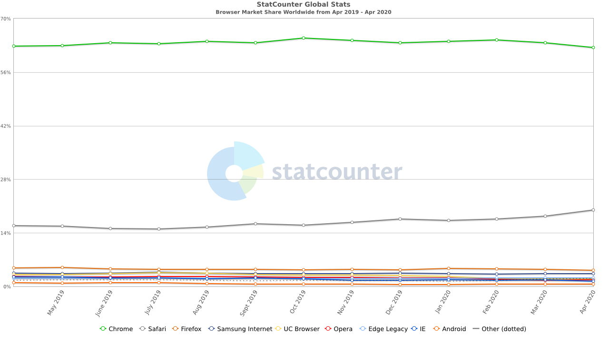
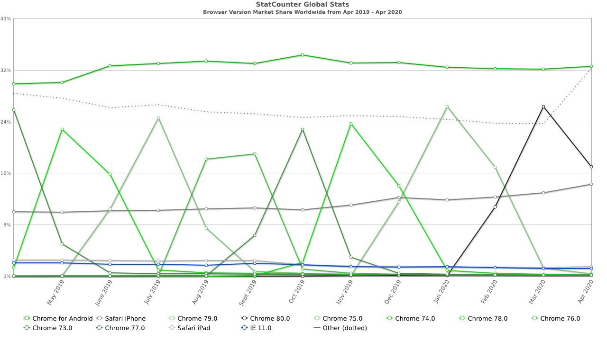
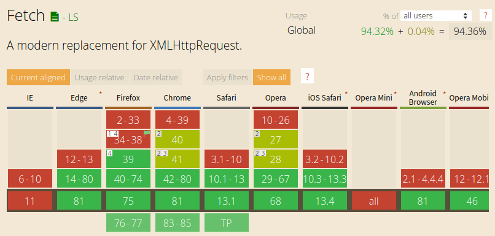
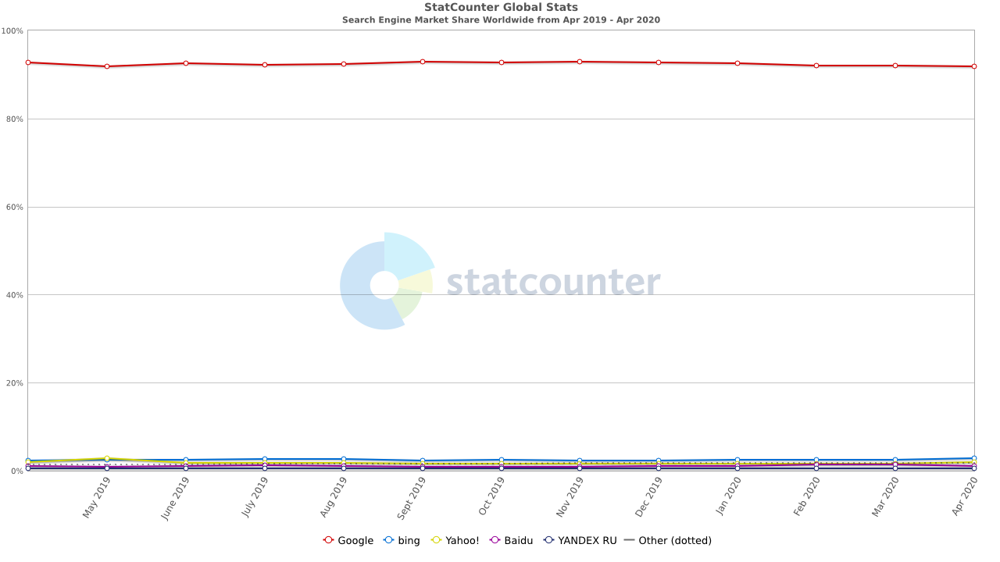
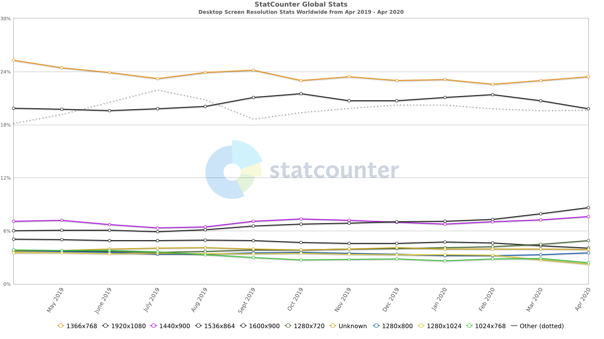
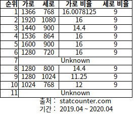
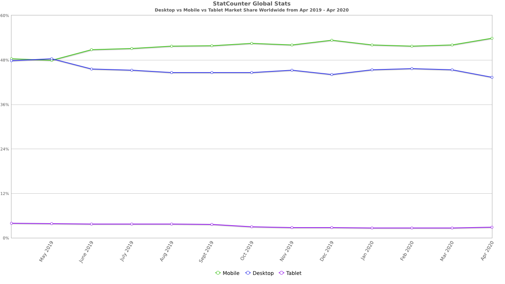

면접 준비 하는 차원에서 [StatCounter](https://gs.statcounter.com/)에 들어가 중요 통계들을 찾아봤다. 프론트엔드 개발자라면 자기가 만든 웹사이트가 통계적으로 어떤 환경에서 디스플레이 되는지 알고 있어야 하지 않을까 하는 생각에서다.

직접 찾아보니 당연한 부분도 있었는데 의외의 결과도 있었다.

크게 브라우저 점유율 / 검색엔진 / 해상도 / 디바이스 타입으로 통계를 나눠볼 수 있을 것 같다. 하나하나 살펴보자.

### 1. 월간 브라우저 점유율

 

  월간 브라우저 점유율 추이 (2019.04 ~ 2020.04)

 

위 그래프는 모든 디바이스 환경에서의 브라우저 점유율을 나타내고 있다. 데스크톱과 모바일 가릴 것 없이 크롬의 점유율이 압도적이다.

데스크톱에서야 무조건 크롬을 쓴다는 사실을 알고 있었지만 갤럭시를 쓰는 나로서는 별일 없으면 내장된 삼성 브라우저를 쓰는데 그렇지 않은 사람들이 많은 모양이다.

 

  월간 브라우저 버전 점유율 추이 (2019.04 ~ 2020.04)

 

좀 더 자세한 통계가 있다. 역시 대부분 크롬이 차지하고 있고 버전 업데이트가 있을 때만 각 버전 별 점유율 차이만 생길 뿐 동일한 양상을 보인다.

이 통계가 중요한 이유는 브라우저 내에서도 어떤 버전이 쓰이는지 또한 중요하기 때문이다. 예컨대 [Can I Use](https://caniuse.com/) 같은 사이트를 들어가보면 각 브라우저 버전 별로 사용할 수 있는 기술이 다르다는 사실을 확인할 수 있다.

직접 들어가서 지난 프로젝트에서 많이 사용했던 fetch API를 검색해봤다.

 

  브라우저 별 fetch API 사용 가능 여부

 

대부분의 브라우저는 지원하나 IE11과 오페라 미니에서 지원하지 않는다. 이 경우 별도의 polyfill 라이브러리를 사용해 해당 브라우저에서 기능이 작동하도록 신경 써줘야 한다.

내친 김에 Web Audio API 까지 검색해봤는데 마찬가지로 IE11 오페라 미니에서만 작동하지 않는다... 후...

### 2. 월간 검색엔진 점유율

 

  월간 검색엔진 점유율 추이 (2019.04 ~ 2020.04)

 

이건 더 이상 볼 것도 없이 구글 압승이다.

### 3. 월간 디스플레이 해상도 점유율

 

  월간 디스플레이 해상도 점유율 추이 (2019.04 ~ 2020.04)

 

이 부분이 상당히 충격적인 결과였다. 나는 지금까지 1920x1080 해상도를 당연하게 여기고 살아왔다. 하지만 실제 가장 높은 점유을 차지한 해상도는 1366x768이었다.

이에 대해 찾은 가장 설득력 있는 [설명](https://superuser.com/questions/946086/why-does-1366x768-resolution-exist)을 참고하자.

 

> According to Wikipedia (emphasis mine):
>
> > The basis for this otherwise odd seeming resolution is similar to that of other "wide" standards – the line scan (refresh) rate of the well-established "XGA" standard (1024x768 pixels, 4:3 aspect) extended to give square pixels on the increasingly popular 16:9 widescreen display ratio without having to effect major signalling changes other than a faster pixel clock, or manufacturing changes other than extending panel width by 1/3rd. As 768 does not divide exactly into 9, the aspect ratio is not quite 16:9 – this would require a horizontal width of 1365.33 pixels. However, at only 0.05%, the resulting error is insignificant.

> Citations are not provided, but it is a reasonable explanation: it's the closest to 16:9 they could get by keeping 768 vertical resolution from 1024x768, which had been widely used for manufacturing of early 4:3 LCD displays. Maybe that helped reduce costs.

1024x768에서 더 높은 픽셀 수를 제공할 필요성이 생겼는데, 4:3에서 16:9 비율 또한 이행해야 했다. 그러나 비용의 문제 때문에 세로 픽셀을 유지하고 가로 픽셀만 늘렸고, 어느 정도 비율의 오차는 비용 문제에 비하면 감수할만 했다는 얘기다.

여기서 비용 문제라는 건 아마 면취율 얘기이지 싶다. 면취율이란 마더글래스에서 잘라내 실제 활용하는 면적의 비율([삼성디스플레이 블로그](http://news.samsungdisplay.com/13671) 참고)로, 디스플레이 갯수에 차이가 생겼던 것이 아닐까 추측해본다.

 

   해상도 비율

 

위 표는 직접 계산해 본 비율이다. 10위에 있는 1024x768은 12:9이므로 실제로는 4:3 비율이다.

 

### 4. 월간 디바이스 점유율

  월간 디바이스(모바일/데스크톱) 점유율 추이 (2019.04 ~ 2020.04)

 

마지막으로 디바이스 점유율 추이다. 지난 해 5월을 기점으로 모바일이 데스크톱 점유율을 넘어서기 시작했다. 그 이전 기간의 점유율이 어땠는지 모르겠는데 아마 모바일 점유율이 꾸준히 우상향하는 그림이 아니었을까 추측해본다.

이를 고려해본다면 내가 이전 프로젝트에서 반응형에 대한 경험을 해보지 못했다는 건 아쉬운 지점이다. 지금까지 반쪽짜리 화면만을 만들어왔다는 말과 다르지 않기 때문이다.

꼭 반응형을 마스터 할 것이다...
