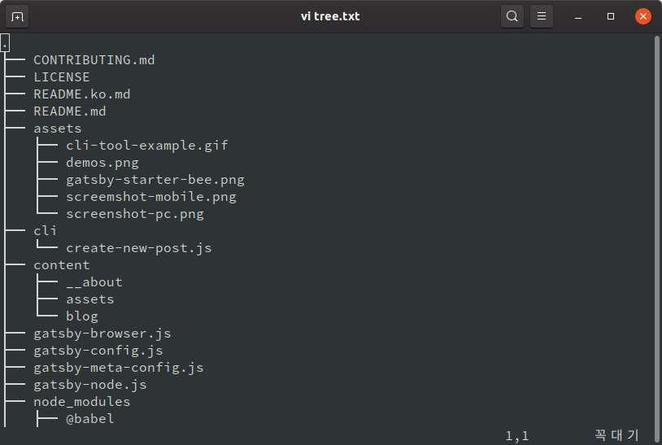

대단한 내용은 아닌데 폴더의 하위 구조를 그려주는 `tree`라는 툴을 발견해서 포스팅 해둔다.

next.js를 사용한 프로젝트를 했다. next.js는 루트 폴더 아래 `pages` 폴더에 라우팅 url과 동일한 이름의 컴포넌트를 생성하고, 그 아래 다시 폴더를 만드는 방식 등으로 동적 라우팅 등을 구현한다. 페이지가 빌드됐을 때도 별도의 폴더가 생성되기 때문에 폴더 구조를 참고할 일이 있다.

그런데 이 폴더 구조를 블로그에 포스팅 하자니 일일히 그려주기 여간 귀찮은게 아니다. 게다가 다른 사람들의 블로그 포스팅을 보면 뭔가 정형화된 틀이 발견되기도 하여 tool이 있으려니 싶었다.

아무튼 `tree`를 깔아준다. 윈도우, MacOS, 리눅스 모두 지원한다. 설치 후 버전을 확인하여 잘 설치가 됐는지 확인해 준다.

```bash
sudo apt-get install tree
tree --version
```

여기서 터미널에 `tree`를 입력하면 폴더 구조가 출력되는데 그냥 이 명령어만 입력하면 엄청나게 많은 파일들이 출력될 것이다. 옵션 몇 가지를 함께 사용해야 유용하게 사용할 수 있다.

`tldr tree`로 확인한 결과는 이렇다.

```
tree
Show the contents of the current directory as a tree.

 - Show files and directories up to 'num' levels of depth (where 1 means the current directory):
   tree -L {{num}}

 - Show directories only:
   tree -d

 - Show hidden files too:
   tree -a

 - Print the tree without indentation lines, showing the full path instead (use -N to not escape whitespace and special characters):
   tree -i -f

 - Print the size of each node next to it, in human-readable format:
   tree -s -h

 - Filter the tree using a wildcard (glob) pattern:
   tree -P {{*.txt}}

 - Ignore entries that match a wildcard (glob) pattern:
   tree -I {{*.txt}}
```

위에서 확인한 내용을 바탕으로 직접 옵션을 조합해 원하는 방식으로 폴더 구조를 출력해보자.

다음은 `tree -d -N -L 2 -I "node_modules"`의 실행 결과다. 이 옵션은 디렉토리만 표시, 한글 깨지지 않게, depth는 2단계까지, `node_modules` 폴더는 제외하고 출력한다.

```
├── assets
├── cli
├── content
│   ├── __about
│   ├── assets
│   └── blog
├── public
│   ├── 404
│   ├── daily thinking
│   ├── development
│   ├── icons
│   ├── offline-plugin-app-shell-fallback
│   ├── page-data
│   └── static
├── src
│   ├── components
│   ├── constants
│   ├── layout
│   ├── pages
│   ├── styles
│   ├── templates
│   └── utils
└── static
```

출력 결과를 파일로 저장하고 싶다면 다음처럼 입력하면 된다.

```
tree -L 2 >> tree.txt
```

위 코드를 실행하고 생성된 txt 파일을 vi로 열어보면 다음과 같이 잘 들어와 있는 걸 볼 수 있다.

<br>

<div align="center">
  
</div>

<br>
