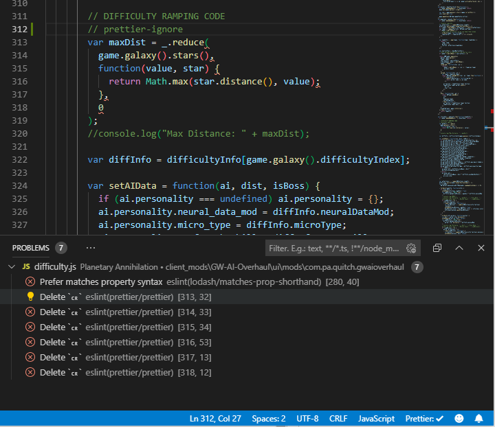
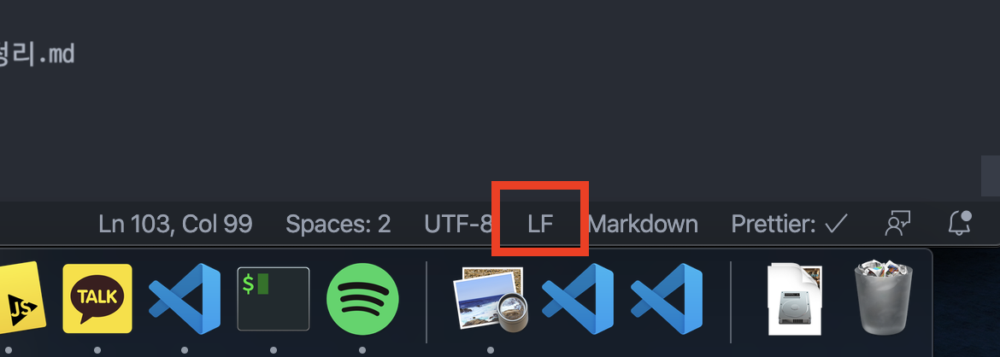

### ESLint "[eslint] Delete 'cr' [prettier/prettier]" 문제

#### tldr : 운영체제의 특성 때문에 발생하는 문제. eslint의 `linebreak-style` 옵션을 손 봐주자.

9기 1차 프로젝트 세팅 중 꼭 윈도우 유저들 한테서 ESLint 에러가 많이 발생했다. 몇몇 케이스는 불필요하게 ESLint, Prettier 익스텐션을 중복 설치한 경우였으나, 또 다른 몇몇 케이스는 정상적으로 세팅을 진행했음에도 이유 없는 빨간 밑줄이 사라지지 않았다.

"개발은 linux/mac os로 합시다!"라고 하고 싶지만... 그건 내 소관이 아니므로 열심히 해결책을 찾는 수 밖에!

<br>

<div align="center">빨간 줄이 쓰러지지 않아...</div>

</br>

이번에 맞닥뜨린 문제는 `"[eslint] Delete 'cr' [prettier/prettier]"` 라는 에러메시지였다. 작성된 코드들 마지막 줄에 죄다 밑줄이 생겼다.

아마 아래와 같은 줄바꿈이 필요한 경우들이 아닐까 추측해본다.

```js
// before lint
<div className="hi" onClick={this.setState({foo: "bar"}) onChange={() => this.fooHandler("baz")}}>테스트</div>

// after lint
<div
  className="hi"
  onClick={this.setState({foo: "bar"})
  onChange={() => this.fooHandler("baz")}}
>
  테스트
</div>
```

이제는 왜 prettier가 lint의 요구를 반영해주지 못해주는지 원인을 찾아볼 차례다.

검색을 하면서 공통적으로 등장한 키워드는 CRLF와 LF였고, **윈도우의 경우 LF를 강제해주면 해결된다**는 내용의 글들이 많았다.

CR은 Carrage Return, LF는 Line Feed다. 간단히 말하자면 운영체제가 줄바꿈을 처리하는 방식에 대한 구분동작이라고 설명할 수 있겠다.

이 둘에 대한 좋은 설명이 있어 인용해본다.

> CR : 현재 커서를 줄 올림 없이 가장 앞으로 옮기는 동작
>
> LF : 커서는 그 자리에 그대로 둔 상황에서 종이만 한 줄 올려 줄을 바꾸는 동작
>
> 이 방식(CR + LF)은 타자기 이후 컴퓨터에서도 줄바꿈을 의미할 때도 사용되었으나, 줄바꿈을 할 때 굳이 2 byte 를 사용할 필요가 없기에 메모리/Storage 절약을 위해 CR 혹은 LF 만 사용하기도 하였다.
>
> 대표적으로 Microsoft 사의 Windows 는 CRLF (\r\n) 을 기본으로 사용하는 반면 Unix/Linux 에서는 LF (\n) 만으로 줄바꿈을 하고 있다.
> (Mac 의 초기 버전, 9 버전 이하는 CR (\r) 을 줄바꿈으로 사용)
>
> 출처: https://technote.kr/300 [TechNote.kr]

정리하자면 유닉스 기반 시스템(Linux/Mac OS)에서는 LF(`\n`)만으로도 줄바꿈이 되는 반면 윈도우에서는 CRLF(`\r\n`)가 모두 입력되어야 줄바꿈이 처리된다.

이 내용을 기반으로 상황을 추론해보자.

- lint/prettier 입장에서는 LF만으로 줄바꿈을 처리할 수 있을 줄 알았는데,
- 윈도우 운영체제 상에서는 CR까지 입력 받아야 줄바꿈이 처리되고,
- 줄바꿈 되지 않았으므로 lint는 계속 해서 줄바꿈을 적용하라는 에러를 출력한다

의 상황인듯 하다.

`.eslintrc.json` 파일에 다음과 같은 옵션을 추가한다.

```js
{
  // ...
  "rules": {
    "linebreak-style": ["error", "windows"] // "off"라고 주면 아예
  }
}
```

VScode 에디터 우측 하단에는 현재 CRLF/LF 중 어떤 모드인지를 알려주는 칸이 있다. 에디터 재시작 후 여기서 잘 바뀌었는지 확인하자.

<br>

<div align="center"></div>

</br>

그런데 이렇게 설정을 하더라도 git 문제로 branch를 이동할 때마다 CRLF로 되돌아가는 경우가 있다. 그 경우에는 프로젝트 최상위에 `.gitattributes` 파일을 두고 다음과 같은 옵션을 추가해준다.

> If you use git, you may want to add a line to your .gitattributes file to prevent git from converting linebreaks in .js files:
>
> \*.js text eol=lf

### 참고 자료

- [CRLF / LF / CR 에 대한 이해](https://technote.kr/300)
- [How can I write a ESLint rule for “linebreak-style”, changing depending on Windows or Unix?](https://stackoverflow.com/questions/39114446/how-can-i-write-a-eslint-rule-for-linebreak-style-changing-depending-on-windo)
- [enforce consistent linebreak style (linebreak-style)](https://eslint.org/docs/rules/linebreak-style)
