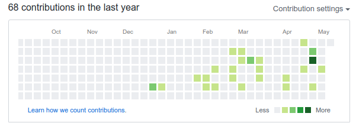
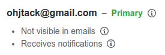
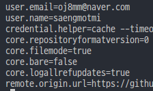
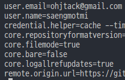

슬슬 구직을 시작했다. 그러다보니 그간 널부러져 있던 github repo도 한번 훑어보게 됐는데 잔디가 예상 외로 너무 휑하다는 사실을 깨달았다.

<br>

<div align="center">으음 처참한걸</div>

<br>

그런데 최근 블로그도 나름 열심히 하고 있고 3달 간 하루도 빠짐 없이 열심히 했는데 어째서 이렇게 휑한 것인가에 대해 궁금할 수 밖에 없었다. 물론 내가 한게 어디 가는 건 아니니까 심각하게 생각하진 않는데 보는 사람 입장에서는 또 다르게 생각할 수 있으니.

잔디 그리드를 자세히 살펴보니 좌측 하단에 [Learn how we count contributors](https://help.github.com/en/github/setting-up-and-managing-your-github-profile/why-are-my-contributions-not-showing-up-on-my-profile)라는 문구가 있다.

클릭 해보면 "Why are my contributions not showing up on my profile?"라는 문서를 확인할 수 있다. 이 문서에 따르면 commit이 count 되기 위해서는 다음 조건을 만족시켜야 한다.

- The email address used for the commits is **associated with your GitHub account.**
- The commits were made in a standalone repository, **not a fork.**
- The commits were made:
  - In the repository's **default branch (usually master)**
  - In the gh-pages branch (for repositories with project sites)

<br>

commit이 count 되지 않는 경우는 다음과 같다.

- Commit was made less than 24 hours ago
- **You haven't added your local Git commit email to your profile**
- Commit was not made in the default or gh-pages branch
- Commit was made in a fork

<br>

이 문서를 보면서 예전에 한번 깃허브 웹에서 이메일 주소를 수정한 적이 있었던 게 떠올랐다. 어째서인지 깃허브 아이디와 이메일 주소가 다르게 되어 있었기 때문인데 웹에는 반영이 되어 있었는데 그 이전에 만든 프로젝트들은 로컬에 이 변경사항이 반영되어 있지 않은 탓인듯 했다.

<div align="center">깃허브 웹에 등록된 이메일</div>

<br>

프로젝트의 현재 git config 상황을 확인하려면 다음과 같이 입력한다.

```
git config --list
```

<br>

<div align="center">블로그 프로젝트에서 확인한 이메일</div>

<br>

이전에 등록했던 이메일이 남아있다. 이제 이 부분을 최신화해주자.

```
git config --global user.email "이메일"
```

<br>

<div align="center">성공적으로 변경되었다</div>

<br>

그러면 자동으로 반영된다.

> If the email address used for the commit hasn't been added to your GitHub profile, you must **add the email address** to your GitHub account. **Your contributions graph will be rebuilt automatically** when you add the new address.

참조 :

- [Github 잔디가 안 심어질 때](https://medium.com/@rnrjsah789/github-%EC%9E%94%EB%94%94%EA%B0%80-%EC%95%88-%EC%8B%AC%EC%96%B4%EC%A7%88-%EB%95%8C-9389b4770f55)
- [Git Config 설정 확인 및 변경하기](https://webisfree.com/2018-07-26/git-config-%EC%84%A4%EC%A0%95-%ED%99%95%EC%9D%B8-%EB%B0%8F-%EB%B3%80%EA%B2%BD%ED%95%98%EA%B8%B0)
